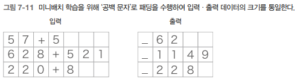

# RNN을 사용한 문장 생성

## 1. 언어 모델을 사용한 문장 생성

언어 모델은 기계 번역, 음성 인식, 문장 생성 등에 활용할 수 있다.  

### 1-1. RNN을 사용한 문장 생성의 순서

<div align="center">
    
</div>
<br/>

"you say goodbye I say hello."라는 말뭉치로 학습한 언어 모델을 예를 들었을 떄, "I" 라는 단어를 입력으로 주면, 확률 분포를 출력한다.  

<div align="center">
    
</div>
<br/>

해당 결과를 기초로 다음 단어를 생성하기 위해서는 2가지 방법이 있다.  

 - __1. 확률이 가장 높은 단어를 선택하는 방법__
    - 결과가 일정하게 정해진다. (결정적인 방법)
 - __2. 확률적으로 선택하는 방법__
    - 각 후보 단어의 확률에 맞게 선택한다.
    - 즉, 확률이 높은 단어는 선택되기 쉽고, 확률이 낮은 단어는 선택되기 어렵다.
    - 선택되는 단어(샘플링 단어)가 매번 다를 수 있다. (확률적인 방법)

<br/>

만약, 확률분포로부터 샘플링을 수행한 결과로 "say"가 선택되었다고 가정한다.  
이후, 계속해서 두 번째 단어를 샘플링한다. 방금 생성한 단어인 "say"를 언어 모델에 입력하여 다음 단어의 확률 분포를 얻고, 그 확률분포를 기초로 다음에 출현할 단어를 샘플링을 반복하게 된다.  
 - 해당 작업은 원하는 만큼 반복된다. 예를 들어, eos 같은 종결 기호가 나타날 떄 까지 반복한다.

<div align="center">
    
</div>
<br/>

### 1-2. 문장 생성 구현

Rnnlm 클래스를 상속해 RnnlmGen 클래스를 만들고, 해당 클래스에 문장 생성 메서드를 추가한다.  

 - `rnnlm_gen.py`
    - skip_ids는 단어 ID 리스트로 해당 리스트에 속하는 ID는 샘플링 되지 않는다. unk나 N 등, 전처리된 단어를 샘플링하지 않게 사용하는 용도이다.
```python
class RnnlmGen(Rnnlm):
    def generate(self, start_id, skip_ids=None, sample_size=100):
        '''
        start_id 최초로 주는 단어의 ID
        skip_ids 단어 ID의 리스트(ex. [12, 20]) 리스트에 속하는 ID는 샘플링X
        sample_size = 샘플링 단어 수
        '''
        word_ids = [start_id]
        
        x = start_id
        while len(word_ids) < sample_size:
            # predict()는 미니배치 처리를 하므로 입력 x는 2차원 배열이여야 한다.
            x = np.array(x).reshape(1, 1)
            score = self.predict(x) # 각 단어의 점수 출력
            p = softmax(score.flatten()) # 정규화 (확률분포 p)
            
            sampled = np.random.choice(len(p), size=1, p=p) # p로 부터 단어 샘플링
            if (skip_ids is None) or (sampled not in skip_ids):
                x = sampled
                word_ids.append(int(x))
                
        return word_ids
```
<br/>

#### RnnlmGen 클래스를 이용한 문장 생성

아무런 학습을 수행하지 않고 문장을 생성한다.  

 - `generate_text.py`
    - 모델의 가중치 초깃값으로 무작위한 값을 사용하여 의미가 통하지 않는 엉터리한 문장이 출력된다.
    - model.load_params() 함수의 주석을 해제하여 학습한 가중치 매개변수를 읽어들일 수 있다.
        - 문법적으로 이상한 문장이 많지만, 그럴듯한 문장도 보이게 된다.
        - 그러나, 성능이 그렇게 좋지 않다.
```python
import sys 
sys.path.append("..")
from rnnlm_gen import RnnlmGen
from dataset import ptb

corpus, word_to_id, id_to_word = ptb.load_data('train')
vocab_size = len(word_to_id)
corpus_size = len(corpus)

model = RnnlmGen()
# model.load_params('../Rnnlm.pkl') # 모델 학습

# 시작 (start) 문자와 건너뛸 (skip) 문자 설정
start_word = 'you'
start_id = word_to_id[start_word]
skip_words = ['N', '<unk>', '$']
skip_ids = [word_to_id[w] for w in skip_words]

# 문장 생성
word_ids = model.generate(start_id, skip_ids)
txt = ' '.join([id_to_word[i] for i in word_ids]) # ID 배열을 문장으로 변환
txt = txt.replace('<eos>', '.\n')
print(txt)
```
<br/>

### 1-3. 더 좋은 문장으로

더 자연스러운 문장을 만들기 위해서는 더 나은 언어 모델을 사용해야 한다.  
이번에는 BetterRnnlm 클래스를 이용한다.  

 - 상속받은 클래스만 다르고, 내부 구현은 모두 동일하다.
    - 생성된 문장에는 문제가 몇 개 남아 있지만, 어느정도 자연스러운 문장을 자유롭게 생성해낸다.
```python
##### BetterRnnlmGen 클래스 #####
class BetterRnnlmGen(BetterRnnlm):
    def generate(self, start_id, skip_ids=None, sample_size=100):
        word_ids = [start_id]

        x = start_id
        while len(word_ids) < sample_size:
            x = np.array(x).reshape(1, 1)
            score = self.predict(x).flatten()
            p = softmax(score).flatten()

            sampled = np.random.choice(len(p), size=1, p=p)
            if (skip_ids is None) or (sampled not in skip_ids):
                x = sampled
                word_ids.append(int(x))

        return word_ids

##### BetterRnnlmGen 클래스를 이용한 문장 생성 #####
import sys 
sys.path.append("..")
import numpy as np
from rnnlm_gen import BetterRnnlmGen
from dataset import ptb

corpus, word_to_id, id_to_word = ptb.load_data('train')
vocab_size = len(word_to_id)
corpus_size = len(corpus)

model = BetterRnnlmGen()
model.load_params('/BetterRnnlm.pkl') # 미리 학습된 가중치 불러와 성능 높임

# 시작 (start) 문자와 건너뛸 (skip) 문자 설정
start_word = 'you'
start_id = word_to_id[start_word]
skip_words = ['N', '<unk>', '$']
skip_ids = [word_to_id[w] for w in skip_words]

# 문장 생성
word_ids = model.generate(start_id, skip_ids)
txt = ' '.join([id_to_word[i] for i in word_ids])
txt = txt.replace('<eos>', '.\n')
print(txt)
```
<br/>

## 2. seq2seq

### 2-1. seq2seq2 원리

seq2seq 모델은 입력 시퀀스를 다른 시퀀스로 변환하는 모델 아키텍처로 Encoder-Decoder 모델로 불린다.  
seq2seq는 인코더와 디코더로 구성된다.  

 - __인코더(Encoder)__
    - 입력 시퀀스를 입력받아 해당 시퀀스의 정보를 캡처하여 __고정된 크기의 벡터로 인코딩__ 합니다.
 - __디코더(Decoder)__
    - 인코더가 생성한 고정 크기의 벡터를 입력으로 받아, 다른 시퀀스를 생성합니다.
    - 디코더는 인코더에서 생성된 벡터를 초기 상태로 사용하여 입력 시퀀스에 대한 출력 시퀀스를 생성합니다.

<br/>

#### 우리말을 영어로 번역하는 예시

"나는 고양이로소이다" 라는 문장을 "I am a cat"으로 번역한다고 가정한다.  

 - Encoder는 RNN을 이용해 시계열 데이터를 h라는 은닉 상태 벡터로 변환한다.
 - Encoder가 출력하는 벡터 h는 LSTM 계층의 마지막 은닉 상태이며, __은닉 상태 h는 고정 길이 벡터__ 이다.
 - 즉, 인코딩은 임의 길이의 문장을 고정 길이 벡터로 변환하는 작업을 말한다.

<div align="center">
    
</div>
<br/>

#### Decoder를 구성하는 계층

LSTM 계층이 벡터 h를 입력받는다.  
단 하나의 사소한 차이로 평범한 언어 모델을 번역에 이용할 수 있게 만들 수 있다.  

<div align="center">
    
</div>
<br/>

#### Encoder와 Decoder 연결 계층 구성

2개의 Time LSTM이 사용된다. 둘은 은닉 상태 h로 이어진다.  
 - Encoder의 LSTM + Decoder의 LSTM
 - 순전파 흐름: Encoder -> h -> Decoder
 - 역전파 흐름: Decoder -> h -> Encoder

<div align="center">
    
</div>
<br/>

### 2-2. 시계열 데이터 변환용 장난감 문제

시계열 변환 문제 예시로 '더하기'를 다루어본다.  
여기서 다루는 덧셈은 인간에게는 쉬운 문제이지만, seq2seq는 덧셈 논리에 대해 아무것도 모른다.  

<div align="center">
    
</div>
<br/>

### 2-3. 가변 길이 시계열 데이터

덧셈 문제 예제로는 단어가 아니라, 문자 단위로 분할하여 처리한다.  
이때, 주의할 점은 덧셈 문장이나 그 대답의 문자 수가 문제마다 다르다는 것이다.  

 - '57+5'는 총 4문자, '628+521'은 총 7문자
 - 그 대답인 '62'는 총 2문자, '1149'는 총 4문자
 - 즉, 샘플마다 데이터의 시간 방향 크기가 다르다. (가변 길이 시계열 데이터)

<br/>

#### 가변 길이 시계열 데이터 다루기

가변 길이 시계열 데이터를 미니배치로 학습하기 위한 가장 단순한 방법은 __패딩__ 을 사용하는 것이다.  
패딩이란 원래의 데이터에 의미 없는 데이터를 채워 모든 데이터의 길이를 균형하게 맞추는 기법이다.  

예제로는 0~999 사이의 숫자 2개만 더하도록 가정한다. 따라서, '+' 기호까지 입력의 최대 문자 수는 7개이다.  
또한, 덧셈 결관은 최대 4 문자(최대 1998)이다. 질문과 정답을 구분하기 위해 출력 앞에 구분자로 밑줄(_) 문자를 넣어 총 5문자로 통일한다.  

 - 패딩을 통해 데이터 크기를 통일하는 방법으로 가변 길이 시계열 데이터를 처리할 수 있다.
    - 하지만, 원래 존재하지 않던 패딩용 문자까지 seq2seq가 처리하게 된다.
    - 정확성이 중요하다면 seq2seq에 패딩 전용 처리를 추가한다.
    - Decoder에 입력된 데이터가 패딩이라면 손실의 결과에 반영하지 않도록 해야 한다. (Softmax with Loss 계층에 마스크 기능 추가)
    - Encoder에 입력된 데이터가 패딩이라면 LSTM 계층이 이전 시각의 입력을 그대로 출력하게 한다.

<div align="center">
    
</div>
<br/>

### 2-4. 덧셈 데이터셋

깃허브 링크에 dataset/addition.txt 텍스트 파일안에 총 50,000개의 덧셈 예시가 있다.  
seq2seq용 학습 데이터를 쉽게 처리할 수 있도록 dataset/sequence.py 파일을 이용한다.  

 - `show_addition_dataset.py`
    - 총 50,000개가 들어있는 덧셈 데이터 셋
    - sequen.load_data(): 텍스트 파일을 읽어, 텍스트를 문자 ID로 반환하고, 훈련 데이터와 테스트 데이터로 나누어 반환한다.
    - get_vocab(): 문자와 문자 ID의 대응 관계를 담은 딕셔너리 반환
```python
import sys
sys.path.append('..')
from dataset import sequence


(x_train, t_train), (x_test, t_test) = \
    sequence.load_data('addition.txt', seed=1984)
char_to_id, id_to_char = sequence.get_vocab()

print(x_train.shape, t_train.shape)
print(x_test.shape, t_test.shape)
# (45000, 7) (45000, 5)
# (5000, 7) (5000, 5)

print(x_train[0])
print(t_train[0])
# [ 3  0  2  0  0 11  5] -> last char = space
# [ 6  0 11  7  5]

print(''.join([id_to_char[c] for c in x_train[0]]))
print(''.join([id_to_char[c] for c in t_train[0]]))
# 71+118
# _189
```
<br/>

## 3. seq2seq 구현

### 3-1. Encoder 클래스

Encoder 클래스는 Embedding 계층과 LSTM 계층으로 구성된다.  
 - Embedding 계층에서는 문자(문자 ID)를 문자 벡터로 변환한다.
 - LSTM 계층은 시간 방향(오른쪽)으로는 은닉 상태와 셸을 출력하고, 위쪽으로는 은닉 상태만 출력한다.
    - 현재 구성에서는 위에 다른 계층이 없어 위쪽 출력은 폐기된다.

<div align="center">
    
</div>
<br/>

 - `Encoder 클래스`
    - 순전파에서는 Time Embedding 계층과 Time LSTM 계층의 forward() 메서드를 호출한다. Time LSTM 계층의 마지막 시각의 은닉 상태만 추출해, 그 값을 Encoder의 forward() 메서드의 출력으로 반환한다.
    - 역전파에서는 LSTM 계층의 마지막 은닉 상태에 대한 기울기가 dh 인수로 전해진다. dh는 Decoder가 전해주는 기울기가 된다.
```python
class Encoder:
    def __init__(self, vocab_size, wordvec_size, hidden_size):
        # vocab_size 문자 종류 0~9, '+', '공백 문자', '_'
        V, D ,H = vocab_size, wordvec_size, hidden_size
        rn = np.random.randn

        # 가중치 매개변수 초기화 및 계층 생성
        embed_W = (rn(V, D) / 100).astype('f')
        lstm_Wx = (rn(D, 4 * H) / np.sqrt(D)).astype('f')
        lstm_Wh = (rn(H, 4 * H) / np.sqrt(H)).astype('f')
        lstm_b = np.zeros(4 * H).astype('f')
        
        self.embed = TimeEmbedding(embed_W)
        self.lstm = TimeLSTM(lstm_Wx, lstm_Wh, lstm_b, stateful=False)
        
        self.params = self.embed.params + self.lstm.params
        self.grads = self.embed.grads + self.lstm.grads
        self.hs = None
        
    def forward(self, xs):
        xs = self.embed.forward(xs)
        hs = self.lstm.forward(xs)
        self.hs = hs
        return hs[:, -1, :]
    
    def backward(self, dh):
        dhs = np.zeros_like(self.hs)
        dhs[:, -1, :] = dh
        
        dout = self.lstm.backward(dhs)
        dout = self.embed.backward(dout)
        return dout
```
<br/>

### 3-2. Decoder 클래스

Decoder 클래스는 Encoder 클래스가 출력한 h를 받아 목적으로 하는 다른 문자열을 출력한다.  

<div align="center">
    <br/>
    Decoder 계층 구성
</div>
<br/>

#### Decoder의 문자열 생성 흐름

확률분포를 바탕으로 샘플링을 수행하면, 생성되는 문장이 확률에 따라 달라진다.  
이번 문제는 덧셈으로 이러한 확률의 비결정성을 배제하고, 결정적인 답을 내도록 점수가 가장 높은 문자를 고르도록 한다.  

 - argmax는 최댓값을 가진 원소의 인덱스(여기서는 문자ID)를 선택하는 메서드이다.
 - Softmax를 사용하지 않고 score가 가장 큰 문자를 선택한다.

<div align="center">
    
</div>
<br/>

 - `Decoder 클래스`
    - backward(): Softmax with Loss 계층으로부터 기울기 dscore를 받아 Time Affine, Time LSTM, Time Embedding 계층 순서로 전파한다.
```python
class Decoder:
  def __init__(self, vocab_size, wordvec_size, hidden_size):
      V, D, H = vocab_size, wordvec_size, hidden_size
      rn = np.random.randn
      
      embed_W = (rn(V, D) / 100).astype('f')
      lstm_Wx = (rn(D, 4 * H) / np.sqrt(D)).astype('f')
      lstm_Wh = (rn(H, 4 * H) / np.sqrt(H)).astype('f')
      lstm_b = np.zeros(4 * H).astype('f')
      affine_W = (rn(H, V) / np.sqrt(H)).astype('f')
      affine_b = np.zeros(V).astype('f')
      
      self.embed = TimeEmbedding(embed_W)
      self.lstm = TimeLSTM(lstm_Wx, lstm_Wh, lstm_b, stateful=True)
      self.affine = TimeAffine(affine_W, affine_b)
      
      self.params, self.grads = [], []
      for layer in (self.embed, self.lstm, self.affine):
          self.params += layer.params
          self.grads += layer.grads
      
  def forward(self, xs, h):
      self.lstm.set_state(h)
      
      out = self.embed.forward(xs)
      out = self.lstm.forward(out)
      score = self.affine.forward(out)
      return score
  
  def backward(self, dscore):
      dout = self.affine.backward(dscore)
      dout = self.lstm.backward(dout)
      dout = self.embed.backward(dout)
      dh = self.lstm.dh
      return dh
  
  def generate(self, h, start_id, sample_size):
      sampled = []
      sample_id = start_id
      self.lstm.set_state(h) # Encoder 계층의 출력 h를 받는다.
      
      for _ in range(sample_size):
          x = np.array(sample_id).reshape((1, 1))
          out = self.embed.forward(x)
          out = self.lstm.forward(out)
          score = self.affine.forward(out) # Affine 계층의 점수
          
          sample_id = np.argmax(score.flatten())
          sampled.append(int(sample_id))
      
      return sampled
```
<br/>

### 3-3. Seq2seq 클래스

Encoder 클래스와 Decoder 클래스를 연결하고, Time Softmax with Loss 계층을 이용해 손실을 계산하는 Seq2seq 클래스를 만든다.  

 - `Seq2seq 클래스`
```python
class Seq2seq(BaseModel):
    def __init__(self, vocab_size, wordvec_size, hidden_size):
        # 초기화
        V, D, H = vocab_size, wordvec_size, hidden_size
        self.encoder = Encoder(V,D,H)
        self.decoder = Decoder(V,D,H)
        self.softmax = TimeSoftmaxWithLoss()
        
        self.params = self.encoder.params + self.decoder.params
        self.grads = self.encoder.grads + self.decoder.grads
        
    def forward(self, xs, ts):
        decoder_xs, decoder_ts = ts[:, :-1], ts[:, 1:]
        h = self.encoder.forward(xs)
        score = self.decoder.forward(decoder_xs, h)
        loss = self.softmax.forward(score, decoder_ts)
        return loss
    
    def backward(self, dout=1):
        dout = self.softmax.backward(dout)
        dh = self.decoder.backward(dout)
        dout = self.encoder.backward(dh)
        return dout
    
    def generate(self, xs, start_id, sample_size):
        h = self.encoder.forward(xs)
        sampled = self.decoder.generate(h, start_id, sample_size)
        return sampled
```
<br/>

### 3-4. seq2seq 평가

seq2seq의 학습 흐름으로는 학습 데이터에서 미니 배치를 선택하고, 미니배치로부터 기울기 계산한다. 이후 기울기를 사용하여 매개변수를 갱신한다.  

<br/>

 - `train_seq2seq.py`
```python
import sys
sys.path.append("..")
import numpy as np
import matplotlib.pyplot as plt
from dataset import sequence
from common.optimizer import Adam
from common.trainer import Trainer
from common.util import eval_seq2seq
from seq2seq import Seq2seq
from peeky_seq2seq import PeekySeq2Seq

# 데이터셋 읽기
(x_train, t_train), (x_test, t_test) = sequence.load_data("addition.txt")
char_to_id, id_to_char = sequence.get_vocab()

# 하이퍼파라미터 설정
vocab_size = len(char_to_id) # 13글자
wordvec_size = 16
hidden_size = 128
batch_size = 128
max_epoch = 25
max_grad  = 5.0

# 모델 / 옵티마이저 / 트레이너 생성
model = Seq2seq(vocab_size, wordvec_size, hidden_size)
optimizer = Adam()
trainer = Trainer(model, optimizer)

acc_list = []
for epoch in range(max_epoch):
    trainer.fit(x_train, t_train, max_epoch=1,
                batch_size=batch_size, max_grad=max_grad)
    correct_num = 0
    for i in range(len(x_test)):
        question, correct = x_test[[i]], t_test[[i]]
        verbose = i < 10 # 최초 10개만
        correct_num += eval_seq2seq(model, question, correct, id_to_char, verbose)
        
    acc = float(correct_num) / len(x_test)
    acc_list.append(acc)
```

 - `그래프 그리기`
    - 학습을 거듭할수록 조금씩 정답에 가까워진다.
```python
# 그래프 그리기
x = np.arange(len(acc_list))
plt.plot(x, acc_list, marker='o')
plt.xlabel('epochs')
plt.ylabel('accuracy')
plt.ylim(0, 1.0)
plt.show()
```

<div align="center">
    
</div>
<br/>

## 4. seq2seq 개선

### 4-1. 입력 데이터 반전(Reverse)

반전을 시키면 학습 진행이 빨라져서, 결과적으로 최종 정확도도 좋아진다.  

<div align="center">
    
</div>
<br/>

```python
# 데이터셋 읽기
(x_train, t_train), (x_test, t_test) = sequence.load_data("addition.txt")
char_to_id, id_to_char = sequence.get_vocab()

# 입력 반전 여부 설정 =============================================
is_reverse = True  # True
if is_reverse:
    x_train, x_test = x_train[:, ::-1], x_test[:, ::-1]
# ================================================================

# 하이퍼파라미터 설정
vocab_size = len(char_to_id) # 13글자
wordvec_size = 16
hidden_size = 128
batch_size = 128
max_epoch = 25
max_grad  = 5.0

# 모델 / 옵티마이저 / 트레이너 생성
model = Seq2seq(vocab_size, wordvec_size, hidden_size)
optimizer = Adam()
trainer = Trainer(model, optimizer)

reversed_acc_list = []
for epoch in range(max_epoch):
    trainer.fit(x_train, t_train, max_epoch=1,
                batch_size=batch_size, max_grad=max_grad)
    correct_num = 0
    for i in range(len(x_test)):
        question, correct = x_test[[i]], t_test[[i]]
        verbose = i < 10 # 최초 10개만
        correct_num += eval_seq2seq(model, question, correct, id_to_char, verbose)
        
    acc = float(correct_num) / len(x_test)
    reversed_acc_list.append(acc)
    print("검증 정확도 : %.3f%%" % (acc * 100))
```

 - `그래프 그리기`
    - 입력 데이터를 반전시키는 것만으로 학습의 진행이 빨라지고 정확도가 향상한다.
```python
# 그래프 그리기
x = np.arange(len(acc_list))
graphs=[ acc_list, reversed_acc_list ] 

for g in graphs:
    plt.plot(x, g, marker='o')
plt.xlabel('epochs')
plt.ylabel('accuracy')
plt.ylim(0, 1.0)
plt.show()
```

<div align="center">
    
</div>
<br/>

### 4-2. 엿보기(Peeky)

기존의 seq2seq의 동작으로 Encoder는 입력 문장을 고정 길이 벡터 h로 변환하고, Decoder에 전송된다.  
즉, h가 Decoder에 있어 유일한 정보로 사용된다.  

<div align="center">
    
</div>
<br/>

seq2seq의 개선안으로 Encoder의 출력 h를 Decoder의 다른 계층에도 전달하는 방법이다.  
모든 시각의 Affine 계층과 LSTM 계층에 Encoder의 출력 h를 전달하여 사용한다.  
 - 다른 계층에서 인코딩된 정보를 엿본다라는 의미로 Peeky Decoder 라고 한다.
 - 해당 개선안은 인코딩된 정보를 Decoder의 다른 계층에도 전해주는 기법이다.

<div align="center">
    
</div>
<br/>

```python
import sys
sys.path.append("..")
import numpy as np
from common.time_layers import *
from seq2seq import Seq2seq, Encoder

class PeekyDecoder:
    def __init__(self, vocab_size, wordvec_size, hidden_size):
        V, D, H = vocab_size, wordvec_size, hidden_size
        rn = np.random.randn
        
        embed_W = (rn(V, D) / 100).astype('f')
        lstm_Wx = (rn(H + D, 4 * H) / np.sqrt(H + D)).astype('f') # concat H and D
        lstm_Wh = (rn(H, 4 * H) / np.sqrt(H)).astype('f')
        lstm_b = np.zeros(4 * H).astype('f')
        affine_W = (rn(H + H, V) / np.sqrt(H + H)).astype('f') # concat H and H
        affine_b = np.zeros(V).astype('f')

        self.embed = TimeEmbedding(embed_W)
        self.lstm = TimeLSTM(lstm_Wx, lstm_Wh, lstm_b, stateful=True)
        self.affine = TimeAffine(affine_W, affine_b)

        self.params, self.grads = [], []
        for layer in (self.embed, self.lstm, self.affine):
            self.params += layer.params
            self.grads += layer.grads
        self.cache = None
        
    def forward(self, xs, h):
        
        N, T = xs.shape
        N, H = h.shape

        self.lstm.set_state(h)

        out = self.embed.forward(xs)
        hs = np.repeat(h, T, axis=0).reshape(N, T, H) # h를 repeat으로 시계열만큼 복제해 hs에 저장
        out = np.concatenate((hs, out), axis=2) # hs와 embedding 계층 출력 연결 

        out = self.lstm.forward(out) 
        out = np.concatenate((hs, out), axis=2) # hs와 lstm 계층 출력 연결

        score = self.affine.forward(out)
        self.cache = H
        return score
    
    def backward(self, dscore):
        H = self.cache

        dout = self.affine.backward(dscore)
        dout, dhs0 = dout[:, :, H:], dout[:, :, :H]
        dout = self.lstm.backward(dout)
        dembed, dhs1 = dout[:, :, H:], dout[:, :, :H]
        self.embed.backward(dembed)

        dhs = dhs0 + dhs1
        dh = self.lstm.dh + np.sum(dhs, axis=1)
        return dh
    
    
    def generate(self, h, start_id, sample_size):
        sampled = []
        char_id = start_id
        self.lstm.set_state(h)

        H = h.shape[1]
        peeky_h = h.reshape(1, 1, H)
        for _ in range(sample_size):
            x = np.array([char_id]).reshape((1, 1))
            out = self.embed.forward(x)

            out = np.concatenate((peeky_h, out), axis=2)
            out = self.lstm.forward(out)
            out = np.concatenate((peeky_h, out), axis=2)
            score = self.affine.forward(out)

            char_id = np.argmax(score.flatten())
            sampled.append(char_id)

        return sampled
    
class PeekySeq2seq(Seq2seq):
    def __init__(self, vocab_size, wordvec_size, hidden_size):
        V, D, H = vocab_size, wordvec_size, hidden_size
        self.encoder = Encoder(V, D, H)
        self.decoder = PeekyDecoder(V, D, H)
        self.softmax = TimeSoftmaxWithLoss()

        self.params = self.encoder.params + self.decoder.params
        self.grads = self.encoder.grads + self.decoder.grads
```

 - `학습 예시`
```python
# 데이터셋 읽기
(x_train, t_train), (x_test, t_test) = sequence.load_data("addition.txt")
char_to_id, id_to_char = sequence.get_vocab()

# 입력 반전 여부 설정 =============================================
is_reverse = True  # True
if is_reverse:
    x_train, x_test = x_train[:, ::-1], x_test[:, ::-1]
# ================================================================

# 하이퍼파라미터 설정
vocab_size = len(char_to_id) # 13글자
wordvec_size = 16
hidden_size = 128
batch_size = 128
max_epoch = 25
max_grad  = 5.0

# 모델 / 옵티마이저 / 트레이너 생성
#model = Seq2seq(vocab_size, wordvec_size, hidden_size)
model = PeekySeq2seq(vocab_size, wordvec_size, hidden_size)
optimizer = Adam()
trainer = Trainer(model, optimizer)

reversed_peeky_acc_list = []
for epoch in range(max_epoch):
    trainer.fit(x_train, t_train, max_epoch=1,
                batch_size=batch_size, max_grad=max_grad)
    correct_num = 0
    for i in range(len(x_test)):
        question, correct = x_test[[i]], t_test[[i]]
        verbose = i < 10 # 최초 10개만
        correct_num += eval_seq2seq(model, question, correct, id_to_char, verbose)
        
    acc = float(correct_num) / len(x_test)
    reversed_peeky_acc_list.append(acc)
    print("검증 정확도 : %.3f%%" % (acc * 100))
```
<br/>

<div align="center">
    
</div>
<br/>

## 5. seq2seq를 이용하는 애플리케이션

seq2seq는 '한 시계열 데이터'를 '다른 시계열 데이터'로 변환한다. 이러한, 시계열 데이터를 변환하는 프레임워크는 다양한 문제에 적용할 수 있다.  

 - 기계 번역: '한 언어의 문장'을 '다른 언어의 문장'으로 변환
 - 자동 요약: '긴 문장'을 '짧게 요약된 문장'으로 변환
 - 질의 응답: '질문'을 '응답'으로 변환
 - 메일 자동 응답: '받은 메일의 문장'을 '답변 글'로 변환

<br/>

### 5-1. 챗봇

챗봇은 사람과 컴퓨터가 텍스트로 대화를 나누는 프로그램이다.  
이러한 챗봇에도 seq2seq를 사용할 수 있는데, 대화라는 것은 '상대의 말'과 '자신의 말'로 구성되어 변환 문제로 볼 수 있다.  

<br/>

### 5-2. 알고리즘 학습

seq2seq를 통해 덧셈 같은 간단한 문제를 해결할 수 있지만, 더 고차원적인 문제도 처리할 수 있다.  
소스 코드도 문자로 쓰여진 시계열 데이터이다.  

<br/>

### 5-3. 이미지 캡셔닝

seq2seq는 텍스트 외에도, 이미지나 음성 등 다양한 데이터를 처리할 수 있다.  
이미지 캡셔닝은 '이미지'를 '문장'으로 변환한다.  
 - Encoder가 LSTM에서 합성곱 신경망(CNN)으로 바뀐다.
 - 이미지의 인코딩을 CNN이 수행한다. CNN의 최종 출력은 특징 맵이다.
    - 특징 맵은 3차원으로 Decoder의 LSTM이 처리할 수 있도록 변환해야 한다.
    - CNN의 특징 맵을 1차원으로 평탄화한 후 완전 연결인 Affine 계층에서 변환한다.
    - 그 다음 변환된 데이터를 Decoder에 전달하여 문장 생성을 수행한다.

<div align="center">
    
</div>

<br/>

## 6. 정리

 - RNN을 이용한 언어 모델은 새로운 문장을 생성할 수 있다.
 - 문장을 생성할 때는 하나의 단어(혹은 문자)를 주고 모델의 출력(확률 분포)에서 샘플링하는 과정을 반복한다.
 - RNN을 2개 조합함으로써 시계열 데이터를 다른 시계열 데이터로 변환할 수 있다.
 - seq2seq는 Encoder가 출발어 입력문을 인코딩하고, 인코딩된 정보를 Decoder가 받아 디코딩하여 도착어 출력문을 얻는다.
 - 입력문을 반전시키는 기법(Reverse), 또는 인코딩된 정보를 Decoder의 여러 계층에 전달하는 기법(Peeky)은 seq2seq의 정확도 향상에 효과적이다.
 - 기계 번역, 챗봇, 이미지 캡셔닝 등 seq2seq는 다양한 애플리케이션에 이용할 수 있다.

