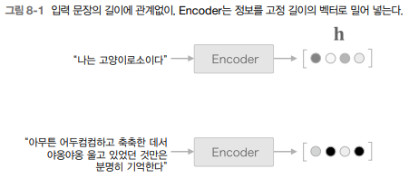

# 어텐션

## 1. 어텐션의 구조

## 1-1. seq2seq의 문제점

seq2seq에서는 Encoder가 시계열 데이터를 인코딩한다. 그리고, 인코딩된 정보를 Decoder로 전달한다. 이떄, Encoder의 출력은 고정 길이의 벡터인데 이 고정 길이라는 점이 문제가 잠재해 있다.  
아무리 긴 문장이라도 고정 길이의 벡터로 변환하는데, 너무 긴 문장이 들어오면 필요한 정보가 벡터에 다 담기지 못하게 된다.  

<div align="center">
    
</div>
<br/>

## 1-2. Encoder 개선

LSTM 계층의 마지막 은닉 상태만을 Decoder에 전달하였지만, Encoder 출력의 길이는 입력 문장의 길이에 따라 바꿔주는 것이 좋다.  
각 시각의 은닉 상태 벡터를 모두 이용하면 입력된 단어와 같은 수의 벡터를 얻을 수 있다.  
 - 만약, 주변 정보를 균형 있게 담기 위해서는 양방향 RNN이 효과적이다.

<div align="center">
    
</div>
<br/>

## 1-3. Decoder 개선

Decoder는 Encoder의 LSTM 계층의 마지막 은닉 상태만을 이용한다.  
h2 전부를 활용할 수 있도록 Decoder를 개선한다.  

<div align="center">
    
</div>
<br/>

기존의 기계 번역에서는 나 = I, 고양이 = cat 같은 단어의 대응 관계를 나타내는 얼라이먼트를 사람이 수작업으로 만들었다.  
어텐션 기술은 얼라인먼트라는 아이디어를 seq2seq에 자동으로 도입하는 데 성공했다.  

<div align="center">
    
</div>
<br/>

기존과 동일하게 Encoder의 마지막 은닉 상태 벡터를 Decoder의 첫 번째 LSTM 계층에 전달한다.  
각 시각에서 Decoder에 입력된 단어와 대응 단계인 단어의 벡터를 hs에서 골라내야 한다. 예컨대 Decoder가 "I"를 출력할 때, hs에서 "나"에 대응하는 벡터를 선택해야 한다. 그리고 이러한 선택 작업을 어떠한 계산으로 수행할 것이다.  
 - 일부 벡터만 선택하는 것은 미분이 불가능하다.
 - 일부 선택이 아닌, 모든 것을 선택하고, 가중치를 별도로 계산한다.
 - a는 확률분포처럼 각 원소가 0.0 ~ 1.0 사이의 스칼라(단일 원소)이며, 모든 원소의 총합은 1이 된다. 그리고 각 단어의 중요도를 나타내는 가중치 a와 각 단어의 벡터 hs로부터 가중합을 구하여, 원하는 벡터를 얻는다.

<div align="center">
    
</div>
<br/>

```python
import numpy as np

# 시계열의 길이 T = 5, 은닉 상태 벡터의 원소수 H = 4
T,H = 5,4
hs = np.random.randn(T,H)
a = np.array([0.8, 0.1, 0.03, 0.05, 0.02])

ar = a.reshape(5,1).repeat(4, axis=1)
print(ar.shape) # (5, 4)

t = hs * ar 
print(t.shape) # (5, 4)

# 단어 벡터 가중치 곱해서 합친 결과
c = np.sum(t, axis=0) 
print(c) # [0.6241871  1.03772847 0.41861277 0.15210266]
print(c.shape) # (4,)
```
<br/>

 - `미니배치 처리용 가중합`
```python
N, T, H  = 10, 5, 4
hs = np.random.randn(N, T, H)
a = np.random.randn(N, T)
ar = a.reshape(N, T, 1).repeat(H, axis=2)

t = hs * ar
print(t.shape) # (10, 5, 4)

c = np.sum(t, axis=1)
print(c.shape) # (10, 4)
```
<br/>

 - `Weight Sum 계층`
    - 맥락 벡터를 구하는 Weight Sum 계층
```python
class WeightSum:
    def __init__(self):
        self.params, self.grads = [],[]
        self.cache = None
        
    def forward(self, hs, a):
        N, T, H  = hs.shape
        
        ar = a.reshape(N, T, 1).repeat(H, axis=2)
        t = hs * ar
        c = np.sum(t, axis=1)
        
        self.cache = (hs, ar)
        return c

    def backward(self, dc):
        hs, ar = self.cache
        N, T, H = hs.shape
        
        dt = dc.reshape(N, 1, H).repeat(T, axis = 1) #sum의 역전파
        dar = dt * hs
        dhs = dt * ar
        da = np.sum(dar, axis=2) # repeat의 역전파
        
        return dhs, da
```
<br/>

## 1-4. Decoder 개선 2

각 단어의 중요도를 나타내는 가중치 a가 있다면, 가중합을 이용해 맥락 벡터를 얻을 수 있다.  
이떄, 각 단어의 가중치 a를 구하기 위해서는 처음으로 LSTM 계층이 은닉 상태를 출력할 떄까지의 처리부터 알아봐야 한다.  

<div align="center">
    <br/>
    h: Decoder의 LSTM 계층의 은닉 상태 벡터
</div>
<br/>

 - hs 와 h 을 내적하여 각 단어 벡터와의 유사도를 구한다.
 - s는 소프트맥스로 0.0~1.0 사이 확률값으로 치환된다.

<div align="center">
    <br/>
    
</div>
<br/>

```python
import sys
sys.path.append('..')
from common.layers import Softmax
import numpy as np

N, T, H = 10,5,4
hs = np.random.randn(N, T, H)
h = np.random.randn(N, H)
hr = h.reshape(N, 1, H).repeat(T, axis=1)

t = hs * hr
print(t.shape) # (10, 5, 4)

s = np.sum(t, axis=2)
print(s.shape) # (10, 5)

softmax = Softmax()
a = softmax.forward(s)
print(a.shape) # (10, 5)
```
<br/>

 - `AttentionWeight`
```python
class AttentionWeight:
    def __init__(self):
        self.params, self.grads = [], []
        self.softmax = Softmax()
        self.cache = None

    def forward(self, hs, h):
        N, T, H = hs.shape

        hr = h.reshape(N, 1, H)#.repeat(T, axis=1)
        t = hs * hr
        s = np.sum(t, axis=2)
        a = self.softmax.forward(s)

        self.cache = (hs, hr)
        return a

    def backward(self, da):
        hs, hr = self.cache
        N, T, H = hs.shape

        ds = self.softmax.backward(da)
        dt = ds.reshape(N, T, 1).repeat(H, axis=2)
        dhs = dt * hr
        dhr = dt * hs
        dh = np.sum(dhr, axis=1)

        return dhs, dh
```
<br/>

## 1-5. Decoder 개선

Attention Weight 계층은 Encoder가 출력하는 각 단어의 벡터 hs에 주목하여 해당 단어의 가중치 a를 구한다.  
Weight Sum 계층은 a와 hs의 가중합을 구하고, 그 결과를 맥락 벡터 c로 출력한다.  
두 계층을 하나로 결합하여 Attention 계층으로 통합한다.  

<div align="center">
    
</div>
<br/>

```python
class Attention:
    def __init__(self):
        self.params, self.grads = [], []
        # 1. 가중치 구하기
        self.attention_weight_layer = AttentionWeight() 
        # 2. 가중합 구하기
        self.weight_sum_layer = WeightSum()
        self.attention_weight = None

    def forward(self, hs, h):
        a = self.attention_weight_layer.forward(hs, h)
        out = self.weight_sum_layer.forward(hs, a)
        self.attention_weight = a
        return out

    def backward(self, dout):
        dhs0, da = self.weight_sum_layer.backward(dout)
        dhs1, dh = self.attention_weight_layer.backward(da)
        dhs = dhs0 + dhs1
        return dhs, dh
```

<div align="center">
    <br/>
    <br/>
    <br/>
    다수의 Attention 계층을 모아서 Time Attention 계층으로 구현
</div>
<br/>

```python
# 시계열 방향으로 펼쳐진 다수의 Attention 계층 구현
class TimeAttention:
    def __init__(self):
        self.params, self.grads = [], []
        self.layers = None
        self.attention_weights = None

    def forward(self, hs_enc, hs_dec):
        N, T, H = hs_dec.shape
        out = np.empty_like(hs_dec)
        self.layers = []
        # 각 Attention 계층의 각 단어 가중치 보관
        self.attention_weights = []

        # Attention 계층을 필요한 수만큼 만들기
        for t in range(T): 
            layer = Attention()
            out[:, t, :] = layer.forward(hs_enc, hs_dec[:,t,:])
            self.layers.append(layer)
            self.attention_weights.append(layer.attention_weight)

        return out

    def backward(self, dout):
        N, T, H = dout.shape
        dhs_enc = 0
        dhs_dec = np.empty_like(dout)

        for t in range(T):
            layer = self.layers[t]
            dhs, dh = layer.backward(dout[:, t, :])
            dhs_enc += dhs
            dhs_dec[:,t,:] = dh

        return dhs_enc, dhs_dec
```
<br/>

# 2. 어텐션을 갖춘 seq2seq 구현

## 2-1. Encoder 구현

기존에는 LSTM 계층의 마지막 은닉 상태 벡터만을 반환했지만, 이번에는 모든 은닉 상태를 반환한다.  

```python
import sys
sys.path.append('..')
from common.time_layers import *
from ch07.seq2seq import Encoder, Seq2seq
from ch08.attention_layer import TimeAttention

class AttentionEncoder(Encoder):
    def forward(self, xs):
        xs = self.embed.forward(xs)
        hs = self.lstm.forward(xs)
        return hs

    def backward(self, dhs):
        dout = self.lstm.backward(dhs)
        dout = self.embed.backward(dout)
        return dout
```
<br/>

## 2-2. Decoder 구현

<div align="center">
    
</div>
<br/>

```python
class AttentionDecoder:
    def __init__(self, vocab_size, wordvec_size, hidden_size):
        V, D, H = vocab_size, wordvec_size, hidden_size
        rn = np.random.randn

        embed_W = (rn(V, D) / 100).astype('f')
        lstm_Wx = (rn(D, 4 * H) / np.sqrt(D)).astype('f')
        lstm_Wh = (rn(H, 4 * H) / np.sqrt(H)).astype('f')
        lstm_b = np.zeros(4 * H).astype('f')
        affine_W = (rn(2*H, V) / np.sqrt(2*H)).astype('f')
        affine_b = np.zeros(V).astype('f')

        self.embed = TimeEmbedding(embed_W)
        self.lstm = TimeLSTM(lstm_Wx, lstm_Wh, lstm_b, stateful=True)
        self.attention = TimeAttention()
        self.affine = TimeAffine(affine_W, affine_b)
        layers = [self.embed, self.lstm, self.attention, self.affine]

        self.params, self.grads = [], []
        for layer in layers:
            self.params += layer.params
            self.grads += layer.grads
```
<br/>

## 2-3. seq2seq 구현

기존 Seq2Seq와 거의 동일하다. 다른 점으로는 Encoder 대신 AttentionEncoder 클래스를 사용하고, Decoder 대신 AttentionDecoder 클래스를 사용한다.  

```python
from ch07.seq2seq import Encoder, Seq2seq

class AttentionSeq2seq(Seq2seq):
    def __init__(self, vocab_size, wordvec_size, hidden_size):
        args = vocab_size, wordvec_size, hidden_size
        self.encoder = AttentionEncoder(*args)
        self.decoder = AttentionDecoder(*args)
        self.softmax = TimeSoftmaxWithLoss()

        self.params = self.encoder.params + self.decoder.params
        self.grads = self.encoder.grads + self.decoder.grads
```
<br/>

# 3. 어텐션 평가

## 3-1. 날짜 형식 변환 문제

영어권에서 사용되는 다양한 날짜 형식을 표준 형식으로 변환하는 것을 목표로 한다.  
 - ex) "september 27, 1994" -> "1994-09-27"

<div align="center">
    
</div>
<br/>

 - 날짜 형식 변환 데이터는 dataset/date.txt에 존재
 - 입력 문장의 길이 통일하기 위해 공백 문자로 패딩
 - 구분 문자는 _
 - 출력의 문자 수는 일정하므로 출력 구분문자는 없음

<div align="center">
    
</div>
<br/>

## 3-2. 어텐션을 갖춘 seq2seq의 학습

학습 데이터는 날짜 데이터이고, 모델은 AttentionSeq2Seq를 사용한다.  

```python
# coding: utf-8
import sys
sys.path.append('..')
sys.path.append('../ch07')
import numpy as np
import matplotlib.pyplot as plt
from dataset import sequence
from common.optimizer import Adam
from common.trainer import Trainer
from common.util import eval_seq2seq
from attention_seq2seq import AttentionSeq2seq
from ch07.seq2seq import Seq2seq
from ch07.peeky_seq2seq import PeekySeq2seq


# 데이터 읽기
(x_train, t_train), (x_test, t_test) = sequence.load_data('date.txt')
char_to_id, id_to_char = sequence.get_vocab()

# 입력 문장 반전
x_train, x_test = x_train[:, ::-1], x_test[:, ::-1]

# 하이퍼파라미터 설정
vocab_size = len(char_to_id)
wordvec_size = 16
hidden_size = 256
batch_size = 128
max_epoch = 10
max_grad = 5.0

model = AttentionSeq2seq(vocab_size, wordvec_size, hidden_size)
# model = Seq2seq(vocab_size, wordvec_size, hidden_size)
# model = PeekySeq2seq(vocab_size, wordvec_size, hidden_size)

optimizer = Adam()
trainer = Trainer(model, optimizer)

acc_list = []
for epoch in range(max_epoch):
    trainer.fit(x_train, t_train, max_epoch=1,
                batch_size=batch_size, max_grad=max_grad)

    correct_num = 0
    for i in range(len(x_test)):
        question, correct = x_test[[i]], t_test[[i]]
        verbose = i < 10
        correct_num += eval_seq2seq(model, question, correct,
                                    id_to_char, verbose, is_reverse=True)

    acc = float(correct_num) / len(x_test)
    acc_list.append(acc)
    print('정확도 %.3f%%' % (acc * 100))


model.save_params()


```
<br/>

 - 에폭마다 테스트 데이터를 사용하여 정답률을 측정한다.
 - 어텐션을 갖춘 seq2seq는 학습을 거듭할수록 점점 똑똑해진다.

```python
# 그래프 그리기
x = np.arange(len(acc_list))
plt.plot(x, acc_list, marker='o')
plt.xlabel('에폭')
plt.ylabel('정확도')
plt.ylim(-0.05, 1.05)
plt.show()
```

<div align="center">
    
</div>
<br/>

 - 이전 모델과 비교
    - 단순한 seq2seq는 전혀 쓸모가 없다.
    - '엿보기'를 사용한 Peeky는 좋은 결과를 보여주고 있다. 학습 속도로는 어텐션이 약간 우세하다.
    - 최종 정확도 측면에서는 어텐션과 Peeky가 동등하다.
    - 현실의 시계열 데이터는 길고 복잡하므로, 학습 속도뿐 아니라 정확도 역시 어텐션이 유리할 것이다.

<div align="center">
    
</div>
<br/>

## 3-3. 어텐션 시각화

Attention 계층은 각 시각의 어텐션 가중치를 인스턴스 변수로 보관하고 있어, 간편하게 시각화가 가능하다.  
 - Time Attention 계층에 attention_weight 변수로 각 시각의 어텐션 가중치가 저장
 - 이것을 사용하여 입력 문장과 출력 문장의 단어 대응 관계를 2차원 맵으로 그릴 수 있다.
 - 시각화 코드: https://github.com/WegraLee/deep-learning-from-scratch-2/blob/master/ch08/visualize_attention.py
```python
# coding: utf-8
import sys
sys.path.append('..')
import numpy as np
from dataset import sequence
import matplotlib.pyplot as plt
from attention_seq2seq import AttentionSeq2seq


(x_train, t_train), (x_test, t_test) = \
    sequence.load_data('date.txt')
char_to_id, id_to_char = sequence.get_vocab()

# 입력 문장 반전
x_train, x_test = x_train[:, ::-1], x_test[:, ::-1]

vocab_size = len(char_to_id)
wordvec_size = 16
hidden_size = 256

model = AttentionSeq2seq(vocab_size, wordvec_size, hidden_size)
model.load_params()

_idx = 0
def visualize(attention_map, row_labels, column_labels):
    fig, ax = plt.subplots()
    ax.pcolor(attention_map, cmap=plt.cm.Greys_r, vmin=0.0, vmax=1.0)

    ax.patch.set_facecolor('black')
    ax.set_yticks(np.arange(attention_map.shape[0])+0.5, minor=False)
    ax.set_xticks(np.arange(attention_map.shape[1])+0.5, minor=False)
    ax.invert_yaxis()
    ax.set_xticklabels(row_labels, minor=False)
    ax.set_yticklabels(column_labels, minor=False)

    global _idx
    _idx += 1
    plt.show()


np.random.seed(1984)
for _ in range(5):
    idx = [np.random.randint(0, len(x_test))]
    x = x_test[idx]
    t = t_test[idx]

    model.forward(x, t)
    d = model.decoder.attention.attention_weights
    d = np.array(d)
    attention_map = d.reshape(d.shape[0], d.shape[2])

    # 출력하기 위해 반전
    attention_map = attention_map[:,::-1]
    x = x[:,::-1]

    row_labels = [id_to_char[i] for i in x[0]]
    column_labels = [id_to_char[i] for i in t[0]]
    column_labels = column_labels[1:]

    visualize(attention_map, row_labels, column_labels)
```
<br/>

<div align="center">
    <br/>
    가로측: 입력문장, 세로측: 출력문장<br/>
    각 원소는 밝을수록 값이 크다(1.0에 가까움)
</div>
<br/>

# 4. 어텐션에 관한 남은 이야기

## 4-1. 양방향 RNN

LSTM의 각 시각의 은닉 상태 벡터는 hs로 모아진다.  
그리고, Encoder가 출력하는 각 행에는 그 행에 대응하는 단어의 성분이 많이 포함되어 있다.  

<div align="center">
    
</div>
<br/>

우리는 글을 왼쪽에서 오른쪽으로 읽는다. 인코딩 과정에서도 "고양이"에 대응하는 벡터에 "나", "는", "고양이" 까지 앞에 나오는 총 세 단어의 정보가 인코딩되어 들어간다.  
전체적인 균형을 위해 "고양이" 단어의 주변 정보를 균형 있게 담아야 한다.  
그래서, LSTM을 양방향으로 처리하는 방법으로 양방향 LSTM 기술이 나온다.  

<div align="center">
    
</div>
<br/>

양방향 LSTM은 기존 LSTM 계층에 더해 역방향으로 처리하는 LSTM 계층을 추가한다.  
그리고, 각 시각에서는 이 두 LSTM 계층의 은닉 상태를 연결시킨 벡터를 최종 은닉 상태로 처리한다.  
 
 - 일반적인 LSTM: 입력 문장을 왼쪽부터 오른쪽으로 처리
 - 반대 방향 LSTM: 입력 문장의 단어들을 반대 순서로 나열(오른쪽에서 왼쪽으로 처리)
    - "A B C D" -> "D C B A"
 - 두 LSTM 계층의 출력을 연결하면 양방향 LSTM 계층이 된다.
```python
class TimeBiLSTM:
    def __init__(self, Wx1, Wh1, b1,
                 Wx2, Wh2, b2, stateful=False):
        self.forward_lstm = TimeLSTM(Wx1, Wh1, b1, stateful)
        self.backward_lstm = TimeLSTM(Wx2, Wh2, b2, stateful)
        self.params = self.forward_lstm.params + self.backward_lstm.params
        self.grads = self.forward_lstm.grads + self.backward_lstm.grads

    def forward(self, xs):
        o1 = self.forward_lstm.forward(xs)
        o2 = self.backward_lstm.forward(xs[:, ::-1])
        o2 = o2[:, ::-1]

        out = np.concatenate((o1, o2), axis=2)
        return out

    def backward(self, dhs):
        H = dhs.shape[2] // 2
        do1 = dhs[:, :, :H]
        do2 = dhs[:, :, H:]

        dxs1 = self.forward_lstm.backward(do1)
        do2 = do2[:, ::-1]
        dxs2 = self.backward_lstm.backward(do2)
        dxs2 = dxs2[:, ::-1]
        dxs = dxs1 + dxs2
        return dxs
```
<br/>

## 4-2. Attention 계층 사용 방법

### 방법 1. LSTM - Attention - Affine

Attention 계층을 LSTM 계층과 Affine 계층 사이에 삽입  
 - Affine 계층이맥락 벡터 정보 이용
 - 구현이 쉽다.
 - Decoder의 데이터 흐름이 아래에서 위로 가는 한 방향으로 Attention 계층을 쉽게 모듈화할 수 있다.

<div align="center">
    
</div>
<br/>

### 방법 2. LSTM - Attention - LSTM

Attention 계층의 출력을 LSTM 계층에 입력이 되도록 연결  
 - LSTM 계층이 맥락 벡터의 정보를 이용할 수 있다.

<div align="center">
    
</div>
<br/>

## 4-3. seq2seq 심층화와 skip 연결

현실에서의 시계열 데이터는 예제 문제들보다 훨씬 복잡하다.  
어텐션을 갖춘 seq2seq에 더 높은 표현력이 요구되는데, 우선적으로 RNN 계층(LSTM)을 깊게 쌓는 방법이 있다.  

<div align="center">
    
</div>
<br/>

 - Encoder와 Decoder 3층 LSTM 계층 사용
 - Encoder와 Decoder는 같은 층수의 LSTM 계층을 이용하는 것이 일반적이다.
 - Decoder의 LSTM 계층의 은닉 상태를 Attention 계층에 입력하고, Attention 계층의 출력인 맥락 벡터를 Decoder의 여러 계층(LSTM, Affine)으로 전파한다.

층을 깊게 할 때 사용되는 중요한 기법 중에는 skip 연결이 있다. skip 연결은 계층을 넘어 선을 연결하는 단순한 기법이다.  

<div align="center">
    
</div>
<br/>

# 5. 어텐션 응용

## 5-1. 구글 신경망 기계 번역(GNMT)

구글 번역은 2016년부터 신경망 번역을 사용하고 있다.  
이 기계 번역 시스템은 구글 신경망 기계 번역(GNMT)이라 불린다.  

<div align="center">
    
</div>
<br/>

GNMT도 어텐션을 갖춘 seq2seq와 마찬가지로 Encoder와 Decoder, Attention으로 구성되어 있다.  
단순한 모델과 달리, 번역 정확도를 높이기 위한 여러 개선이 더해져있다.  
 - LSTM 계층 다층화
 - 양방향 LSTM(Encoder의 첫 번째 계층만)
 - skip 연결
 - 다수의 GPU로 분산 학습

<br/>

## 5-2. 트랜스포머

RNN은 이전 시각에 계산한 결과를 이용하여 순서대로 계산한다. 때문에 RNN의 계싼을 시간 방향으로 병렬 계산하는 것은 불가능하다. 이 점은 딥러닝 학습이 GPU를 사용한 병렬 계산 환경에서 이뤄진다는 점을 생각하면 큰 병목이 된다.  

이러한 배경에서 RNN을 없애는 연구가 활발히 이뤄지고 있는데, 그 중에서 유명한 것으로 Attention is all you need 라는 논문에서 제안한 기법인 트랜스포머 모델이 있다.  

 - RNN이 아닌 어텐션을 사용하여 처리
 - Self-Attention : 자기 자신에 대한 주목
 - 하나의 시계열 데이터 내에서 각 원소가 다른 원소들과 어떻게 관련되는지 살펴본다.

<div align="center">
    <br/>
    
</div>
<br/>

 - Encoder와 Decoder 모두에서 RNN 대신 Attention 사용
    - 학습 시간 대폭 감소
    - 병렬 처리 가능
    - 정확도 향상

<br/>

## 5-3. 뉴럴 튜링 머신(NTM)

외부 메모리를 통해 RNN의 한정적인 정보 보관량(고정 길이) 을 늘리는 방식  

 - 어텐션을 이용해 Write Head & Read Head 계층이 메모리 조작
 - 읽고 쓰는 작업을 가중치로 대체
 - 2개의 어텐션 이용
    - 콘텐츠 기반 어텐션
        - 그냥 어텐션
        - query 벡터와 비슷한 벡터를 메모리에서 찾아내줌
    - 위치 기반 어텐션
        - 이전 시각에서 주목한 메모리의 위치 기준으로 단어 전후로 이동

<div align="center">
    
</div>
<br/>

