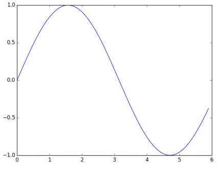

# 헬로 파이썬

## 파이썬이란?

파이썬은 과학 분야, 특히 기계학습과 데이터 과학 분야에서 널리 쓰인다. 파이썬 자체의 뛰어난 성능에 넘파이와 사이파이 같은 수치 계산과 통계 처리를 다루는 탁월한 라이브러리가 더해져 데이터 과학 분야에서 확고한 위치를 차지하고 있다. 나아가 딥러닝 프레임워크로 카페, 텐서플로, 체이너, 테아노 등 파이썬용 API가 제공된다.  

 - 간단하고 배우기 쉬운 프로그래밍 언어
 - 오픈 소스로 무료로 이용
 - 인터프리터 언어로 컴파일 과정이 없음

<br/>

## 파이썬 설치

 - `아나콘다 배포판`
    - 파이썬을 설치하는 방법은 여러가지가 있다. 아나콘다는 데이터 분석에 중점을 둔 배포판으로 설치 한 번으로 넘파이와 matplotlib을 포함해 데이터 분석에 유용한 라이브러리가 기존적으로 포함되어 있다.
    - 공식 사이트 주소: https://www.anaconda.com/distribution
```python
# 자료형
# 정수, 실수, 문자열 등이 존재한다. type() 함수로 자료형 확인 가능
type(10) # <class 'int'>
type(2.123) # <class 'float'>
type('hello') # <class 'str'>

# 변수
x = 10
y = 3.14
z = x * y

# 리스트
a = [1, 2, 3, 4, 5]
len(a) # 5: 리스트의 길이
a[0] # 1: 첫 원소의 접근
a[4] = 99 # 값 대입

# 슬라이싱
a[0:2] # [1,2] : 0 ~ 1
a[1:] # [2,3,4,99] : 1 ~ 마지막
a[:3] # [1,2,3] : 0 ~ 2
a[:-1] # [1,2,3,4] : 0 ~ 마지막 원소의 1개 앞

# 딕셔너리
# 키와 값을 쌍으로 저장
person = {
    'height': 180,
}
person['weight'] = 70 # 새원소 추가

# bool
# bool 형은 참과 거짓 중 하나를 취하며, and, or, not 연산자를 사용할 수 있다.
isValid = True
type(isValid) # <class 'bool'>
not isValid # False
isValid and False # False
isValid or False # True
```

<br/>

 - `함수 및 클래스`
```python
# 함수
def hello():
    print("Hello World!")

def hello2(msg):
    print(msg)

hello()
hello2("Hello World!")

# 클래스
class Person:
    # 생성자
    def __init__(self, name): 
        self.name = name
        print("Initialized!")
    
    # 메서드1
    def hello(self):
        print("Hello " + self.name)

person = Person("Harry")
person.hello()
```

<br/>

## 넘파이

 - `예제 코드`
    - 넘파이 배열을 만들 때는 np.array() 메서드를 이용한다.
    - 산술 연산시 원소 수가 같다면 각 원소에 대해서 행해진다. 원소 수가 다르면 오류가 발생하니 원소 수를 맞추어야 한다.
    - 넘파이 배열은 원소별 계산뿐 아니라 넘파이 배열과 수치 하나의 조합으로 된 산술 연산을 수행할 수 있다. 이 기능을 브로드캐스트라고 한다. (스칼라값과의 계싼이 넘파이 배열의 원소별 한 번씩 수행된다.)
```python
import numpy as np

# 넘파이 배열 생성
x = np.array([1.0, 2.0, 3.0])
type(x) # <class 'numpy.ndarray'>

# 넘파이 산술 연산
x = np.array([1.0, 2.0, 3.0])
y = np.array([2.0, 4.0, 6.0])
x + y # array([3., 6., 9.]) : 원소별 덧셈
x * y # array([2., 8., 18.]) : 원소별 곱셈

# 브로드 캐스트
x = np.array([1.0, 2.0, 3.0])
x / 2.0 # array([0.5, 1., 1.5])

# 넘파이 N 차원 배열
A = np.array([[1, 2], [3, 4]])
A.shape # (2, 2)
A.dtype # dtype('int64')
```

<br/>

 - `브로드캐스트`
    - 넘파이에서는 형상이 다른 배열끼리도 계산할 수 있다.
```python
>>> A = np.array([[1, 2], [3, 4]])
>>> B = np.array([[10, 20]])
>>> A * B
array([[ 10, 40],
       [ 30, 80]])
```

<div align="center">
    
</div>
<br/>

## matplotlib

딥러닝 실험에서는 그래프 그리기와 데이터 시각화가 중요하다. matplotlib은 그래프를 그려주는 라이브러리이다.  

 - `단순한 그래프 그리기`
    - arange 메서드로 [0, 0.1, 0.2, .. 5.8, 5.9] 라는 데이터를 생성한다.
```python
import numpy as np
import matplotlib.pyplot as plt

# 데이터 준비
x = np.arange(0, 6, 0.1) # 0~6까지 0.1 간격으로 생성
y = np.sin(x)

# 그래프 그리기
plt.plot(x, y)
plt.show()
```

<div align="center">
    
</div>
<br/>

 - `pyplot 기능`
```python
import numpy as np
import matplotlib.pyplot as plt

# 데이터 준비
x = np.arange(0, 6, 0.1)
y1 = np.sin(x)
y2 = np.cos(x)

# 그래프 그리기
plt.plot(x, y1, label="sin")
plt.plot(x, y2, linestyle="--", label="cos") # cos 함수는 점선으로 그리기
plt.xlabel("x") # x축 이름
plt.ylabel("y") # y축 이름
plt.title('sin & cos') # 제목
plt.legend()
plt.show()
```

<br/>

 - `이미지 표시하기`
    - pyplot에는 이미지를 표시해주는 imshow() 메서드가 존재한다.
    - 이미지를 읽어 들일 때는 matplotlib.image 모듈의 imread() 메서드를 이용한다.
```python
import matplotlib.pyplot as plt
from matplotlib.image import imread

img = imread('파일명')

plt.imshow(img)
plt.show()
```

