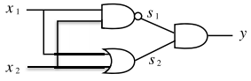

# 퍼셉트론


퍼셉트론(Perceptron)은 인공 신경망의 한 종류로, 간단한 형태의 인공 뉴런을 기반으로 합니다. 퍼셉트론은 프랑크 로젠블라트(Frank Rosenblatt)에 의해 1957년에 개발되었습니다. 이는 초기에는 이진 분류(Binary Classification)를 위한 간단한 형태의 인공 신경망으로 소개되었습니다.  

퍼셉트론은 입력값과 가중치(weight)를 곱한 것들을 합산하고, 그 결과에 편향(bias)을 더한 후, 활성화 함수(activation function)를 거쳐 출력을 내보냅니다. 이때, 출력값이 임계치(threshold)를 넘으면 1을 출력하고, 그렇지 않으면 0을 출력합니다.  

<br/>

## 퍼셉트론이란?

퍼셉트론은 다수의 신호를 입력받아 하나의 신호를 출력한다.  
전류가 전선을 타고 흐르는 전자를 내보내듯, 퍼셉트론 신호도 흐름을 만들고 정보를 앞으로 전달한다.  

x1과 x2는 입력 신호, y는 출력 신호, w1과 w2는 가중치를 뜻한다. 그림의 원을 뉴런 혹은 노드라고 부른다. 입력 신호가 뉴런에 보내질 때는 각각 고유한 가중치가 곱해진다. 뉴런에서 보내온 신호의 총합이 정해진 한계를 넘어설 때만 1을 출력한다. 그 한계를 임계값이라 하며, 0 기호로 나타낸다.  

퍼셉트론은 복수의 입력 신호 각각에 고유한 가중치를 부여하며, 가중치는 각 신호가 결과에 주는 영향력을 조절하는 요소로 작용한다. 즉, 가중치가 클수록 해당 신호가 그만큼 더 중요함을 뜻한다.  

<div align="center">
    
</div>
<br/>

## 퍼셉트론 구현하기

 - `AND 논리 회로 구현`
    - x1과 x2를 인수로 받는 AND 함수 구현
    - 매개변수 w1, w2, theta는 함수 안에서 초기화하고, 가중치를 곱한 입력의 총합이 임계값을 넘으면 1을 반환하고 그 외에는 0을 반환한다.
```python
def AND(x1, x2):
    w1, w2, theta = 0.5, 0.5, 0.7
    tmp = x1 * w1 + x2 * w2
    if tmp <= theta:
        return 0
    elif tmp > theta:
        return 1

AND(0, 0) # 0
AND(1, 0) # 0
AND(0, 1) # 0
AND(1, 1) # 1
```

<br/>

 - `가중치와 편향 도입`
    - 퍼셉트론은 입력 신호에 가중치를 곱한 값과 편향을 합하여, 그 값이 0을 넘으면 1을 출력하고 그렇지 않으면 0을 출력한다.
    - 0 (b + w1x1 + w2x2 <= 0)
    - 1 (b + w1x2 + w2x2 > 0)
```python
import numpy as np
x = np.array([0, 1]) # 입력
w = np.array([0.5, 0.5]) # 가중치
b = -0.7 # 편향
w * x # array([0., 0.5])
np.sum(w*x) # 0.5
np.sum(w*x) + b # -0.19999..
```

<br/>

 - `가중치와 편향 구현하기`
    - w1과 w2는 각 입력 신호가 결과에 주는 영향력(중요도)를 조절하는 매개변수고, 편향은 뉴런이 얼마나 쉽게 활성화 하느냐를 조정하는 매개변수이다.
    - 예를 들어, b가 -0.1이면 각 입력 신호에 가중치를 곱한 값들의 합이 0.1을 초과할 때만 뉴런이 활성화한다. 반면 b가 -20.0이면 각 입력 신호에 가중치를 곱한 값들의 합이 20.0을 넘지 않으면 뉴런은 활성화하지 않는다.
```python
def AND(x1, x2):
    x = np.array([x1, x2]) # 입력
    w = np.array([0.5, 0.5]) # 가중치
    b = -0.7 # 편향
    tmp = np.sum(w*x) + b
    if tmp <= 0:
        return 0
    else:
        return 1

def NAND(x1, x2):
    x = np.array([x1, x2])
    w = np.array([-0.5, -0.5]) # AND와는 가중치(w와 b)만 다르다
    b = 0.7
    tmp = np.sum(w*x) + b
    if tmp <= 0:
        return 0
    else:
        return 1

def OR(x1, x2):
    x = np.array([x1, x2])
    w = np.array([0.5, 0.5])
    b = -0.2
    tmp = np.sum(w*x) + b
    if tmp <= 0:
        return 0
    else:
        return 1
```

<br/>

## 퍼셉트론의 한계

XOR 게이트는 배타적 논리합이라는 논리 회로이다. x1과 x2 중 한쪽이 1일 때만 1을 출력한다.  
지금까지 본 퍼셉트론으로는 이 XOR 게이트를 구현할 수 없다.  

지금까지의 퍼셉트론은 직선으로 나뉜 두 영역을 만든다. 직선으로 나뉜 한쪽 영역은 1을 출력하고 다른 한쪽은 0을 출력한다.  
XOR 게이트를 직선 하나로 나누는 영역을 만들어낼 수 없다. 하지만, '직선'이라는 제약을 없앤다면 가능하다.  
곡선의 영역을 비선형 영역, 지선의 영역을 선형 영역이라고 한다.  

<div align="center">
    
</div>
<br/>

## 다층 퍼셉트론

XOR 게이트를 만드는 방법은 다양하다. 그중 하나는 AND, NAND, OR 게이트를 조합하는 방법이 있다.  
x1과 x2가 입력 신호, y가 출력 신호이다. x1과 x2는 NAND와 OR 게이트의 입력이 되고, NAND와 OR의 출력이 AND 게이트의 입력으로 이어진다.  

<div align="center">
    <br/>
    AND, NAND, OR 게이트 기호
</div>
<br/>

<div align="center">
    <br/>
    게이트를 조합해 구현한 XOR 게이트
</div>
<br/>

### XOR 게이트 구현

```python
def XOR(x1, x2):
    s1 = NAND(x1, x2)
    s2 = OR(x1, x2)
    y = AND(s1, s2)
    return y

XOR(0, 0) # 0
XOR(1, 0) # 1
XOR(0, 1) # 1
XOR(1, 1) # 1
```

 - `XOR의 퍼셉트론`
    - XOR는 다층 구조의 네트워크로 표현된다.
    - 지금까지 본 AND, OR 퍼셉트론은 단층 퍼셉트론인 데 반해, XOR는 2층 퍼셉트론이다.
    - 이처럼 층이 여러 개인 퍼셉트론을 다층 퍼셉트론이라 한다.

<div align="center">
    
</div>
<br/>

그림과 같이 2층 퍼셉트론에서는 0층에서 1층으로 신호가 전달되고, 이어서 1층에서 2층으로 신호가 전달된다.  
단층 퍼셉트론으로는 표현하지 못한 것을 층을 하나 늘려 구현할 수 있었다.  
이처럼 퍼셉트론은 층을 쌓아(깊게 하여) 더 다양한 것을 표현할 수 있다.  

<br/>

## 요약

 - 퍼셉트론은 입출력을 갖춘 알고리즘이다. 입력을 주면 정해진 규칙에 따른 값을 출력한다.
 - 퍼셉트론에서는 __가중치__ 와 __편향__ 을 매개변수로 설정한다.
 - 퍼셉트론으로 AND, OR 게이트 등의 논리 회로를 표현할 수 있다.
 - XOR 게이트는 단층 퍼셉트론으로는 표현할 수 없다.
 - 2층 퍼셉트론을 이용하면 XOR 게이트를 표현할 수 있다.
 - 단층 퍼셉트론은 직선형 영역만 표현할 수 있고, 다층 퍼셉트론은 비선형 영역도 표현할 수 있다.


