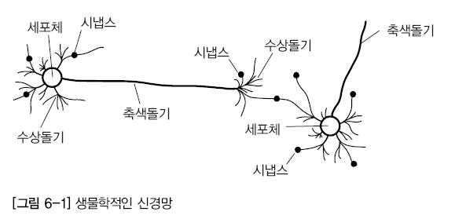

# 퍼셉트론 Blog

 - https://80000coding.oopy.io/2470b1c3-c280-4ad6-88ce-b649c2ba2196
 - https://compmath.korea.ac.kr/deeplearning/Perceptron.html
 - https://heytech.tistory.com/332
 - https://velog.io/@jhlsuper/%EC%9D%B8%EA%B3%B5%EC%A7%80%EB%8A%A5-%EC%9D%B8%EA%B3%B5-%EC%8B%A0%EA%B2%BD%EB%A7%9D

 

## 퍼셉트론이란?

인공 신경망 모형의 하나인 퍼셉트론은 1957년에 Rosenblatt라는 사람에 의해서 처음 고안된 알고리즘으로 용어적으로 Perceptron은 퍼셉션과 뉴런, 두 단어의 조합이다.  
 - Perception: 무엇을 인지하는 능력
 - Neuron: 입력 정보를 의미있는 정보로 바꿔주는 신경 세포

 

### 신경세포와 인공 뉴런

인간의 뇌에는 수십억 개 이상의 뉴런이 존재한다. 뉴런은 화학 및 전기적 신호를 처리하고 전달하는 데 관여하는 인간의 뇌에서 서로 연결된 신경 세포이다. 가지돌기는 다른 뉴런으로부터 정보를 받아 세포체를 거쳐 축삭을 통해서 다른 뉴런으로 신호를 보낸다.  

     
    

 

퍼셉트론은 다수의 입력을 받아서 하나의 신호를 출력한다. 이때 각 입력과 상호작용하는 각각의 가중치(Weight)들이 출력을 결정하게 된다.  
여기서, 가중치(Weight)들을 정하고 조정하는 작업을 기계가 한다고 볼 수 있으며, 수 많은 입력 데이터와 결과값을 활용해 훈련시키고 원하는 수준의 가중치(Weight)를 찾아내는 것이다.  

 - 신경망은 가중치를 반복적으로 조정하여 학습
 - 뉴런은 링크로 연결되어 있고, 각 링크에는 그와 연관된 수치적인 가중치가 있다.
 - 가중치는 장기 기억을 위한 기본적인 수단으로, 각 뉴런 입력 강도, 즉 중요도를 표현

     
    생물학적 뉴런 대 인공 뉴런

 

## 단층 퍼셉트론(Single-Layer Perceptron)

은닉층 없이 입력층과 출력층만 있는 경우를 단층 퍼셉트론이라 부른다. 단층 퍼셉트론은 디지털 논리 회로 개념에서 AND, NAND, OR 게이트를 구현할 수 있지만, XOR 게이트는 구현하지 못한다는 한계가 있다.  

그 이유로는 단층 퍼셉트론은 입력값에 따른 출력값을 구분짓는 직선을 1개밖에 그릴 수 없기 때문이다. 2개의 입력값과 출력값을 (x1, x2, y)와 같이 표현할 때, 입력값이 서로 다를 때만 1의 출력값을 갖는 XOR 게이트는 (0,0,0), (0,1,1), (1,0,1), (1,1,0) 으로 표현할 수 있다. x1과 x2로 2차원 좌표평면이 있을 때, 하나의 직선으로 좌표별 출력값 y을 구분지을 수 없게 된다.  

 

## 다층 퍼셉트론(Multi-Layer Perceptron, MLP)

입력층과 출력층 사이에 1개 이상의 은닉층이 있는 경우 다층 퍼셉트론이라 부른다. 다층 퍼셉트론은 단일 퍼셉트론이 XOR 게이트를 구현하지 못한다는 한계를 보완하기 위해 등장하였다.  

다층 퍼셉트론은 AND, NAND, OR 게이트를 조합하여 XOR 게이트를 구현한다. XOR 게이트는 은닉층 1개를 추가하여 구현할 수 있지만, 더욱 복잡한 문제를 해결하기 위해 2개 이상의 은닉층을 추가할 수도 있다. 이처럼 2개 이상의 은닉층을 가진 다층 퍼셉트론을 심층신경망(Deep Neural Network, DNN) 이라 부른다.  

     
    다층 퍼셉트론 
    https://commons.wikimedia.org/wiki/File:Multilayer_Neural_Network.png

 

