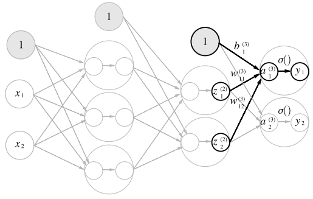

# 신경망

퍼셉트론을 여러개 쌓아 복잡한 함수도 표현할 수 있다. 하지만, 퍼셉트론은 가중치를 설정하는 작업을 사람이 수동으로 하여야 한다.  

가중치 매개변수의 적절한 값을 데이터로부터 자동으로 학습하는 능력은 신경망의 중요한 성질이다. 신경망이 입력 데이터가 무엇인지 식별하는 처리 과정을 알아본다.  

<br/>

## 퍼셉트론에서 신경망으로

신경망을 그림으로 나타내면 아래처럼 된다.  
여기에서 가장 왼쪽을 __입력층__, 중간을 __은닉층__, 오른쪽을 __출력층__ 이라고 한다. 은닉층의 뉴런은 사람 눈에는 보이지 않아 은닉층이라고 한다. 또한, 입력층을 제외하고 나머지 층의 갯수로 신경망의 층수를 정의한다. 실제 가중치를 갖는 층의 개수를 기준으로 하게 되어, 아래 그림은 2층 신경망 이라고 한다.  

<div align="center">
    
</div>
<br/>

 - `퍼셉트론 복습`
```
x1과 x2라는 두 신호를 입력받아 y를 출력하는 퍼셉트론
 - 0: b + w1x1 + w2x2
 - 1: b + w1x1 + w2x2

여기서 b는 편향을 나타내는 매개변수로, 뉴런이 얼마나 쉽게 활성화되느냐를 제어한다.
w1과 w2는 각 신호의 가중치를 나타내는 매개변수로, 각 신호의 영향력을 제어한다.
```

<br/>

 - `활성화 함수의 등장`
    - 입력 신호의 총합을 출력 신호로 변환하는 함수를 일반적으로 활성화 함수라고 한다.
    - 활성화라는 이름이 말해주듯 활성화 함수는 입력 신호의 총합이 활성화를 일으키는지를 정하는 역할을 한다.
```
y = h(b + w1x1 + w2x2)
```

가중치 신호를조합한 결과가 a라는 노드가 되고, 활성화 함수 h()를 통과하여 y라는 노드로 변환되는 과정이 나타난다.  
활성화 함수는 입력 신호의 총합이 활성화를 일으키는지(1) 아닌지(0)를 정하는 역할을 한다.  

<div align="center">
    
</div>
<br/>

## 활성화 함수


활성화 함수(Activation Function)는 인공 신경망의 각 뉴런에서 입력 신호의 가중치 합을 변환하여 출력 신호를 생성하는 함수입니다. 이 함수는 뉴런의 활성화 여부를 결정하고, 신경망이 비선형성을 학습하고 다양한 복잡한 함수를 근사할 수 있도록 도와줍니다. 활성화 함수는 주로 비선형 함수로 선택되며, 이는 신경망이 다양한 패턴과 특징을 학습할 수 있게 합니다.  

<br/>

### 시그모이드 함수

시그모이드 함수(Sigmoid Function)는 비선형 활성화 함수 중 하나로, 입력값을 0과 1 사이의 값으로 압축하는 함수입니다. 주로 이진 분류(Binary Classification) 문제에서 출력층의 활성화 함수로 사용됩니다.  

신경망에서는 활성화 함수로 시그모이드 함수를 이용하여 신호를 변환하고, 그 변환된 신호를 다음 뉴런에 전달한다.  

 - __출력 범위__: 시그모이드 함수는 항상 0과 1 사이의 값을 출력합니다. 이 특성은 이진 분류 문제에서 확률로 해석되며, 출력값이 특정 클래스에 속할 확률을 나타낼 수 있습니다.
 - __미분 가능성__: 시그모이드 함수는 연속적이며 미분 가능한 함수입니다. 이 특징은 역전파(Backpropagation)와 같은 학습 알고리즘에서 기울기를 계산하는 데 유용합니다.
 - __기울기 소실(Vanishing Gradient) 문제__: 시그모이드 함수는 입력이 큰 경우 미분값이 매우 작아져 기울기 소실 문제가 발생할 수 있습니다. 이는 깊은 신경망에서 학습이 어려울 수 있는 문제로 작용할 수 있습니다.

<div align="center">
    <br/>
    시그모이드 함수 식
</div>
<br/>

### 계단 함수 구현하기

계단 함수(Step Function)는 입력값을 기준으로 출력이 두 가지 값 중 하나로 변하는 함수입니다. 이 함수는 이진 분류 문제에서 활성화 함수로 사용될 수 있습니다. 계단 함수는 단순하게 입력값이 특정 임계값을 넘으면 하나의 값으로 출력하고, 그렇지 않으면 다른 값으로 출력합니다.  

 - 입력이 0을 넘으면 1을 출력하고, 그 외에는 0을 출력하는 함수
```python
def step_function(x):
    if x > 0:
        return 1
    else:
        return 0

# 넘파이 배열 지원
def step_function(x):
    y = x > 0
    return y.astype(np.int)
```

<br/>

### 계단 함수 그래프

정의한 계단 함수를 그래프로 그린다.  

```python
import numpy as np
import matplotlib.pylab as plt

def step_function(x):
    return np.array(x > 0, dtype=np.int)

x = np.arange(-5.0, 5.0, 0.1) # -5.0, -4.9, .. 4.9, 5.0
y = step_function(x)
plt.plot(x, y)
plt.ylim(-0.1, 1.1) # y축의 범위 지정
plt.show()
```

<div align="center">
    
</div>
<br/>

### 시그모이드 함수 구현하기

```python
import numpy as np
import matplotlib.pylab as plt

def sigmoid(x):
    return 1 / (1 + np.exp(-x))

# 시그모이드 적용 1
x = np.array([-1.0, 1.0, 2.0])
sigmoid(x) # array([0.26894142, 0.73105858, 0.88079708])

# 시그모이드 적용 및 그래프 그리기
x = np.arange(-5.0, 5.0, 0.1)
y = sigmoid(x)
plt.plot(x, y)
plt.ylim(-0.1, 1.1)
plt.show()
```

<div align="center">
    
</div>
<br/>

### 시그모이드 함수와 계단 함수 비교

시그모이드 함수와 계단 함수는 둘 다 비선형 활성화 함수로서 주로 이진 분류 문제에서 사용되지만, 그 특성과 동작 방식에 있어서 차이가 있습니다.  

시그모이드 함수는 부드러운 곡선이며 입력에 따라 출력이 연속적으로 변화한다. 한편, 계단 함수는 0을 경계로 출력이 갑자기 바뀌어버린다. 즉, 퍼셉트론에서는 뉴런 사이에 0 혹은 1이 흘렀다면, 신경망에서는 연속적인 실수가 흐른다.  

 - __연속성과 미분 가능성:__
    - 시그모이드 함수: 시그모이드 함수는 연속이며 미분 가능한 함수입니다. 이는 역전파 알고리즘과 같은 최적화 기법에서 미분을 통한 가중치 업데이트가 가능하다는 장점을 제공합니다.
    - 계단 함수: 계단 함수는 불연속이며 미분이 불가능한 함수입니다. 이는 최적화에서 미분이 필요한 경우에 제약을 가할 수 있습니다.
 - __출력 값의 범위:__
    - 시그모이드 함수: 출력 범위는 0에서 1 사이로 제한됩니다. 확률로 해석할 수 있어 이진 분류 문제에서 출력층의 활성화 함수로 적합합니다.
    - 계단 함수: 출력은 두 가지 값 중 하나로 제한됩니다. 일반적으로 0 또는 1의 값을 갖는 이진 출력에 사용됩니다.
 - __부드러움과 경사 소실 문제:__
    - 시그모이드 함수: 부드러운 S 모양의 곡선으로, 입력 값이 어떤 범위에 있더라도 항상 미분값이 존재합니다. 하지만 시그모이드 함수는 큰 입력값에 대해 기울기가 작아져 경사 소실(Vanishing Gradient) 문제가 발생할 수 있습니다.
    - 계단 함수: 불연속이며, 특히 기울기가 0인 구간이 많기 때문에 역전파 시에 기울기 소실 문제가 더욱 심화될 수 있습니다.
 - __사용 분야:__
    - 시그모이드 함수: 이진 분류 문제에서 주로 출력층의 활성화 함수로 사용됩니다.
    - 계단 함수: 주로 역사적인 이유로, 퍼셉트론과 같은 초기의 인공 신경망에서 사용되었습니다. 현재는 주로 히든 레이어의 활성화 함수로는 거의 사용되지 않습니다.

<br/>

### 비선형 함수

시그모이드 함수는 곡선, 계단 함수는 계단처럼 구부러진 직선으로 나타나며, 동시에 비선형 함수로 분류된다.  

신경망에서는 활성화 함수로 비선형 함수를 사용해야 한다. 달리 말하면 선형 함수를 사용해서는 안 되며, 그 이유로 선형 함수를 이용하면 신경망의 층을 깊게 하는 의미가 없어지기 떄문이다.  

선형 함수의 문제는 층을 아무리 깊게 해도 '은닉층이 없는 네트워크'로 똑같은 기능을 할 수 있다. 예를 들어, 선형 함수인 h(x) = cx를 활성화 함수로 사용한 3층 네트워크를 구현할 때 식으로 표현하면 y(x) = h(h(h(x)))가 된다. 이 계산은 y(x) = c*c*c*x 처럼 곱셈을 세 번 수행하지만, 실은 y(x) = ax와 똑같은 식이 된다.  

즉, 은닉층이 없는 네트워크로 표현할 수 있다. 선형 함수를 이용해서는 여러 층으로 구현하는 이점을 살릴 수 없다. 그래서 층을 쌓는 혜택을 얻고 싶다면 활성화 함수로는 반드시 비선형 함수를 사용해야 한다.  

<br/>

### ReLU 함수

기존에 신경망 분야에서 활성화 함수로 시그모이드 함수가 많이 이용되었지만, 최근에는 ReLU(Rectified Linear Unit) 함수가 많이 이용된다. ReLU는 입력이 0을 넘으면 그 입력을 그대로 출력하고, 0 이하이면 0을 출력하는 함수이다.  
 - ReLU(Rectified Linear Unit) 함수는 인공 신경망에서 널리 사용되는 비선형 활성화 함수 중 하나입니다. ReLU 함수는 입력이 양수인 경우에는 입력값을 그대로 출력하고, 음수인 경우에는 0으로 출력합니다.
 - __비선형성(Non-linearity):__ ReLU는 비선형 활성화 함수로, 여러 층의 신경망을 구성할 때 비선형성을 추가하여 네트워크가 다양한 패턴을 학습할 수 있도록 합니다.
 - __계산 효율성:__ ReLU는 입력이 양수인 경우에는 그대로 값을 출력하므로 계산이 간단하고 효율적입니다. 이는 특히 대규모 신경망에서 학습 속도를 향상시킵니다.
 - __기울기 소실 문제 감소:__ 시그모이드 함수나 하이퍼볼릭 탄젠트 함수와 같은 함수들이 가지는 기울기 소실 문제를 감소시킵니다. ReLU는 양수 영역에서는 기울기가 항상 1이기 때문에 기울기 소실 문제가 발생하지 않습니다.

```python
def relu(x):
    return np.maximum(0, x)

import matplotlib.pyplot as plt
plt.cla()
# np.linspace(start, stop, num) 함수는 start에서부터 stop까지 num 개의 숫자를 등간격으로 나눠 넘파이 배열로 반환한다.
x = np.linspace(-5.0, 5.0, 100)
y = relu(x)
plt.grid()
plt.plot(x, y)
plt.xlim(-6.0, 6.0)
plt.show()
```

<div align="center">
    
</div>
<br/>

## 다차원 배열의 계산

신경망을 효율적으로 구현하기 위해서는 넘파이의 다차원 배열을 사용한 계산법을 익히는 것이 좋다.  

 - `다차원 배열`
```python
import numpy as np

# 1차원 배열
A = np.array([1, 2, 3, 4])
A # [1 2 3 4]
np.ndim(A) # 1: 배열의 차원 수
A.shape # (4,): 배열의 형상
A.shape[0] # 4

# 2차원 배열
B = np.array([[1, 2], [3, 4], [5, 6]])
B # [[1 2] [3 4] [5 6]]
np.ndim(B) # 2: 배열의 차원 수
B.shape # (3, 2)
```

<br/>

 - `행렬의 곱`
    - 행렬 곱은 왼쪽 행렬의 행(가로)와 오른쪽 행렬의 열(세로)을 원소별로 곱하고 그 값들을 더해서 계산한다. 그리고 그 계산 결과가 새로운 다차원 배열의 원소가 된다.
    - 행렬의 곱은 넘파이 함수 np.dot() 을 이용한다.
        - 입력이 1차원 배열이면 벡터를, 2차원 배열이면 행렬 곱을 계산한다.
    - 행렬의 곱은 앞 행렬의 열수와 뒤 행렬의 행수가 같을 때 연산이 가능하다.
        - 다차원 배열을 곱하려면 두 행렬의 대응하는 차원의 원소 수를 일치시켜야 한다.
        - 계산 결과인 행렬 C의 형상은 행렬 A의 행 수와 행렬 B의 열수가 된다.
```python
A = np.array([[1, 2], [3, 4]])
A.shape # (2, 2)

B = np.array([[5, 6], [7, 8]])
B.shape # (2, 2)

np.dot(A, B) # array([[19, 22], [43, 50]])
```

<div align="center">
    
</div>
<br/>

 - `신경망에서의 행렬 곱`
    - X는 입력값, W는 가중치, Y는 출력값을 나타낸다.
```python
X = np.array([1, 2]) # 입력값 (2,)
W = np.array([[1, 3, 5], [2, 4, 6]]) # 가중치 (2,3)
Y = np.dot(X, W) # 출력값
print('Y=', Y) # [5 11 17]
```

<div align="center">
    
</div>
<br/>

## 3층 신경망 구현하기

<div align="center">
    <br/>
    입력층 2개, 첫 은닉층 3개, 두번째 은닉층 2개, 출력층 2개
</div>
<br/>

### 표기법

계산의 편의를 위해 아래와 같은 표기법을 정의한다.  

<div align="center">
    
</div>
<br/>

### 각 층의 신호 전달 구현

<div align="center">
    
</div>
<br/>

첫 번째 은닉층(1층)의 계산식은 다음과 같다.  
a1은 가중치를 곱한 신호 두 개와 편향을 합해서 계산한다.  
여기서, 행렬의 곱을 이용하면 1층의 가중치 부분을 간소화하여 표현할 수 있다.  

<div align="center">
    <br/>
    a1 수식 <br/>
    <br/>
    행렬의 곱으로 간소화 표현<br/>
    <br/>
    A, X, B, W<br/>
</div>
<br/>

```python
X = np.array([1.0, 0.5])
W1 = np.array([[0.1, 0.3, 0.5], [0.2, 0.4, 0.6]])
B1 = np.array([0.1, 0.2, 0.3])

A1 = np.dot(X, W1) + B1
```

 - `활성화 함수 처리 그림`
    - 은닉층에서의 가중치 합을 a로 표기하고 활성화 함수 h()로 변환된 신호를 z로 표기한다.
    - 여기서 활성화 함수로 시그모이드 함수를 사용한다.
```python
Z1 = sigmoid(A1)

print(A1) # [0.3, 0.7, 1.1]
print(Z1) # [0.57444252, 0.66818777, 0.75026011]
```

<div align="center">
    
</div>
<br/>

<br/>

 - `1층에서 2층으로의 신호 전달`
    - 1층의 출력 Z1이 2층의 입력이 된다. [np.dot(Z1, W2) + B2]
```python
W2 = np.array([[0.1, 0.4], [0.2, 0.5], [0.3, 0.6]])
B2 = np.array([0.1, 0.2])

A2 = np.dot(Z1, W2) + B2
Z2 = sigmoid(A2)
```
<div align="center">
    
</div>
<br/>

 - `2층에서 출력층으로의 신호 전달`
    - 2층의 출력 Z2이 3층의 입력이 된다. [np.dot(Z2, W3) + B3]
    - 항등 함수인 identity_function()을 정의하고, 이를 출력층의 활성화 함수로 이용한다.
```python
def identity_function(x):
    return x

W3 = np.array([[0.1, 0.3], [0.2, 0.4]])
B3 = np.array([0.1, 0.2])

A3 = np.dot(Z2, W3) + B3
Y = identity_function(A3)
```

<div align="center">
    
</div>
<br/>

### 구현 정리

 - `구현 정리 코드`
    - 신경망 구현의 관례에 따라 가중치만 W1과 같이 대문자로 쓰고, 그 외 편향과 중간 결과 등은 모두 소문자를 사용한다.
```python
# 딕셔너리 변수(network)에 가중치와 편향 초기화
def init_network():
    network = {}
    network['W1'] = np.array([[0.1, 0.3, 0.5], [0.2, 0.4, 0.6]])
    network['b1'] = np.array([0.1, 0.2, 0.3])

    network['W2'] = np.array([[0.1, 0.4], [0.2, 0.5], [0.3, 0.6]])
    network['b2'] = np.array([0.1, 0.2])

    network['W3'] = np.array([[0.1, 0.3], [0.2, 0.4]])
    network['b3'] = np.array([0.1, 0.2])

    return network

# 순방향 처리
def forward(network, x):
    W1, W2, W3 = network['W1'], network['W2'], network['W3']
    b1, b2, b3 = network['b1'], network['b2'], network['b3']

    # 0층(입력층)에서 1층으로 신호 전달
    a1 = np.dot(x, W1) + b1
    z1 = sigmoid(a1)

    # 1층에서 2층으로 신호 전달
    a2 = np.dot(z1, W2) + b2
    z2 = sigmoid(a2)

    # 2층에서 3층(출력층)으로 신호 전달
    a3 = np.dot(z2, W3) + b3
    y = identity_function(a3)

    return y

network = init_network()
x = np.array([1.0, 0.5])
y = forward(network, x)
print(y)
```

<br/>

## 출력층 설계하기

신경망은 회귀와 분류 모두 이용할 수 있다. 다만, 둘 중 어떤 문제냐에 따라 출력층에서 사용하는 활성화 함수가 달라진다. 일반적으로 __회귀에는 항등 함수__ 를 사용하고, __분류에는 소프트맥스 함수__ 를 사용한다.  

<br/>

## 항등 함수와 소프트맥스 함수 구현하기

항등은 입력과 출력이 항상 같다는 뜻으로 항등 함수는 입력을 그대로 출력한다. 그래서 출력층에서 항등 함수를 사용하면 입력 신호가 그대로 출력 신호가 된다.  

한편, 분류에서 사용하는 소프트맥스 함수 식은 다음과 같다.  
exp(x)는 지수 함수를 뜻한다. n은 출력층의 뉴런 수, yk는 그중 k번쨰 출력임을 뜻한다.  

```python
def softmax(a):
    exp_a = np.exp(a) # 지수 함수
    sum_exp_a = np.sum(exp_a) # 지수 함수의 합
    y = exp_a / sum_exp_a

    return y
```

<div align="center">
    <br/>
    
</div>
<br/>

### 소프트맥스 함수 구현시 주의점

소프트맥스 함수를 파이썬 함수를 이용하여 쉽게 구현할 수 있다. 하지만, 컴퓨터 계산할 때 오버플로 문제를 주의해야 한다. 소프트맥스 함수는 지수 함수를 사용하는데, 지수 함수는 쉽게 아주 큰 값을 반환한다. e^10은 20,000이 넘는 값이고, e^100은 0이 40개가 넘는 큰 값이 되고, e^1000은 무한대를 뜻하는 inf 값이 된다. 이러한 큰 값끼리 나눗셈을 하면 결과 수치가 불안정해진다.  
 - 컴퓨터는 수를 4바이트나 8바이트와 같이 크기가 유한한 데이터로 다룬다.
 - 즉, 표현할 수 있는 수의 범위가 한정되어 너무 큰 값은 표현할 수 없다.

<br/>

이 문제를 해결하기 위해 소프트맥스 함수를 아래처럼 개선해야 한다.  

<div align="center">
    
</div>
<br/>

첫 번째 변형으로 C라는 임의의 정수를 분자와 분모 양쪽에 곱한다.  
그 다음으로 C를 지수 함수 exp() 안으로 옮겨 logC로 만든다.  
마지막으로 logC를 C' 이라는 새로운 기호로 바꾼다. (C'=logC)  

```python
def softmax(a):
    c = np.max(a)
    exp_a = np.exp(a - c) # 오버플로 대책
    sum_exp_a = np.sum(exp_a)
    y = exp_a / sum_exp_a

    return y
```

<br/>

### 소프트맥스 함수 특징

소프트맥스 함수의 출력은 0에서 1.0 사이의 실수가 되며, 소프트맥스 함수의 총합은 1이 된다.  

이러한 성질 덕분에 소프트맥스 함수의 출력을 __확률__ 로 해석할 수 있다. "n번째 원소의 확률이 가장 높으니, 답은 n번째 클래스다" 라고 할 수 있다. 즉, 소프트맥스 함수를 이용함으로써 문제를 확률적(통계적)으로 대응할 수 있게 된다.  

```python
a = np.array([0.3, 2.9, 4.0])
y = softmax(a)
print(y) # [ 0.01821127 0.24519181 0.73659691]
np.sum(y) # 1.0
```

<br/>

### 출력층의 뉴런 수 정하기

출력층의 뉴런 수는 풀려는 문제에 맞게 적절히 정해야 한다. 분류에서는 분류하고 싶은 클래스 수로 설정하는 것이 일반적이다. 예를 들어, 입력 이미지를 0부터 9로 분류하는 문제라면 출력층의 노드 수는 분류할 이미지의 갯수와 같게 10으로 설정한다.  

<div align="center">
    
</div>
<br/>

## 손글씨 숫자 인식

신경망 구조를 응용할 수 있는 문제로 손그맀 분류를 다룬다. 이미 학습된 매개변수를 사용하여 학습 과정을 생략하고, 추론 과정만을 구현한다.  

기계학습과 마찬가지로 신경망도 두 단계를 거쳐 문제를 해결한다. 먼저 훈련 데이터를 사용해 가중치 매개변수를 학습하고, 추론 단계에서는 앞서 학습한 매개변수를 사용하여 입력 데이터를 분류한다.  

 - 깃허브 주소: https://github.com/WegraLee/deep-learning-from-scratch

<br/>

### MNIST 데이터셋

MNIST는 기계학습 분야에서 자주 사용되는 손글씨 숫자 이미지를 모아 놓은 집합이다. MNIST 데이터셋은 0부터 9까지 숫자 이미지로 구성되며 훈련 이미지 60,000장, 시험 이미지 10,000장으로 이루어져 있다.  

MNIST 이미지 데이터는 28x28 크기의 회색조 이미지이며 각 픽셀은 0부터 255까지의 값으로 이루어져있다. 각 이미지에는 그 이미지가 실제 의미하는 숫자 레이블이 함께 붙어 있다.  

 - `데이터 가져오기`
    - mnist.py 파일에 정의된 load_mnist() 함수를 이용하면 MNIST 데이터를 쉽게 가져올 수 있다.
    - load_mnist 함수
        - normalize 인수는 입력 이미지의 픽셀 값을 0.0 ~ 1.0 사이의 값으로 정규화할지 정한다. False로 설정하면 입력 이미지의 픽셀은 원래 값 그대로 0~255 사이의 값을 유지한다.
        - flatten 인수는 입력 이미지를 평탄하게, 즉 1차원 배열로 만들지를 정한다. False로 설정하면 입력 이미지를 1 * 28 * 28의 3차원 배열로, True로 설정하면 784개의 원소로 이루어진 1차원 배열로 저장한다.
        - one_hot_label 인수는 레이블을 원-핫 인코딩 형태로 저장할지 정한다.
```python
# coding: utf-8
import sys, os
sys.path.append(os.pardir)  # 부모 디렉터리의 파일을 가져올 수 있도록 설정
from dataset.mnist import load_mnist

if __name__ == '__main__':
    (x_train, t_train), (x_test, t_test) = load_mnist(flatten=True, normalize=False)

    # 각 데이터의 형상 출력
    print(x_train.shape) # (60000, 784)
    print(t_train.shape) # (60000,)
    print(x_test.shape) # (10000, 784)
    print(t_test.shape) # (10000,)
```

<br/>

 - `데이터 확인`
    - 데이터를 확인하기 위해 MNIST 이미지를 화면에 불러온다.
    - 이미지 표시에는 PIL 모듈을 사용한다.
    - flatten 옵션을 True로 설정해 읽어 들인 이미지는 1차원 넘파이 배열로 저장되어 있다. 그래서 이미지를 표시할 때는 원래 형상인 28 * 28 크기로 다시 변형해야 한다. reshape() 메서드에 원하는 형상을인수로 지정하면 넘파이 배열의 형상을 바꿀 수 있다.
    - 또한, 넘파이로 저장된 이미지 데이터를 PIL용 데이터 객체로 변환해야한다.
```python
# coding: utf-8
import sys, os
sys.path.append(os.pardir)  # 부모 디렉터리의 파일을 가져올 수 있도록 설정
import numpy as np
from dataset.mnist import load_mnist
from PIL import Image


def img_show(img):
    pil_img = Image.fromarray(np.uint8(img))
    pil_img.show()

(x_train, t_train), (x_test, t_test) = load_mnist(flatten=True, normalize=False)

img = x_train[0]
label = t_train[0]
print(label)  # 5

print(img.shape)  # (784,)
img = img.reshape(28, 28)  # 형상을 원래 이미지의 크기로 변형
print(img.shape)  # (28, 28)

img_show(img)
```

<br/>

### 신경망의 추론 처리

MNIST 데이터셋을 가지고 추론을 수행하는 신경망을 구현한다.  
이 신경망은 입력층 뉴런 784개, 출력층 뉴런 10개로 구성한다. 입력층 뉴런이 784개인 이유는 이미지 크기가 28 * 28(784)이기 떄문이고, 출력층 뉴런이 10개인 이유는 이 문제가 0~9 까지의 숫자를 구분하는 문제이기 때문이다.  
또한, 은닉층은 총 두 개로, 첫 번째 은닉층에는 50개 뉴런, 두 번째 은닉층에는 100개 뉴런을 배치한다. (임의의 값)  

 - `neuralnet_mnist.py`
```python
# coding: utf-8
import sys, os
sys.path.append(os.pardir)  # 부모 디렉터리의 파일을 가져올 수 있도록 설정
import numpy as np
import pickle
from dataset.mnist import load_mnist
from common.functions import sigmoid, softmax

# 데이터 로드
def get_data():
    (x_train, t_train), (x_test, t_test) = load_mnist(normalize=True, flatten=True, one_hot_label=False)
    return x_test, t_test

# 학습된 가중치 매개변수 읽기
def init_network():
    with open("sample_weight.pkl", 'rb') as f:
        network = pickle.load(f)
    return network


def predict(network, x):
    W1, W2, W3 = network['W1'], network['W2'], network['W3']
    b1, b2, b3 = network['b1'], network['b2'], network['b3']

    a1 = np.dot(x, W1) + b1
    z1 = sigmoid(a1)
    a2 = np.dot(z1, W2) + b2
    z2 = sigmoid(a2)
    a3 = np.dot(z2, W3) + b3
    y = softmax(a3)

    return y

# 1. 데이터 로드
x, t = get_data()

# 2. 학습된 가중치 매개변수 읽기
network = init_network()

accuracy_cnt = 0
for i in range(len(x)):
    # 3-1. X에 저장된 이미지 데이터를 1개씩 꺼내 predict() 함수로 분류
    y = predict(network, x[i]) # 각 레이블의 확률을 넘파이 배열로 반환

    # 3-2. 배열에서 값이 가장 큰 원소의 인덱스 가져오기 (가장 높은 확률 값)
    p = np.argmax(y) # 확률이 가장 높은 원소의 인덱스를 얻는다.

    # 3-3. 예측값과 결과값이 동일한 경우 카운트 +1
    if p == t[i]:
        accuracy_cnt += 1

print("Accuracy:" + str(float(accuracy_cnt) / len(x)))
```

<br/>

### 배치 처리

 - `신경망 각 층의 가중치 형상 확인`
```python
for key, val in network.items():
  print('키: {}, 값의 크기: {}'.format(key, val.shape))

키: b1, 값의 크기: (50,)
키: b2, 값의 크기: (100,)
키: b3, 값의 크기: (10,)
키: W1, 값의 크기: (784, 50)
키: W2, 값의 크기: (50, 100)
키: W3, 값의 크기: (100, 10)

```

<div align="center">
    
</div>
<br/>

이미지 데이터 1장을 입력했을 때 흐름으로 원소 784개로 구성된 1차원 배열이 입력되어 마지막에는 원소가 10개인 1차원 배열이 출력된다.  

이미지 여러 장을 한 번에 계산하면 더 효율적이게 된다. 가령 이미지 100개를 묶어 predict() 함수에 한 번에 넘기면, x의 형상을 100 * 784로 바꿔서 100장 분량의 데이터를 하나의 입력 데이터로 표현하면 된다.  

입력 데이터의 형상은 100 * 784, 출력 데이터의 형상은 100 * 10이 된다. 이는 100장 분량 입력 데이터의 결과가 한 번에 출력됨을 나타낸다. 가령 x[0], y[0]에는 0번째 이미지와 그 추론 결과가 들어가고, x[1]과 y[1]에는 1번째 이미지와 그 결과가 저장될 것이다.  

<div align="center">
    
</div>
<br/>

 - `neuralnet_mnist_batch.py`
```python
# coding: utf-8
import sys, os
sys.path.append(os.pardir)  # 부모 디렉터리의 파일을 가져올 수 있도록 
import numpy as np
import pickle
from dataset.mnist import load_mnist
from common.functions import sigmoid, softmax

# 데이터 로드
def get_data():
    (x_train, t_train), (x_test, t_test) = load_mnist(normalize=True, flatten=True, one_hot_label=False)
    return x_test, t_test

# 학습된 가중치 매개변수 읽기
def init_network():
    with open("sample_weight.pkl", 'rb') as f:
        network = pickle.load(f)
    return network


def predict(network, x):
    w1, w2, w3 = network['W1'], network['W2'], network['W3']
    b1, b2, b3 = network['b1'], network['b2'], network['b3']

    a1 = np.dot(x, w1) + b1
    z1 = sigmoid(a1)
    a2 = np.dot(z1, w2) + b2
    z2 = sigmoid(a2)
    a3 = np.dot(z2, w3) + b3
    y = softmax(a3)

    return y


# 1. 데이터 로드
x, t = get_data()

# 2. 학습된 가중치 매개변수 읽기
network = init_network()

batch_size = 100 # 배치 크기
accuracy_cnt = 0

for i in range(0, len(x), batch_size):
    # 3-1. X에 저장된 이미지 데이터를 Batch Size개씩 꺼내 predict() 함수로 분류
    x_batch = x[i:i+batch_size]
    y_batch = predict(network, x_batch)

    # 3-2. 배열에서 값이 가장 큰 원소의 인덱스 가져오기 (가장 높은 확률 값)
    p = np.argmax(y_batch, axis=1)

    # 3-3. 예측값과 결과값이 동일한 경우 카운트 +1
    accuracy_cnt += np.sum(p == t[i:i+batch_size])

print("Accuracy:" + str(float(accuracy_cnt) / len(x)))
```

<br/>

## 요약

 - 신경망에서는 활성화 함수로 시그모이드 함수와 ReLU 함수 같은 매끄럽게 변화하는 함수를 이용한다.
 - 넘파이의 다차원 배열을 잘 사용하면 신경망을 효율적으로 구현할 수 있다.
 - 기계학습 문제는 크게 회귀와 분류로 나눌 수 있다.
 - 출력층의 활성화 함수로는 회귀에서는 주로 항등 함수, 분류에서는 소프트맥스 함수를 이용한다.
 - 분류에서는 출력층의 뉴런 수를 분류하려는 클래스 수와 같게 설정한다.
 - 입력 데이터를 묶은 것을 배치라 하며, 추론 처리를 이 배치 단위로 진행하면 결과를 훨씬 빠르게 얻을 수 있다.

