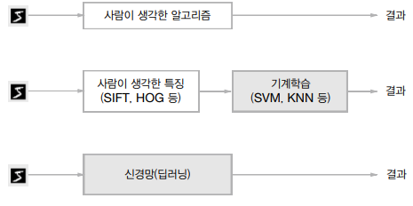
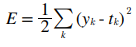

# 신경망 학습

## 데이터에서 학습

신경망의 특징은 데이터를 보고 학습할 수 있다는 점인데, 이것은 가중치 매개변수의 값을 데이터를 보고 자동으로 결정하는 뜻이다.  
실제 신경망에서는 수천, 수만의 매개변수가 설정되어야 한다. 나아가 층을 깊게 한 딥러닝이 되면 그 수는 수억에 이를 수도 있다.  
즉, 매개변수를 수작업으로 정한다는 것은 아예 불가능하다.  

<br/>

### 데이터 주도 학습

보통 어떤 문제를 해결하려 할 때, 사람이 직접 어떠한 규칙성과 패턴을 찾거나, 경험과 직관을 단서로 시행착오를 거듭하며 일을 진행한다. 반면, 기계학습에서는 사람의 개입을 최소화하고 수집한 데이터로부터 패턴을 찾으려 시도한다.  

예를 들어, 자유분방한 손글씨에서 숫자 '5'를 구분하는 프로그램을 구현하는 것이 목표이라고 가정했을 때 사람이라면 어렵지 않게 인식할 수 있다. 하지만, 그 안에 숨은 규칙성을 명확한 로직으로 풀기는 쉽지 않고 만만치 않다. '5'를 인식하는 알고리즘을 설계하는 대신, 주어진 데이터를 잘 활용하여 해결하고 싶어진다.  

그런 방법의 하나로, 이미지에서 특징을 추출하고 그 특징의 패턴을 기계학습 기술로 학습하는 방법이 있다. 특징은 입력 데이터에서 본질적인 데이터를 정확하게 추출할 수 있도록 설계된 변환기를 가리킨다. 이미지의 특징은 보통 벡터로 기술하고, 컴퓨터 비전 분야에서 SIFT, SURF, HOG 등의 특징을 많이 사용한다. 이런 특징을 사용하여 이미지 데이터를 벡터로 변환하고, 변환된 벡터를 가지고 지도 학습 방식의 대표 분류 기법인 SVM, KNN 등으로 학습할 수 있다.  

이와 같이 기계학습은 모아진 데이터로부터 규칙을 찾아내는 역할을 기계가 담당한다. 다만, 이미지를 벡터로 변환할 떄 사용하는 특징은 여전히 사람이 설계해야 한다. 쉽게, 문제에 적합한 특징을 쓰지 않으면 좋지 않은 결과를 얻게 된다.  

다만, 신경망은 이미지를 있는 그대로 학습한다. 즉, 이미지에 포함된 중요한 특징까지도 기계가 스스로 학습하게 된다.  

<div align="center">
    
</div>
<br/>

### 훈련 데이터와 시험 데이터

기계학습 문제는 데이터를 훈련 데이터와 시험 데이터로 나눠 학습과 실험을 수행하는 것이 일반적이다. 우선, 훈련 데이터만 사용하여 학습하면서 최적의 매개변수를 찾는다. 이후 다음 시험 데이터를 사용하여 앞서 훈련한 모델의 실력을 평가한다.  

<br/>

## 손실 함수

손실 함수(Loss Function)는 머신러닝 및 딥러닝 모델에서 학습 중에 모델의 예측값과 실제값 간의 차이를 측정하는 함수입니다. 손실 함수의 값은 모델이 얼마나 정확한지를 나타내며, 학습 중에 이 값을 최소화하는 것이 모델의 목표입니다.  

모델이 예측한 값과 실제 값 사이의 차이, 즉 오차를 측정하여 손실을 계산합니다. 이 손실을 최소화하는 방향으로 모델의 파라미터를 조정하여 모델을 향상시키는 것이 학습의 주요 목표입니다.  

<br/>

### 오차제곱합

오차제곱합(Sum of Squared Errors, SSE)은 회귀 모델에서 예측값과 실제값 간의 오차를 측정하는 방법 중 하나입니다. 회귀 분석에서 모델의 성능을 평가하고 최적화하는 데 자주 사용되는 손실 함수 중 하나입니다.  

오차제곱합은 각 데이터 포인트에서 예측값과 실제값 간의 차이를 제곱한 후 모두 합한 값으로 정의됩니다.  

<div align="center">
    <br/>
    오차제곱합<br/>
    yk는 신경망의 출력, tk는 정답 레이블, k는 데이터의 차원수
</div>
<br/>

 - `오차제곱합 예시`
    - 첫 번쨰 추정 결과가 오차가 더 작다. 즉, 정답에 더 가까운 것으로 판단한다.
```python
def sum_squares_error(y, t):
    return 0.5 * np.sum((y-t) ** 2)

# 정답은 '2'
t = [0, 0, 1, 0, 0, 0, 0, 0, 0, 0]

# '2'일 확률이 가장 높다고 추정
y = [0.1, 0.05, 0.6, 0.0, 0.05, 0.1, 0.0, 0.1, 0.0, 0.0]
sum_squares_error(np.array(y), np.array(t)) # 0.0975..

# '7'일 확률이 가장 높다고 추정
y = [0.1, 0.05, 0.1, 0.0, 0.05, 0.1, 0.0, 0.6, 0.0, 0.0]
sum_squares_error(np.array(y), np.array(t)) # 0.5975..
```

<br/>

### 교차 엔트로피 오차

교차 엔트로피 오차(Cross-Entropy Error)는 주로 분류 문제에서 사용되는 손실 함수 중 하나입니다. 이는 모델의 예측 확률 분포와 실제 데이터의 확률 분포 간의 차이를 측정하여 모델의 성능을 평가하는 데 사용됩니다.  

<div align="center">
    <br/>
    교차 엔트로피 오차<br/>
    yk 신경망의 출력, tk는 정답 레이블, tk는 정답에 해당하는 인덱스만 1이고 나머지는 0이다.
</div>
<br/>

x가 1일 때 y는 0이 되고, x가 0에 가까워질수록 y의 값은 점점 작아진다.  
정답에 해당하는 출력이 커질수록 0에 다가가다가, 그 출력이 1일 때 0이 된다.  
반대로, 정답일 때의 출력이 작아질수록 오차는 커진다.  

<br/>

 - `오차 엔트로피 예제 코드`
    - 엔트로피 오차가 더 작은 첫 번쨰 추정이 정답일 가능성이 높다.
```python
def cross_entropy_error(y, t):
    delta = 1e-7
    return -np.sum(t * np.log(y + delta))

t = [0, 0, 1, 0, 0, 0, 0, 0, 0, 0]
y = [0.1, 0.05, 0.6, 0.0, 0.05, 0.1, 0.0, 0.1, 0.0, 0.0]
cross_entropy_error(np.array(y), np.array(t)) # 0.5108..

y = [0.1, 0.05, 0.1, 0.0, 0.05, 0.1, 0.0, 0.6, 0.0, 0.0]
cross_entropy_error(np.array(y), np.array(t)) # 2.3025..
```

<br/>

### 미니배치 학습

 - `MNIST 데이터셋 읽기`
    - 훈련 데이터는 60,000개이고, 입력 데이터는 784열(28*28)인 이미지 데이터이다.
    - 정답 레이블은 10줄짜리 데이터이다.
```python
import sys, os
sys.path.append(os.pardir)
import numpy as np
from dataset.mnist import load_mnist

(x_train, t_train), (x_test, t_test) = \
    load_mnist(normalize=True, one_hot_label=True)

print(x_train.shape) # (60000, 784)
print(t_train.shape) # (60000, 10)

# 무작위로 10장 추출
train_size = x_train.shape[0]
batch_size = 10
batch_mask = np.random.choice(train_size, batch_size)
x_batch = x_train[batch_mask]
t_batch = t_train[batch_mask]

```

<br/>

### 교차 엔트로피 오차 구현하기

 - `배치용 교차 엔트로피 오차`
    - 데이터 하나당 교차 엔트로피 오차를 구하는 경우 reshape 함수로 데이터의 형삭을 바꿔준다. 그리고 배치의 크기로 나눠 정규화하고 이미지 1장당 평균의 교차 엔트로피 오차를 계산한다.
```python
def cross_entropy_error(y, t):
    if y.ndim == 1:
        t = t.reshape(1, t.size) # 정답 레이블
        y = y.reshape(1, y.size) # 신경망의 출력

    batch_size = y.shape[0]
    return -np.sum(t * np.log(y + 1e-7)) / batch_size
```

<br/>

## 수치 미분

수치 미분(Numerical Differentiation)은 함수의 도함수(미분) 값을 근사적으로 계산하는 방법 중 하나입니다. 미분은 함수에서 한 지점에서의 기울기를 나타냅니다. 수치 미분은 함수의 작은 변화에 대한 근사적인 기울기를 계산함으로써 미분 값을 추정합니다.  

해석적 미분은 수학 시간에 배운 미분이고, 수치 미분은 이를 근사치로 계산하는 방법이다.  

```python
import numpy as np
import matplotlib.pylab as plt

def function_1(x):
    return 0.01 * x ** 2 + 0.1 * x

x = np.arange(0.0, 20.0, 0.1)
y = function_1(x)
plt.xlabel("x")
plt.ylabel("f(x)")
plt.plot(x, y)
plt.show()
```

<br/>

### 편미분

편미분은 변수가 하나인 미분과 마찬가지로 특정 장소의 기울기를 구한다.  
단, 여러 변수 중 목표 변수 하나에 초점을 맞추고 다른 변수는 값을 고정한다.  


```python
def function_2(x):
    return x[0] ** 2 + x[1] ** 2
```

<br/>

## 기울기

모든 변수의 편미분을 벡터로 정리한 것을 기울기라고 한다.  

```python
def numerical_gradient(f, x):
    h = 1e-4 # 0.0001
    grad = np.zeros_like(x) # x와 형상이 같은 배열을 생성

    for idx in range(x.size):
        tmp_val = x[idx]
        # f(x+h) 계산
        x[idx] = tmp_val + h
        fxh1 = f(x)

        # f(x-h) 계산
        x[idx] = tmp_val - h
        fxh2 = f(x)

        grad[idx] = (fxh1 - fxh2) / (2 * h)
        x[idx] = tmp_val # 값 복원

    return grad
```

### 경사법(경사 하강법)

경사법(Gradient Descent)은 함수의 최솟값을 찾는 최적화 알고리즘 중 하나입니다. 경사법은 현재 위치에서 함수의 기울기(경사)를 계산하고, 그 기울기의 반대 방향으로 이동함으로써 함수의 최솟값을 찾아가는 방법입니다.  

경사법은 현 위치에서 기울어진 방향으로 일정 거리만큼 이동한다. 그런 다음 이동한 곳에서도 마찬가지로 기울기를 구하고, 또 그 기울어진 바얗ㅇ으로 나아가기를 반복한다. 이렇게 해서 함수의 값을 점차 줄이는 것이 경사법이다.  
 - 기계학습 문제 대부분은 학습 단계에서 최적의 매개변수를 찾아낸다. 여기서 최적이란 손실 함수가 최솟값이 될 때의 매개변수 값이다.

```python
# init_x는 초깃값, lr은 learning rate를 의미하는 학습률
# step_num은 경사법에 따른 반복 횟수
def gradient_descent(f, init_x, lr=0.01, step_num=100):
    x = init_x

    for i in range(step_num):
        # 함수의 기울기는 numerical_gradient(f, x)로 구한다.
        grad = numerical_gradient(f, x)

        # 기울기에 학습률을 곱한 값을 ㅗ갱신 처리
        x -= lr * grad
    
    return x
```

