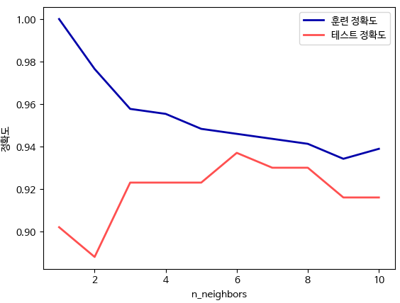

# k-최근접 이웃

K-NN 알고리즘은 가장 가까운 훈련 데이터 포인트 하나를 최근접 이웃으로 찾아 예측에 사용한다.  
가장 가까운 이웃은 하나가 아니라 임의의 k개가 선택될 수 있다. 때문에, k-최근접 이웃 알고리즘이라 불리며, 둘 이상의 이웃을 선택할 때는 레이블을 정하기 위해 투표를 한다.  
즉, 테스트 포인트 하나에 대해 클래스 0에 속한 이웃이 몇 개인지, 그리고 클래스 1에 속한 이웃이 몇 개인지를 센다. 그리고 이웃이 더 많은 클래스를 레이블로 지정한다.  

```python
mglearn.plots.plot_knn_classification(n_neighbors=3)
```

<div align="center">
    
</div>
<br/>

 - `k-최근접 이웃 사용 예시`
```python
# 일반화 성능을 평가할 수 있도록 데이터를 훈련 셋과 테스트 셋으로 나눈다.
from sklearn.model_selection import train_test_split
X, y = mglearn.datasets.make_forge()

X_train, X_test, y_train, y_test = train_test_split(X, y, random_state=0)

# KNN 알고리즘을 제공하는 함수를 임포트한다.
from sklearn.neighbors import KNeighborsClassifier
clf = KNeighborsClassifier(n_neighbors=3)

# 훈련 셋을 사용하여 분류 모델을 학습시킨다.
clf.fit(X_train, y_train)

# 테스트 데이터에 대해 predict 메서드를 호출해 예측한다. 또한, 얼마나 잘 일반화되었는지 평가하기 위해 score 메서드를 사용한다.
print("테스트 세트 예측:", clf.predict(X_test))
print("테스트 세트 정확도: {:.2f}".format(clf.score(X_test, y_test))) # 0.86
```

<br/>

 - `k-최근접 이웃 분석`
    - 2차원 데이터셋으로 가능한 모든 테스트 포인트의 예측을 xy 평면에 그려볼 수 있다.
    - 각 데이터 포인트가 속한 클래스에 따라 평면에 색을 칠하면, 알고리즘이 클래스 0과 클래스 1로 지정한 영역으로 나뉘는 결정 경계를 볼 수 있다.
```python
fig, axes = plt.subplots(1, 3, figsize=(10, 3))

for n_neighbors, ax in zip([1, 3, 9], axes):
    # fit 메소드는 self 오브젝트를 리턴합니다
    # 그래서 객체 생성과 fit 메소드를 한 줄에 쓸 수 있습니다
    clf = KNeighborsClassifier(n_neighbors=n_neighbors).fit(X, y)
    mglearn.plots.plot_2d_separator(clf, X, fill=True, eps=0.5, ax=ax, alpha=.4)
    mglearn.discrete_scatter(X[:, 0], X[:, 1], y, ax=ax)
    ax.set_title("{} 이웃".format(n_neighbors))
    ax.set_xlabel("특성 0")
    ax.set_ylabel("특성 1")
axes[0].legend(loc=3)
plt.show()
```

<div align="center">
    
</div>
<br/>

 - `유방암 데이터셋 활용`
```python
from sklearn.datasets import load_breast_cancer

cancer = load_breast_cancer()
X_train, X_test, y_train, y_test = train_test_split(
    cancer.data, cancer.target, stratify=cancer.target, random_state=66)

training_accuracy = []
test_accuracy = []
# 1 에서 10 까지 n_neighbors 를 적용
neighbors_settings = range(1, 11)

for n_neighbors in neighbors_settings:
    # 모델 생성
    clf = KNeighborsClassifier(n_neighbors=n_neighbors)
    clf.fit(X_train, y_train)
    # 훈련 세트 정확도 저장
    training_accuracy.append(clf.score(X_train, y_train))
    # 일반화 정확도 저장
    test_accuracy.append(clf.score(X_test, y_test))

plt.plot(neighbors_settings, training_accuracy, label="훈련 정확도")
plt.plot(neighbors_settings, test_accuracy, label="테스트 정확도")
plt.ylabel("정확도")
plt.xlabel("n_neighbors")
plt.legend()
plt.show()
```

<div align="center">
    
</div>
<br/>

 - `k-최근접 이웃 회귀`
    - k-최근접 이웃 알고리즘은 회귀 분석에도 사용된다. wave 데이터셋을 활용해본다.
    - 회귀를 위한 k-최근접 이웃 알고리즘은 KNeighborsRegressor에 구현되어 있다.
```python
from sklearn.neighbors import KNeighborsRegressor

X, y = mglearn.datasets.make_wave(n_samples=40)

# wave 데이터셋을 훈련 세트와 테스트 세트로 나눕니다
X_train, X_test, y_train, y_test = train_test_split(X, y, random_state=0)

# 이웃의 수를 3으로 하여 모델의 객체를 만듭니다
reg = KNeighborsRegressor(n_neighbors=3)
# 훈련 데이터와 타깃을 사용하여 모델을 학습시킵니다
reg.fit(X_train, y_train)

print("테스트 세트 예측:\n", reg.predict(X_test))
print("테스트 세트 R^2: {:.2f}".format(reg.score(X_test, y_test)))
```

<br/>

 - `KNeighborsRegressor 분석`
    - 1차원 데이터셋에 대해 가능한 모든 특성 값을 만들어 예측해볼 수 있다.
    - 이웃을 하나만 사용할 때는 훈련 셋의 각 데이터 포인트가 예측에 주는 영향이 커서 예측값이 훈련 데이터 포인트를 모두 지나간다.
    - 이웃을 많이 사용하면 훈련 데이터에는 잘 안 맞을 수 있지만 더 안정된 예측을 얻게 된다.
```python
fig, axes = plt.subplots(1, 3, figsize=(15, 4))
# -3 과 3 사이에 1,000 개의 데이터 포인트를 만듭니다
line = np.linspace(-3, 3, 1000).reshape(-1, 1)
for n_neighbors, ax in zip([1, 3, 9], axes):
    # 1, 3, 9 이웃을 사용한 예측을 합니다
    reg = KNeighborsRegressor(n_neighbors=n_neighbors)
    reg.fit(X_train, y_train)
    ax.plot(line, reg.predict(line))
    ax.plot(X_train, y_train, '^', c=mglearn.cm2(0), markersize=8)
    ax.plot(X_test, y_test, 'v', c=mglearn.cm2(1), markersize=8)

    ax.set_title(
        "{} 이웃의 훈련 스코어: {:.2f} 테스트 스코어: {:.2f}".format(
            n_neighbors, reg.score(X_train, y_train), reg.score(X_test, y_test)))
    ax.set_xlabel("특성")
    ax.set_ylabel("타깃")
axes[0].legend(["모델 예측", "훈련 데이터/타깃", "테스트 데이터/타깃"], loc="best")
plt.show()
```

<div align="center">
    
</div>
<br/>


 - `장단점과 매개변수`

일반적으로 KNeighbors 분류기에 중요한 매개변수는 데이터 포인트 사이의 거리를 재는 방법과 이웃의 수로 2가지이다.  
거리를 재는 방법은 기본적으로 여러 환경에서 잘 동작하는 유클리디안 거리 방식이 사용된다.  
보통 최근접 이웃 모델은 매우 바르게 만들 수 있지만, 훈련 세트가 매우 크면 예측이 느려진다.  
즉, k-NN 알고리즘을 사용할 때는 데이터 전처리 과정이 중요하며, 수백 개 이상의 많은 특성을 가진 데이터셋에는 잘 동작하지 않으며, 특성 값 대부분이 0인 데이터셋과는 특히 잘 작동하지 않는다.  
k-최근접 이웃 알고리즘은 이해하기 쉽지만 예측이 느리고 많은 특성을 처리하는 능력이 부족해 현업에서는 잘 사용되지 않는다.

