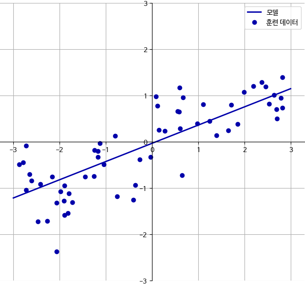
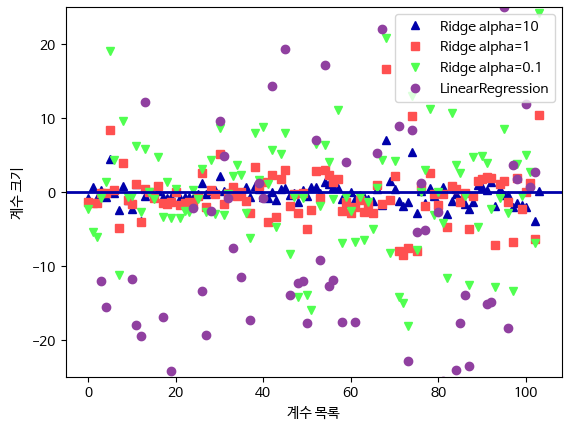
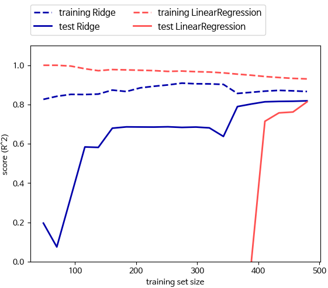

# 선형 모델

선형 모델(Linear Model)은 입력 특성(Features)과 가중치(Weights)의 선형 조합으로 출력을 예측하는 모델입니다. 이 모델은 간단하면서도 많은 문제에서 효과적으로 사용됩니다.  

 - f(x) = w0 + w1⋅x1 + w2​⋅x2 + … + wn⋅xn + b
    - x[0]부터 x[n]까지는 하나의 데이터 포인트에 대한 특성을 나타내며, w와 b는 학습할 파라미터이다.
    - f(x)는 모델이 만들어낸 예측값이다.
 - wo, .. wn은 가중치이며, 각각의 특성에 대한 중요도를 나타낸다.
 - x1, .. xn은 입력 특성이다.
 - w0은 편향이라 불리며, 입력 특성에 대한 가중치가 없는 항으로, 모델의 출력에 추가적인 조정을 제공한다.
​
<br/>

## 예시

회귀를 위한 선형 모델은 특성이 하나일 땐 직선, 두 개일 땐 평면이 되며, 더 높은 차원에서는 초평면이 되는 회귀 모델의 특징을 가지고 있다.  

```python
mglearn.plots.plot_linear_regression_wave()
```

<div align="center">
    
</div>
<br/>

## 선형 회귀(최소제곱법)

선형 회귀는 입력 특성과 출력 사이의 선형 관계를 모델링하는 회귀 분석 기법 중 하나입니다. 선형 회귀의 목표는 주어진 특성과 관련된 출력 값을 가장 잘 설명하는 선형 함수를 찾는 것입니다. 최소제곱법(Least Squares Method)은 이 선형 함수를 찾기 위한 일반적인 방법 중 하나입니다.  

선형 회귀는 예측과 훈련 세트에 있는 타깃 y 사이의 평균제곱오차를 최소화하는 파라미터 w와 b를 찾는다. 평균제곱오차는 예측값과 타깃 값의 차이를 제곱하여 더한 후에 샘플의 갯수로 나눈 것이다.  
선형 회귀는 매개변수가 없는 것이 장점이지만, 그래서 모델의 복잡도를 제어할 방법도 없다.  

 - `예제 코드`
    - 기울기 파라미터(w)는 가중치 또는 계수라고 하며 coef_ 속성에 저장되어 있고 편향 또는 절편 파라미터(b)는 intercept_ 속성에 저장되어 있다.
    - 성능을 확인하면 0.66으로 좋은 결과는 아니다. 하지만, 훈련셋과 테스트셋의 점수가 매우 비슷한데, 이는 과대적합이 아니라 과소적합인 상태를 의미한다.
    - 1차원 데이터셋에서는 모델이 매우 단순하므로 과대적합을 걱정할 필요가 없다. 그러나, 특성이 많은 고차원 데이터셋에서는 선형 모델의 성능이 매우 높아져서 과대적합이 될 가능성이 높다.
```python
# 선형 모델 만들기
from sklearn.linear_model import LinearRegression
X, y = mglearn.datasets.make_wave(n_samples=60)
X_train, X_test, y_train, y_test = train_test_split(X, y, random_state=42)

lr = LinearRegression().fit(X_train, y_train)

# 기울기 파라미터(w), 절편 파라미터(b) 확인
print("lr.coef_:", lr.coef_)
print("lr.intercept_:", lr.intercept_)

# 훈련셋과 테스트셋 성능 확인
print("훈련 세트 점수: {:.2f}".format(lr.score(X_train, y_train))) # 0.67
print("테스트 세트 점수: {:.2f}".format(lr.score(X_test, y_test))) # 0.66
```

<br/>

 - `고차원 데이터셋 예제 코드`
    - 보스턴 주택가격 데이터셋은 샘플이 506개가 있고, 특성은 유도된 것을 합쳐 104개이다.
    - 훈련셋과 테스트셋 점수를 비교해보면 훈련셋에서는 예측이 매우 정확한 반면 테스트 셋에서는 R2 값이 매우 낮다.
    - 훈련셋과 테스트셋 사이의 이런 성능 차이는 모델이 과대적합이 되었다는 확실한 신호로, 복잡도를 제어할 수 있는 모델을 사용해야 한다.
```python
X, y = mglearn.datasets.load_extended_boston()

X_train, X_test, y_train, y_test = train_test_split(X, y, random_state=0)
lr = LinearRegression().fit(X_train, y_train)

print("훈련 세트 점수: {:.2f}".format(lr.score(X_train, y_train))) # 0.95
print("테스트 세트 점수: {:.2f}".format(lr.score(X_test, y_test))) # 0.61
```

<br/>

## 리지 회귀

리지 회귀(Ridge Regression)는 선형 회귀의 한 변종으로, 과대적합(overfitting)을 방지하기 위한 정규화(regularization) 기법 중 하나입니다. 리지 회귀는 선형 회귀의 손실 함수에 추가적인 제약 조건을 더하여 가중치(w)의 크기를 제한하는 방식으로 동작합니다.  

 - `리지 회귀 예제 코드`
    - 선형 회귀는 이 데이터셋에 과대적합이 되지만, Ridge는 덜 자유로운 모델로 과대적합이 적어진다. 모델의 복잡도가 낮아지면 훈련 세트에서의 성능은 나빠지지만 더 일반화된 모델이 된다.
    - Ridge는 모델을 단순하게 해주고 훈련 세트에 대한 성능 사이를 절충할 수 있는 방법을 제공한다. 사용자는 alpha 매개변수로 훈련 세트의 성능 대비 모델을 얼마나 단순화할지를 지정할 수 있다.
    - alpha 값을 높이면 계수를 0에 가깝게 만들어서 훈련 세트의 성능은 나빠지지만 일반화에는 도움을 줄 수 있다.
```python
from sklearn.linear_model import Ridge

ridge = Ridge().fit(X_train, y_train)
print("훈련 세트 점수: {:.2f}".format(ridge.score(X_train, y_train))) # 0.89
print("테스트 세트 점수: {:.2f}".format(ridge.score(X_test, y_test))) # 0.75

ridge10 = Ridge(alpha=10).fit(X_train, y_train)
print("훈련 세트 점수: {:.2f}".format(ridge10.score(X_train, y_train))) # 0.79
print("테스트 세트 점수: {:.2f}".format(ridge10.score(X_test, y_test))) # 0.64

ridge01 = Ridge(alpha=0.1).fit(X_train, y_train)
print("훈련 세트 점수: {:.2f}".format(ridge01.score(X_train, y_train))) # 0.93
print("테스트 세트 점수: {:.2f}".format(ridge01.score(X_test, y_test))) # 0.77
```

<br/>

 - `alpha 값 확인`
    - alpha 값에 따라 모델의 coef_ 속성이 어떻게 달라지는지를 조사해보면 alpha 매개변수가 모델을 어떻게 변경시키는지 더 깊게 이해할 수 있다.
    - 높은 alpha 값은 제약이 더 많은 모델이므로 작은 alpha 값일 때보다 coef_의 절대값 크기가 작을 것이라고 예상할 수 있다.
```python
plt.plot(ridge10.coef_, '^', label="Ridge alpha=10")
plt.plot(ridge.coef_, 's', label="Ridge alpha=1")
plt.plot(ridge01.coef_, 'v', label="Ridge alpha=0.1")

plt.plot(lr.coef_, 'o', label="LinearRegression")
plt.xlabel("계수 목록")
plt.ylabel("계수 크기")
xlims = plt.xlim()
plt.hlines(0, xlims[0], xlims[1])
plt.xlim(xlims)
plt.ylim(-25, 25)
plt.legend()
plt.show()
```

<div align="center">
    
</div>
<br/>

 - `규제 효과 테스트`
    - alpha 값을 고정하고 훈련 데이터의 크기를 변화시켜 본다.
    - 보스턴 주택가격 데이터셋에서 여러 가지 크기로 샘플링하여 LinearRegression과 Ridge를 적용한다.
    - 모든 데이터셋에 대해 리지와 선형 회귀 모두 훈련 세트의 점수가 테스트 세트의 점수보다 높다. 리지에는 규제가 적용되므로 리지의 훈련 데이터 점수가 전체적으로 선형 회귀의 훈련 데이터 점수보다 낮다. 그러나, 테스트 데이터에서는 리지의 점수가 더 높으며 특별히 작은 데이터셋에서는 더 크다. 데이터셋 크기가 400 미만에서는 선형 회귀는 어떤 것도 학습하지 못하고, 두 모델의 성능은 데이터가 많아질수록 좋아지고 마지막에는 선형 회귀가 리지 회귀를 따라잡는다.
        - 데이터가 충분히 많으면 규제 항은 덜 중요해져서 리지 회귀와 선형 회귀의 성능이 같아진다.
        - 데이터가 많아질수록 모델이 데이터를 기억하거나 과대적합하기 어려워진다.
```python
mglearn.plots.plot_ridge_n_samples()
```

<div align="center">
    
</div>
<br/>

