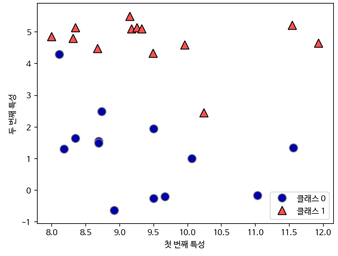
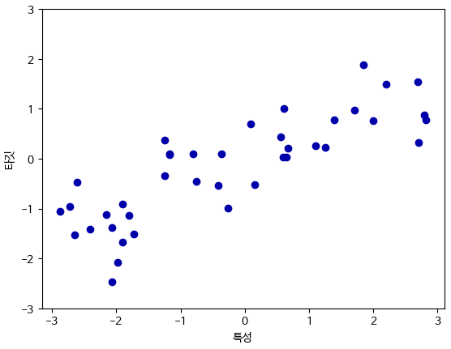

# 02장. 지도 학습

지도 학습은 입력과 출력 샘플 데이터가 있고, 주어진 입력으로부터 출력을 예측하고자 할 때 사용한다.  

## 분류와 회귀

분류(Classification)와 회귀(Regression)는 머신러닝에서 데이터를 분석하고 예측하는 두 가지 주요 작업입니다.  

 - `분류(Classification)`
    - 정의: 분류는 입력 데이터를 미리 정의된 클래스 또는 범주 중 하나로 할당하는 작업입니다. 예를 들어, 이메일이 스팸인지 아닌지를 판별하거나 손글씨 숫자를 인식하는 문제가 여기에 해당합니다.
    - 예시: 이진 분류의 경우, 스팸 여부, 양성/음성 여부 등을 판별하는 문제가 있을 수 있습니다. 다중 분류의 경우, 손글씨 숫자를 0부터 9까지 구분하는 문제 등이 있을 수 있습니다.
    - 알고리즘: 로지스틱 회귀, 결정 트리, 랜덤 포레스트, 서포트 벡터 머신(SVM), 신경망 등이 분류 문제에 사용될 수 있습니다.
 - `회귀(Regression)`
    - 정의: 회귀는 입력 데이터와 연속적인 출력 값을 사용하여 입력 데이터에 대한 출력 값을 예측하는 작업입니다. 예를 들어, 주택 가격 예측, 판매량 예측 등이 여기에 해당합니다.
    - 예시: 주택 가격을 예측하는 문제에서, 주택의 특성(크기, 위치, 시설 등)을 기반으로 가격을 예측하는 것이 회귀 문제의 한 예입니다.
    - 알고리즘: 선형 회귀, 다항 회귀, 랜덤 포레스트 회귀, 서포트 벡터 머신 회귀, 신경망 등이 회귀 문제에 사용될 수 있습니다.
 - `차이점`
    - 출력 값의 형태: 분류는 이산형 클래스 레이블을 예측하고, 회귀는 연속적인 값을 예측합니다.
    - 평가 지표: 분류에서는 정확도, 정밀도, 재현율 등이 주로 사용되고, 회귀에서는 평균 제곱 오차(Mean Squared Error, MSE), 평균 절대 오차(Mean Absolute Error, MAE) 등이 사용됩니다.
    - 예측 값의 해석: 분류에서는 각 클래스에 속할 확률이나 레이블이 주로 해석되며, 회귀에서는 예측된 연속 값 자체가 주로 해석됩니다.

<br/>

## 일반화, 과대적합, 과소적합

일반화, 과대적합, 과소적합은 머신러닝 모델의 성능과 관련된 중요한 개념들입니다.  

 - `일반화 (Generalization)`
    - 정의: 모델이 처음 보는 데이터에 대해서도 정확하게 예측할 수 있는 능력을 의미합니다. 모델이 훈련 데이터뿐만 아니라 새로운, 이전에 보지 못한 데이터에 대해서도 일반적인 패턴을 학습하고 적용할 수 있으면 이를 "일반화되었다"고 말합니다.
    - 목표: 모델이 새로운 데이터에 대해 정확하게 예측하고, 일반적인 규칙을 학습하여 새로운 상황에 대응할 수 있도록 하는 것이 목표입니다.
 - `과대적합 (Overfitting)`
    - 정의: 모델이 훈련 데이터에 지나치게 맞춰져, 훈련 데이터에는 높은 정확도를 보이지만 새로운 데이터나 테스트 데이터에 대해서는 성능이 떨어지는 현상을 말합니다.
    - 특징: 모델이 훈련 데이터의 잡음(noise)까지 학습하여 모델이 훈련 데이터에 지나치게 적합되어 있을 때 발생합니다.
    - 해결 방법: 더 많은 데이터를 수집하거나, 모델의 복잡도를 줄이는 방법(모델 단순화), 정규화 등을 통해 과대적합을 방지할 수 있습니다.
 - `과소적합 (Underfitting)`
    - 정의: 모델이 훈련 데이터에 너무 간단하게 적합되어 새로운 데이터에 대한 일반화 능력이 부족한 상태를 말합니다.
    - 특징: 모델이 훈련 데이터의 패턴을 제대로 학습하지 못하거나, 모델이 너무 단순할 때 발생합니다.
    - 해결 방법: 모델의 복잡도를 증가시키거나, 더 많은 특징(feature)을 사용하여 모델을 더 복잡하게 만들어주는 등의 방법을 통해 과소적합을 해결할 수 있습니다.
 - `요약`
    - 가진 정보를 모두 사용해서 너무 복잡한 모델을 만드는 경우 과대적합이 발생할 수 있다. 과대 적합은 모델이 훈련 세트의 각 샘플에 너무 가깝게 맞춰져서 새로운 데이터에 일반화되기 어려울 떄 일어난다.
    - 반대로 모델이 너무 간단한 경우, 데이터의 면면과 다양성을 잡아내지 못할 것이고 훈련 세트에도 잘 맞지 않을 것이다. 이것을 과소적합이라고 한다.

<br/>

## 지도 학습 알고리즘

### 환경 설정

 - `기본 설정`
    - 맷플롯립 그래프에 한글을 쓰기 위해 나눔 폰트를 사용한다.
```python
# 노트북이 코랩에서 실행 중인지 체크합니다.
import os
import sys
if 'google.colab' in sys.modules and not os.path.isdir('mglearn'):
    # 사이킷런 최신 버전을 설치합니다.
    !pip install -q --upgrade scikit-learn

    # mglearn을 다운받고 압축을 풉니다.
    !wget -q -O mglearn.tar.gz https://bit.ly/mglearn-tar-gz
    !tar -xzf mglearn.tar.gz
    !wget -q -O data.tar.gz https://bit.ly/data-tar-gz
    !tar -xzf data.tar.gz

    # 나눔 폰트를 설치합니다.
    !sudo apt-get -qq -y install fonts-nanum
    import matplotlib.font_manager as fm
    font_files = fm.findSystemFonts(fontpaths=['/usr/share/fonts/truetype/nanum'])
    for fpath in font_files:
        fm.fontManager.addfont(fpath)
```
```python
import sklearn
from preamble import *
import matplotlib

# 나눔 폰트를 사용합니다.
matplotlib.rc('font', family='NanumBarunGothic')
matplotlib.rcParams['axes.unicode_minus'] = False

# 코랩에서 넘파이 경고를 나타내지 않기 위해
import sys
if 'google.colab' in sys.modules:
    import warnings
    warnings.filterwarnings("ignore", category=np.VisibleDeprecationWarning)
```

<br/>

### 예제에 사용할 데이터셋

 - `이진 분류 데이터셋`
    - X.shape로 확인시 데이터셋은 데이터 포인트 26개와 특성 2개를 가진다.
```python
# 데이터셋을 만든다.
X, y = mglearn.datasets.make_forge()

# 산점도를 그린다.
mglearn.discrete_scatter(X[:, 0], X[:, 1], y)
plt.legend(["클래스 0", "클래스 1"], loc=4)
plt.xlabel("첫 번쨰 특성")
plt.ylabel("두 번째 특성")
print("X.shape:", X.shape)
```

<div align="center">
    
</div>
<br/>


 - `회귀 알고리즘용 데이터셋`
    - 회귀 알고리즘에는 인위적으로 만든 wave 데이터셋을 사용한다.
    - wave 데이터셋은 입력 특성 하나와 모델링할 타깃 변수를 가진다.
```python
X, y = mglearn.datasets.make_wave(n_samples=40)
plt.plot(X, y, 'o')
plt.ylim(-3, 3)
plt.xlabel("특성")
plt.ylabel("타깃")
plt.show()
```

<div align="center">
    
</div>
<br/>

 - `Scikit-learn 제공 데이터셋`
    - 싸이킷런은 기본적으로 연습용 데이터셋을 제공한다.
    - load_breast_cancer() 함수로 양성, 악성 종양 데이터셋을 가져올 수 있다.
    - load_boston() 함수로 보스턴 주택가격 데이터셋을 가져올 수 있다. 해당 데이터셋을 활용해 회귀 분석용으로 사용할 수 있다.
```python
# 유방암 데이터셋
from sklearn.datasets import load_breast_cancer
cancer = load_breast_cancer()
print("cancer.keys():\n", cancer.keys())
print("유방암 데이터의 형태:", cancer.data.shape) # (569, 30)
print("클래스별 샘플 갯수:\n",
      {n: v for n, v in zip(cancer.target_names, np.bincount(cancer.target))}) # malignant: 212, benign: 357
print("특성 이름:\n", cancer.feature_names)

# 보스턴 주택 데이터셋
X, y = mglearn.datasets.load_extended_boston()
print("X.shape:", X.shape) # (506, 104)

# 보스턴 주택 데이터셋 (1.2버전에서 삭제되어 아래 코드 사용)
data_url = "http://lib.stat.cmu.edu/datasets/boston"
raw_df = pd.read_csv(data_url, sep="\s+", skiprows=22, header=None)
data = np.hstack([raw_df.values[::2, :], raw_df.values[1::2, :2]])
target = raw_df.values[1::2, 2]
print("데이터의 형태:", data.shape) # (506, 13)
```

