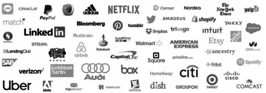
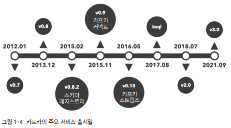
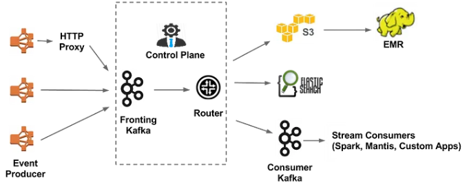
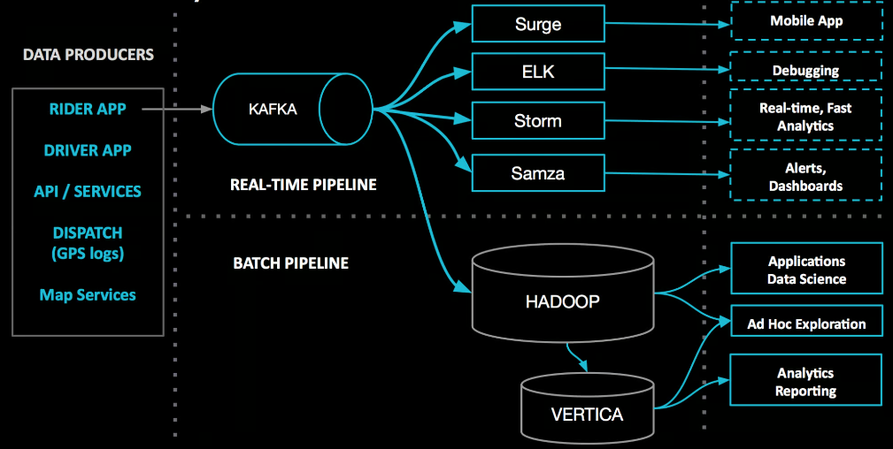
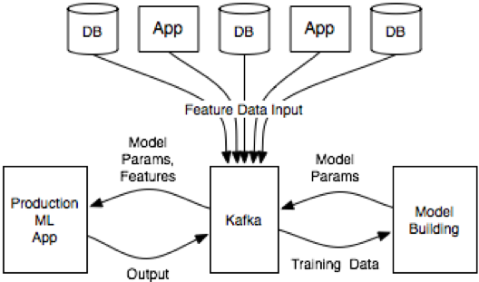

# 카프카 개요

카프카는 미국의 대표적인 비즈니스 인맥 소셜 네트워크 서비스인 링크드인에서 근무하던 제이 크렙스, 준 라오, 네하 나크헤데가 링크드인 내부에서 발생하고 있는 이슈들을 해결하기 위해 만들어졌습니다. 예를 들어, 데이터 파이프라인 확장의 어려움, 이기종 간의 호환성, 고성능 기반의 실시간 데이터 처리의 어려움 등의 문제를 해결하기 위해 2010년에 개발되었으며, 2011년 아파치 오픈소스로 세상에 공개되었습니다.  

<br/>

## 1. 카프카 도입 사례

동기 방식의 한계를 느끼고 비동기 방식으로의 전환을 고려한 잘란도는 비동기 방식의 대표 스트리밍 플랫폼인 카프카를 선택했습니다. 카프카를 선택한 이유로는 높은 처리량, 순서 보장, 적어도 한 번 전송 방식, 강력한 파티셔닝, 자연스러운 백프레셔 핸들링, 로그 컴팩션 같은 훌륭한 기능들이 있습니다.  

 - __빠른 데이터 수집이 가능한 높은 처리량__
    - HTTP 기반으로 전달되는 이벤트라도 카프카로 처리되는 응답 시간은 불과 한 자릿수 밀리초(ms) 단위로 처리된다.
 - __순서 보장__
    - 이벤트 처리 순서가 보장되면서, 엔티티 간의 유효성 검사나 동시 수정 같은 무수한 복잡성들이 제거됨으로써 구조가 매우 간결해진다.
 - __적어도 한 번 전송 방식__
    - 분산된 여러 네트워크 환경에서의 데이터 처리에서 중요한 모범 사례는 멱등성이다. 멱등성은 동일한 작업을 여러 번 수행하더라도 결과가 달라지지 않는 것을 의미한다. 따라서, 프로듀서가 재전송을 하더라도 데이터 변화는 일어나지 않는다.
    - 간혹 이벤트들이 중복 발생할 수는 있으나 누락 없는 재전송이 가능하므로 메시지 손실에 대한 걱정이 사라진다.
 - __자연스러운 백프레셔 핸들링__
    - 카프카의 클라이언트는 풀 방식으로 동작한다.
    - 풀 방식은 자기 자신의 속도로 데이터를 처리할 수 있지만, 푸시 방식은 브로커가 보내주는 속도에 의존해야 한다는 한계가 있다.
    - 성능과 편리함에 집중하고자 풀 방식을 채택한 카프카 클라이언트는 복잡한 피드백이나 제한의 요구사항이 사라져 매우 간단하고 편리하게 클라이언트를 구현할 수 있다.
 - __강력한 파티셔닝__
    - 카프카의 파티셔닝 기능을 이용하면, 논리적으로 토픽을 여러 개로 나눌 수 있다.
    - 또한, 파티션에 적절한 키를 할당하기 위한 여러 고려사항이 있지만, 각 파티션들을 다른 파티션들과 관계없이 처리할 수 있으므로 효과적인 수평 확장이 가능해졌다.
 - __그 외 여러 가지 기능__
    - 로그 컴팩션 기능을 통해 스냅샷 역할이 가능해졌고, 새로운 애플리케이션이 나중에 메시지를 읽어가는 방식도 전혀 문제가 되지 않는다.
    - 또한, 프로듀서와 컨슈머가 완벽하게 분리된 비동기식 방식을 사용함에 따라 애플리케이션의 병목 현상을 정확하게 파악할 수 있다.

<br/>

```
아래와 같은 고민이 있다면 카프카를 도입함으로써 상당히 많은 문제를 해결할 수 있다.

1. 동기/비동기 데이터 전송에 대한 고민
2. 실시간 데이터 처리에 대한 고민
3. 현재의 데이터 처리에 한계
4. 새로운 데이터 파이프라인의 복잡성
5. 데이터 처리의 비용 절감 고려
```
<br/>

## 2. 국내외 카프카 이용 현황

 - __해외 카프카 이용 현황__
    - 2018년 라인 디벨로퍼 데이의 발표 자료로 라인 내부의 50여 개 서비스들이 카프카를 이용하며, 하루에 2,500억 건이 넘는 메시지를 처리하고 약 210TB 데이터가 카프카로 인입된다고 했다.
    - 미국의 대표적인 일간지(뉴욕타임스)는 카프카와 스트림즈 API를 이용해 실시간으로 콘텐츠를 배포하고 있다.
    - 유럽 최대 스포츠웨어 제조사인 아디다스는 데이터 스트리밍 플랫폼으로 카프카를 이용해 데이터 소스 시스템을 통합하고, 모니터링과 분석 등의 작업을 실시간으로 처리하고 있다.
    - 애플리케이션 모니터링 솔루션을 제공하는 데이터독은 각종 메트릭과 이벤트 통합 파이프라인으로 카프카를 사용하고 있다.
 - __국내 카프카 이용 현황__
    - 2018년 카카오 개발자 콘퍼런스 이프 카카오에서 총 7개의 크러스터를 보유하고 있고, 하루 2,600억 개의 메시지를 처리하며, 하루 약 240TB의 데이터가 카픜로 유입된다고 했다.

<div align="center">
    
</div>
<br/>

## 3. 카프카의 주요 특징

### 3-1. 높은 처리량과 낮은 지연시간

카프카를 선택하는 가장 큰 이유로는 높은 처리량과 낮은 지연시간이 있다.  
컨플루언트의 블로그에는 메시징 시스템 간의 성능을 비교한 자료가 공개되어 있으며, 아파치 카프카, 북키퍼 기반의 스토리지를 이용한 펄사 메시징 시스템, 전통적인 메시징 큐 시스템인 래빗MQ 총 세 가지 메시징 시스템의 비교를 볼 수 있다.  

처리량이 가장 높은 것은 카프카이며, 응답 속도가 가장 빠른 것은 래빗MQ이다. 하지만, 처리량과 응답 속도를 같이 비교했을 때는 카프카가 단연 독보적이다.  

<br/>

### 3-2. 높은 확장성

카프카는 손쉬운 확장이 가능하도록 잘 설계된 애플리케이션이다.  

<br/>

### 3-3. 고가용성

카프카 초기 버전에서는 무엇보다도 메시지를 빠르게 처리하는 것이 목표였지만, 점차 시간이 지나면서 고가용성 측면도 중요하게 여기게 됐다.  
카프카는 2013년에 클러스터 내 리플리케이션 기능을 추가했고, 이를 통해 카프카 클러스터의 고가용성이 확보됐다.  

<br/>

### 3-4. 내구성

프로듀서는 카프카로 메시지를 전송할 때 프로듀서의 acks라는 옵션을 조정하여 메시지의 내구성을 강화할 수 있다. 만약, 강력한 메시지의 내구성을 원한다면 옵션을 acks=all로 사용할 수 있다. 프로듀서에 의해 카프카로 전송되는 모든 메시지는 안전한 저장소인 카프카의 로컬 디스크에 저장된다.  

기존 메시징 시스템의 경우, 컨슈머가 메시지를 가져감과 동시에 저장소에서 메시지가 삭제된다. 반면에 카프카는 컨슈머가 메시지를 가져가더라도, 메시지는 삭제되지 않고 지정된 설정 시간 또는 로그의 크기만큼 로컬 디스크에 보관되므로, 코드의 버그나 장애가 발생하더라도 과거의 메시지들을 불러와 재처리할 수 있다. 또한, 메시지는 브로커 한 대에만 저장되는 것이 아니라 두 대 또는 세 대의 브로커에 저장되므로, 브로커 중 한 대가 종료되더라도 다른 브로커의 로컬 디스크에 저장된 내용을 바탕으로 복구할 수 있다.  

<br/>

### 3-5. 개발 편의성

카프카는 메시지를 전송하는 역할을 하는 프로듀서와 메시지를 가져오는 역할을 하는 컨슈머가 완벽하게 분리되어 동작하고 서로 영향을 주지도 받지도 않는다.  
이러한 구성에 따라 프로듀싱을 원하는 개발자는 프로듀서만 개발하면 되고, 컨슈밍을 원하는 개발자는 컨슈머만 개발해 사용하면 된다.  

또한, 카프카에서는 개발 편의성을 제공하기 위해 카프카 커넥트와 스키마 레지스트리를 제공한다.  
스키마 레지스트리는 카프카를 사용하는 많은 개발자가 데이터 활용보다는 데이터를 파싱하는 데 많은 시간을 소모하는 매우 비효율적인 현실을 보완하고자 스키마를 정의해서 사용할 수 있도록 개발된 애플리케이션이다.  
카프카 커넥트는 프로듀서와 컨슈머를 따로 개발하지 않고도 카프카와 연동해 손쉽게 소스와 싱크로 데이터를 보내고 받을 수 있는 별도의 애플리케이션이다. 카프카 커넥트는 엘라스틱 서치와 HDFS 등 다양한 소스와 싱크를 제공하여 개발 편의성을 높인다.  

<br/>

## 4. 카프카의 성장

2011년 아파치 공식 오픈소스로 카프카가 세상에공개된 이후 지금까지도 많은 인기를 얻고 있다.  

<div align="center">
    
</div>
<br/>

 - __리플리케이션 기능 추가(v0.8)__
    - 2013년 12월 0.8 버전에서 리플리케이션 기능이 추가됐다.
    - 카프카 클러스터에서 브로커의 장애가 발생해도 리플리케이션 기능으로 인해 데이터 유실 없이 안정적으로 사용할 수 있게 됐다.
 - __스키마 레지스트리 공개(v0.8.2)__
    - 2015년 2월 0.8.2 버전에서 프로듀서와 컨슈머 간에 서로 데이터 구조를 설명할 수 있는 스키마를 등록 지정해 사용하는 스키마 레지스트리 기능이 추가됐다.
    - 프로듀서와 컨슈머는 스키마 레지스트리를 이용해 스키마를 등록할 수 있고, 이를 통해 스키마에 정의된 데이터만 주고받게 된다.
    - 기존 카프카 펍/섭 모델의 데이터 흐름은 브로드캐스트 방식으로 컨슈머 입장에서는 데이터를 전송하는 프로듀서를 일방적으로 신뢰할 수 밖에 없는 구조를 갖게 된다.
 - __카프카 커넥트 공개(v0.9)__
    - 카프카를 사용하려면 카프카 클라이언트인 프로듀서 API, 컨슈머 API 등을 이용해야 한다. 하지만, 카프카와 연결되는 시스템이 다양해지고 인터페이싱하는 프로토콜도 DB뿐만 아니라 FTP, HDFS, 아마존 S3, 액티브MQ 등 점점 늘어났다.
    - 여러 시스템과 카프카를 하나하나 연동하는 클라이언트를 개발하고 유지보수하는 일이 점점 과중해지는 문제를 해결하기 위해 2015년 11월 0.9 버전으로 카프카 커넥트가 공개됐다.
    - 카프카 커넥트를 이용해 별도의 코드 작성 없이 다양한 프로토콜과 카프카를 연동할 수 있게 됐다.
 - __카프카 스트림즈 공개(v0.10)__
    - 카프카의 강점 중 하나인 높은 처리량, 빠른 응답 속도를 바탕으로 실시간 처리에 대한 니즈가 높아져 2016년 5월 0.10 버전에 카프카 스트림즈가 공개되었다.
    - 카프카 스트림즈를 이용해 실시간 분석, 처리 등이 가능해졌다.
 - __KSQL 공개__
    - 개발자들이 별도의 코드를 작성하지 않고도 익숙한 언어인 SQL 기반으로 실시간 처리 가능한 KSQL이 2017년 8월에 공개되었다.
    - KSQL을 이용하면 스트림 처리뿐만 아니라 배치 처리도 가능하며, 개발자 대다수에게 익숙한 SQL 언어로 처리할 수 있다는 장점이 있다.
- __주키퍼 의존성에서 해방(v3.0)__
    - 카프카의 토픽, 브로커 등을 관리하는 목적으로 분산 코디네이터 시스템인 주키퍼를 사용해왔으나 주키퍼는 그간 카프카가 높은 성능을 갖는 데 장벽이 되어왔다.
    - 카프카의 주키퍼 의존성을 제거하기 위한 노력의 일환으로 2021년 4월 2.8 버전 발표와 함께 주키퍼 없이 동작 가능한 카프카가 공개되었다.
    - 아파치 카프카 3.0의 주요 내용으로는 카프카의 메시지 포맷 v0, v1 지원 종료, 자바8과 스칼라 2.12 지원 종료 등 오래된 버전들에 대한 지원을 종료하였다.

<br/>

## 5. 다양한 카프카 사용 사례

### 5-1. 넷플릭스

넷플릭스는 데이터 기반 회사로서 풍부한 데이터 분석을 통해 비즈니스와 제품에 대한 의사결정을 내립니다. 데이터를 수집, 통계, 처리, 적재하기 위해 파이프라인들이 연결되어 있어 이러한 파이프라인을 연결해주는 역할로 카프카를 사용하고 있습니다.  

넷플릭스는 사용자의 넷플릭스 비디오 시청 활동, 유저 인터페이스 사용 빈도, 에러 로그 등의 모든 이벤트는 데이터 파이프라인을 통해 흐르므로, 이런 내용을 ㅂ누석해 사용자의 경험을 예측해 능동적으로 대응할 수 있으며 오류 발생 시에도 실시간으로 대응이 가능합니다.  

<div align="center">
    <br/>
    이미지 출처 - https://netflixtechblog.com/evolution-of-the-netflix-data-pipeline-da246ca36905
</div>
<br/>

### 5-2. 우버

기존의 데이터 엔지니어는 하나의 데이터 파이프라인을 추가할 대마다 이기종 간의 호환성 확인, 데이터 정합성 등으로 매우 고단하고 번거로운 작업을 수행해야 했습니다.  
하지만, 카프카를 도입한 이후부터는 안정적이고 손쉽게 데이터 파이프라인의 추가가 가능해졌습니다.  

다양한 에코시스템과 메시지 버스로 카프카가 연결되어 사용되는 우버는 운전자와 탑승자 앱으로부터 이벤트 데이터를 수집하고 이렇게 수집된 데이터는 카프카를 통해 다양한 다운스트림 컨슈머들에게 전달됩니다.  

<div align="center">
    <br/>
    이미지 출처 - https://www.uber.com/en-KR/blog/ureplicator-apache-kafka-replicator/
</div>
<br/>

### 5-3. 머신러닝 분야 활용 사례

인터넷과 스마트폰의 등장으로 우리의 일상생활은 모두 바뀌었습니다. 사람들이 장비를 어떻게 다루고 어떻게 사용하는지, 어떤 서비스를 사용하는지 등 갖가지 요구사항은 기업의 비즈니스에서 매우 중요하게 사용됩니다.  

데이터 전송과 파이프라인을 위해 카프카 커넥트를, 모델 생성 또는 상용 머신러닝 앱의 실시간 처리를 위해서는 카프카 스트림즈를 사용합니다.  
그 외에도 스키마 정의를 위한 스키마 레지스트리, SQL 기반 쿼리를 위한 KSQL 등 카프카의 연계 시스템들이 종합적으로 활용됩니다.  

<div align="center">
    <br/>
    이미지 출처 - https://www.confluent.io/blog/build-deploy-scalable-machine-learning-production-apache-kafka/
</div>

