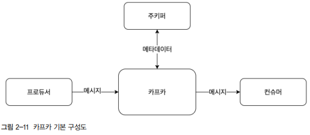

# 카프카 환경 구성

## 1. 실습 환경 구성

원할한 실습 환경 구성을 위해 보안 그룹으로 모든 트래픽과 모든 TCP, 포트 범위는 0~65535로 설정한다.  
또한, AWS상의 EC2 인스턴스들끼리 서로 통신할 수 있도록 모든 트래픽 유형의 소스는 사용자 지정으로 선택해 172.31.0.0/16을 허용하도록 한다. 기본 VPC가 생성된 기준의 CIDR이다.  

 - EC2(t2.medium)
    - 주키퍼 3대
    - 카프카 3대
    - 배포 서버 1대
 - Route53 -> /etc/hosts 파일로 대체
    - DNS 서버

<br/>

## 2. 앤서블 구성

 - `앤서블 설치`
    - AWS의 amazon-linux-extras를 이용하여 앤서블을 설치한다.
    - 앤서블 서버에서 카프카 서버에 접근 가능하도록 공개키를 생성하여 카프카 서버에 등록해준다.
```sh
# 앤서블 설치
sudo amazon-linux-extras install -y ansible2

# 소스코드 내려받기
sudo yum install -y git
git clone https://github.com/onlybooks/kafka2

# 로컬의 키페어 파일을 EC2로 전송 (로컬에서 입력)
scp -i keypair.pem keypair.pem ec2-user@배포서버:~
chmod 600 keypair.pem
ssh-agent bash
ssh-add keypair.pem

# 배포 서버 공개키 생성
ssh-keygen
cat /home/ec2-user/.ssh/id_rsa.pub

# 카프카 서버에 배포서버의 공개키 설정 [카프카 서버에서 입력]
vi /home/ec2-user/.ssh/authorized_keys
chmod 600 .ssh/authorized_keys
```
<br/>

 - `주키퍼 설치`
    - 앤서블을 이용하여 주키퍼 서버에 주키퍼를 설치한다.
```sh
# 주키퍼 설치
cd kafak2/chapter2/ansible_playbook
ansible-playbook -i hosts zookeeper.yml

# 주키퍼 상태 확인 [주키퍼 서버에서 입력]
sudo systemctl status zookeeper-server
```
<br/>

 - `카프카 설치`
    - 앤서블을 이용하여 카프카 서버에 카프카를 설치한다.
```sh
# 카프카 설치
cd kafak2/chapter2/ansible_playbook
ansible-playbook -i hosts kafka.yml

# 카프카 상태 확인 [카프카 서버에서 입력]
sudo systemctl status kafka-server
```
<br/>

## 3. 카프카 맛보기

카프카를 이용해 토픽을 생성하고, 콘솔 프로듀서와 콘솔 컨슈머를 이용해 메시지를 주고받는다.  

<br/>

### 3-1. 카프카의 기본 구성

카프카는 데이터를 받아서 전달하는 데이터 버스의 역할을 한다.  
카프카에서 데이터를 만들어 주는 쪽을 프로듀서, 카프카에서 데이터를 빼내서 소비하는 쪽은 컨슈머라고 한다.  
주키퍼는 카프카의 정상 동작을 보장하기 위해 메타데이터를 관리하는 코디네이터라 할 수 있다.  

 - 프로듀서와 컨슈머는 클라이언트이며, 중앙에 카프카 애플리케이션이 있고, 코디네이터 역할을 하는 주키퍼 애플리케이션이 있다.
 - 카프카의 메타데이터 저장소로 주키퍼를 사용하며 브로커들의 노드 관리 등을 하고 있다.
 - 컨슈머는 저장된 메시지를 꺼내오는 역할을 한다. 꺼내온 메시지를 엘라스틱서치나 하둡 같은 애플리케이션으로 전송하기도 하고, 메시지를 변형하여 다시 카프카로 전송하는 등 다양한 방법으로 응용해 사용할 수 있다.

<div align="center">
    
</div>
<br/>

### 3-2. 메시지 보내고 받기

일반적으로 프로듀서가 카프카로 메시지를 전송할 때 카프카로 그냥 전송하는 것이 아니라, 카프카의 특정 토픽으로 전송하게 된다.  

 - `토픽 생성`
    - 카프카 서버로 접속한 후 kafka-topics.sh 명령어를 이용해 토픽을 생성한다.
```sh
/usr/local/kafka/bin/kafka-topics.sh --bootstrap-server peter-kafka01.foo.bar:9092 --create --topic peter-overview01 --partitions 1 --replication-factor 3
```
<br/>

 - `컨슈머 실행`
    - 메시지를 꺼내오는 컨슈머를 실행한다.
```sh
/usr/local/kafka/bin/kafka-console-consumer.sh --bootstrap-server peter-kafka01.foo.bar:9092 --topic peter-overview01
```
<br/>

 - `프로듀서 실행`
    - 메시지를 발송하는 프로듀서를 실행한다.
```sh
/usr/local/kafka/bin/kafka-console-producer.sh --bootstrap-server peter-kafka01.foo.bar:9092 --topic peter-overview01
```
<br/>

### 3-3. 카프카 제공 명령어 요약

 - kafka-topics.sh: 토픽을 생성하거나 토픽의 설정 등을 변경하기 위해 사용
 - kafka-console-producer.sh: 토픽으로 메시지를 전송하기 위해 사용
 - kafka-console-consumer.sh: 토픽에서 메시지를 가져오기 위해 사용
 - kafka-reassign-partitions.sh: 토픽의 파티션과 위치 변경 등을 위해 사용
 - kafka-dump-log.sh: 파티션에 저장된 로그 파일의 내용을 확인하기 위해 사용

