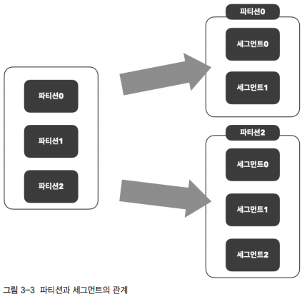
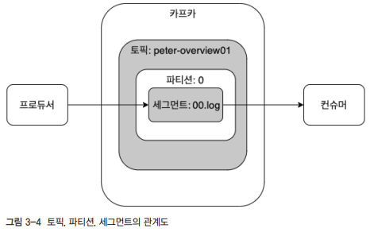
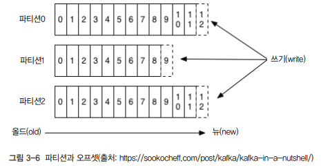
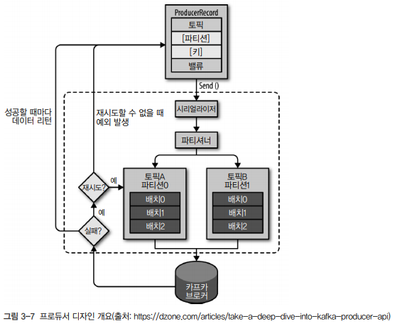
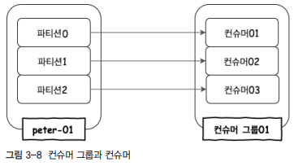

# 카프카 기본 개념과 구조

## 1. 카프카 기초 다지기

### 카프카를 구성하는 주요 요소

 - 주키퍼: 아파치 프로젝트 애플리케이션 이름. 카프카의 메타데이터 관리 및 브로커의 정상상태 점검을 담당
 - 카프카, 카프카 클러스터: 아파치 프로젝트 애플리케이션 이름. 여러 대의 브로커를 구성한 클러스터
 - 브로커: 카프카 애플리케이션이 설치된 서버 또는 노드
 - 프로듀서: 카프카로 메시지를 보내는 역할을 하는 클라이언트
 - 컨슈머: 카프카에서 메시지를 꺼내가는 역할을 하는 클라이언트
 - 토픽: 카프카는 메시지 피드들을 토픽으로 구분하고, 각 토픽의 이름은 카프카 내에서 고유하다.
 - 파티션: 병렬 처리 및 고성능을 얻기 위해 하나의 토픽을 여러 개로 나눈 것을 말한다.
 - 세그먼트: 프로듀서가 전송한 실제 메시지가 브로커의 로컬 디스크에 저장되는 파일을 말한다.
 - 메시지, 레코드: 프로듀서가 브로커로 전송하거나 컨슈머가 읽어가는 데이터 조각

<br/>

### 1-1. 리플리케이션

카프카에서 리플리케이션이란 각 메시지들을 여러 개로 복제해서 카프카 클러스터 내 브로커들에 분산시키는 동작을 의미한다. 이러한 리플리케이션 동작 덕분에 하나의 브로커가 종료되더라도 카프카는 안정성을 유지할 수 있다.  

리플리케이션 팩터 수가 커지면 안정성은 높아지지만 그만큼 브로커 리소스를 많이 사용하게 된다. 따라서 복제에 대한 오버헤드를 줄여서 최대한 브로커를 효율적으로 사용하는 것이 권장된다.  
 - 테스트나 개발 환경: 리플리케이션 팩터 수를 1개로 설정
 - 운영 환경(로그성 메시지로서 약간의 유실 허용시): 리플리케이션 팩터 수를 2로 설정
 - 운영 환경(유실 허용하지 않음): 리플리케이션 팩터 수를 3으로 설정

<br/>

### 1-2. 파티션

하나의 토픽이 한 번에 처리할 수 있는 한계를 높이기 위해 토픽 하나를 여러 개로 나눠 병렬 처리가 가능하게 만든 것을 파티션이라고 한다. 이렇게 하나를 여러 개로 나누면 분산 처리가 가능하며, 나뉜 파티션 수만큼 컨슈머를 연결할 수 있다.  
 - 파티션 수는 초기 생성 후 언제든지 늘릴 수 있지만, 한 번 늘린 파티션 수는 줄일 수 없다.

<br/>

## 1-3. 세그먼트

프로듀서에 의해 브로커로 전송된 메시지는 토픽의 파티션에 저장되며, 각 메시지들은 세그먼트라는 로그 파일의 형태로 브로커의 로컬 디스크에 저장된다.  
각 파티션마다 N개의 세그먼트 로그 파일들이 존재한다.  

 - 프로듀서는 카프카의 토픽으로 메시지를 전송한다.
 - 토픽은 파티션이 하나뿐이므로, 프로듀서로부터 받은 메시지를 파티션0의 세그먼트 로그 파일에 저장한다.
 - 브로커의 세그먼트 로그 파일에 저장된 메시지는 컨슈머가 읽어갈 수 있다.

<div align="center">
    <br/>
    
</div>
<br/>

## 2. 카프카의 핵심 개념

### 2-1. 분산 시스템

분산 시스템은 네트워크상에서 연결된 컴퓨터들의 그룹을 말하며, 단일 시스템이 갖지 못한 높은 성능을 목표로 한다. 분산 시스템은 성능이 높다는 장점 이외에도 하나의 서버 또는 노드 등에 장애가 발생할 때 다른 서버 또는 노드가 대신 처리하므로 장애 대응이 탁월하며, 부하가 높은 경우에는 시스템 확장이 용이하다는 장점이 있다.  

카프카도 분산 시스템이므로 최초 구성한 클러스터의 리소스가 한계치에 도달해 더욱 높은 메시지 처리량이 필요한 경우, 브로커를 추가하는 방식으로 확장이 가능하다.  

<br/>

### 2-2. 페이지 캐시

카프카는 OS의 페이지 캐시를 활용하는 방식으로 설계되어 있다. 페이지 캐시는 직접 디스크에 읽고 쓰는 대신 물리 메모리 중 애플리케이션이 사용하지 않는 일부 잔여 메모리를 활용한다. 이렇게 페이지 캐시를 이용하면 디스크 I/O 접근이 줄어들어 성능을 높일 수 있다.  
카프카가 직접 디스크에서 읽고 쓰기를 하지 않고 페이지 캐시를 통해 읽고 쓰기를 한다.  

<br/>

### 2-3. 배치 전송 처리

카프카는 프로듀서, 컨슈머 클라이언트들과 서로 통신하며, 이들 사이에서 수 많은 메시지를 주고받는다. 이떄, 발생하는 수많은 통신을 묶어서 처리할 수 있다면, 단건으로 통신할 때에 비해 네트워크 오버헤드를 줄이고 효율적으로 처리할 수 있다.  

<br/>

### 2-4. 압축 전송

카프카는 메시지 전송 시 좀 더 성능이 높은 압축 전송을 사용하는 것을 권장한다. 카프카에서 지원하는 압축 타입은 gzip, snappy, lz4, zstd 등이 있다.  

 - 압축만으로도 네트워크 대역폭이나 회선 비용 등을 줄일 수 있다. 배치 전송과 결합해 사용하면 더욱 높은 효과를 얻을 수 있다.
 - 높은 압축률이 필요한 경우 gzip, zstd 권장
 - 빠른 응답 속도가 필요한 경우 lz4, snappy 권장

<br/>

### 2-5. 토픽, 파티션, 오프셋

카프카는 토픽이라는 곳에 데이터를 저장한다. 토픽은 병렬 처리를 위해 여러 개의 파티션이라는 단위로 나뉜다.  
카프카에서는 파티셔닝을 통해 단 하나의 토픽이라도 높은 처리량을 수행할 수 있다. 파티션의 메시지가 저장되는 위치를 오프셋이라 부르며, 오프셋은 순차적으로 증가하는 숫자 형태로 되어 있다.  

 - 토픽은 N개의 파티션으로 나뉘며 프로듀서로부터 전송되는 메시지들의 쓰기 동작이 각 파티션별로 이루어진다.
 - 파티션마다 순차적으로 증가하는 숫자인 오프셋을 볼 수 있다.
 - 파티션에서의 오프셋은 고유한 숫자로, 카프카에서는 오프셋을 통해 메시지의 순서를 보장하고 컨슈머에서는 마지막까지 읽은 위치를 확인할 수 있다.

<div align="center">
    
</div>
<br/>

### 2-6. 고가용성 보장

카프카는 분산 시스템으로 하나의 서버나 노드가 다운되어도 다른 서버 또는 노드가 장애가 발생한 서버의 역할을 대신해 안정적인 서비스가 가능하다.  
카프카는 고가용성을 보장하기 위해 리플리케이션 기능을 제공한다. 리플리케이션 기능은 토픽 자체를 복제하는 것이 아니라 토픽의 파티션을 복제하는 것이다.  
 - 원본과 리플리케이션을 구분하기 위해 리더와 팔로워 라는 용어를 사용한다.
 - 리더는 프로듀서, 컨슈머로부터 오는 모든 읽기와 쓰기 요청을 처리하며, 팔로워는 오직 리더로부터 리플리케이션하게 된다.

<br/>

### 2-7. 주키퍼의 의존성

주키퍼는 여러 대의 서버를 앙상블(클러스터)로 구성하고, 살아 있는 노드 수가 과반수 이상 유지된다면 지속적인 서비스가 가능한 구조이다.  

지노드를 이용해 카프카의 메타 정보가 주키퍼에 기록되며, 주키퍼는 이러한 지노드를 이용해 브로커의 노드 관리, 토픽 관리, 컨트롤러 관리 등 매우 중요한 역할을 하고 있다.  
 - 주키퍼는 반드시 홀수로 구성해야 한다.
 - 카프카 4.0에서 메타 데이터 관리를 위해 사용된 ZooKeeper를 제거하고, Apache Kafka Raft로 대체된다.
 - 카프카 3.30에는 ZooKeeper와 Apache Kafka Raft 옵션 모두 포함한다.

<br/>

## 3. 프로듀서의 기본 동작과 예제 맛보기

### 3-1. 프로듀서 디자인

ProducerRecord는 카프카로 전송하기 위한 실제 데이터이며, 레코드는 토픽, 파티션 키, 벨류로 구성된다.  
프로듀서가 카프카로 레코드를 전송할 때, 카프카의 특정 토픽으로 메시지를 전송한다. 따라서, 레코드에서 토픽과 벨류는 필수값이며, 특정 파티션을 지정하기 위한 레코드의 파티션과 특정 파티션에 레코드들을 정렬하기 위한 레코드의 키는 필수값이 아닌 선택사항이다.  

<div align="center">
    
</div>
<br/>

### 3-2. 프로듀서의 주요 옵션

 - __bootstrap.servers__: 카프카 클러스터는 클러스터 마스터라는 개념이 없으므로, 클러스터 내 모든 서버가 클라이언트의 요청을 받을 수 있다. 클라이언트가 카프카 클러스터에 처음 연결하기 위한 호스트와 포트 정보를 나타낸다.
 - __client.dns.lookup__: 하나의 호스트에 여러 IP를 매핑해 사용하는 일부 환경에서 클라이언트가 하나의 IP와 연결하지 못할 경우에 다른 IP로 시도하는 설정이다. use_all_dns_ips가 기본값으로, DNS에 할당된 호스트의 모든 IP를 쿼리하고 저장한다. 첫 번째 IP로 접근이 실패하면, 종료하지 않고 다음 IP로 접근을 시도한다.
 - __acks__: 프로듀서가 카프카 토픽의 리더 측에 메시지를 전송한 후 요청을 완료하기를 결정하는 옵션이다. 0, 1, all(-1)로 표현한다.
    - 0은 빠른 전송을 의미하지만, 일부 메시지 손실 가능성이 있다.
    - 1은 리더가 메시지를 받았는지 확인하지만, 모든 팔로워를 전부 확인하지는 않는다. 대부분 기본값으로 1을 사용한다.
    - all은 팔로워가 메시지를 받았는지 여부를 확인한다. 다소 느릴 수 있지만, 하나의 팔로워가 있는 한 메시지는 손실되지 않는다.
 - __buffer.memory__: 프로듀서가 카프카 서버로 데이터를 보내기 위해 잠시 대기할 수 있는 전체 메모리 바이트이다.
 - __compression.type__: 프로듀서가 메시지 전송 시 선택할 수 있는 압축 타입이다. none, gzip, snappy, lz4, zstd 중 원하는 타입을 선택할 수 있다.
 - __enable.idempotence__: 설정을 true로 하는 경우 중복 없는 전송이 가능하며, 이와 동시에 max.in.flight.requests.per.connection은 5 이하, retries는 0 이상, acks는 all로 설정해야 한다.
 - __max.in.flight.requests.per.connection__: 하나의 커넥션에서 프로듀서가 최대한 ACK 없이 전송할 수 있는 요청 수 이다. 메시지의 순서가 중요하다면 1로 설정할 것을 권장하지만,  성능이 다소 떨어진다.
 - __retries__: 일시적인 오류로 인해 전송에 실패한 데이터를 다시 보내는 횟수이다.
 - __batch.size__: 프로듀서는 동일한 파티션으로 보내는 여러 데이터를 함께 배치로 보내려고 시도한다. 적절한 배치 크기 설정은 성능에 도움을 준다.
 - __linger.ms__: 배치 형태의 메시지를 보내기 전에 추가적인 메시지를 위해 기다리는 시간을 조정하고, 배치 크기에 도달하지 못한 상황에서 linger.ms 제한 시간에 도달했을 때 메시지를 전송한다.
 - __transactional.id__: 정확히 한 번 전송을 위해 사용하는 옵션이며, 동일한 transactionalId에 한해 정확히 한 번을 보장한다. 옵션을 사용하기 전 enable.idempotence를 true로 설정해야 한다.

<br/>

### 3-3. 프로듀서 예제

 - `토픽 생성`
```bash
/usr/local/kafka/bin/kafka-topics.sh --bootstrap-server peter-kafka01.foo.bar:9092 --create --topic peter-basic01 --partitions 1 --replication-factor 3
```
<br/>

 - `메시지 보내고 확인하지 않기`
    - ProducerRecord 객체를 생성해 send() 메서드로 메시지를 전송한다.
```java
import org.apache.kafka.clients.producer.KafkaProducer;
import org.apache.kafka.clients.producer.Producer;
import org.apache.kafka.clients.producer.ProducerRecord;

import java.util.Properties;

public class ProducerFireForgot {
    public static void main(String[] args) {
        Properties props = new Properties(); //Properties 오브젝트를 시작.
        props.put("bootstrap.servers", "peter-kafka01.foo.bar:9092,peter-kafka02.foo.bar:9092,peter-kafka03.foo.bar:9092"); //브로커 리스트를 정의.
        props.put("key.serializer",
                "org.apache.kafka.common.serialization.StringSerializer"); //메시지 키와 벨류에 문자열을 사용하므로 내장된 StringSerializer를 지정.
        props.put("value.serializer",
                "org.apache.kafka.common.serialization.StringSerializer");

        Producer<String, String> producer = new KafkaProducer<>(props); //Properties 오브젝트를 전달해 새 프로듀서를 생성.

        try {
            for (int i = 0; i < 10; i++) {
                ProducerRecord<String, String> record = new ProducerRecord<>("peter-basic01", "Apache Kafka is a distributed streaming platform - " + i); //ProducerRecord 오브젝트를 생성.
                producer.send(record); //send()메소드를 사용하여 메시지를 전송 후 Java Future Ojbect로 RecordMetadata를 리턴 받지만, 리턴값을 무시하므로 메시지가 성공적으로 전송되었는지 알 수 없음.
            }
        } catch (Exception e){
            e.printStackTrace(); //카프카 브로커에게 메시지를 전송한 후의 에러는 무시하지만, 전송 전 에러가 발생하면 예외를 처리할 수 있음.
        } finally {
            producer.close(); // 프로듀서 종료
        }
    }
}
```
<br/>

 - `동기 전송`
    - ProducerRecord 객체를 생성해 send() 메서드로 메시지를 전송한다.
    - send() 메서드의 반환 값으로 Future 객체를 받는다. get() 메서드를 이용해 처리를 기다리고, 응답 값을 받는다.
    - 메시지가 정상적으로 전송되었으면, RecordMetadata 객체를 반환받는다.
    - RecordMetadata로 파티션과 오프셋 정보를 확인할 수 있다.
```java
import org.apache.kafka.clients.producer.KafkaProducer;
import org.apache.kafka.clients.producer.Producer;
import org.apache.kafka.clients.producer.ProducerRecord;
import org.apache.kafka.clients.producer.RecordMetadata;

import java.util.Properties;

public class ProducerSync {
    public static void main(String[] args) {
        Properties props = new Properties(); //Properties 오브젝트를 시작.
        props.put("bootstrap.servers", "peter-kafka01.foo.bar:9092,peter-kafka02.foo.bar:9092,peter-kafka03.foo.bar:9092"); //브로커 리스트를 정의.
        props.put("key.serializer",
                "org.apache.kafka.common.serialization.StringSerializer"); //메시지 키와 벨류에 문자열을 사용하므로 내장된 StringSerializer를 지정.
        props.put("value.serializer",
                "org.apache.kafka.common.serialization.StringSerializer");

        Producer<String, String> producer = new KafkaProducer<>(props); //Properties 오브젝트를 전달해 새 프로듀서를 생성.

        try {
            for (int i = 0; i < 3; i++) {
                ProducerRecord<String, String> record = new ProducerRecord<>("peter-basic01", "Apache Kafka is a distributed streaming platform - " + i); //ProducerRecord 오브젝트를 생성.
                RecordMetadata metadata = producer.send(record).get(); //get() 메소드를 이용해 카프카의 응답을 기다립니다. 메시지가 성공적으로 전송되지 않으면 예외가 발생하고, 에러가 없다면 RecordMetadata를 얻음.
                System.out.printf("Topic: %s, Partition: %d, Offset: %d, Key: %s, Received Message: %s\n", metadata.topic(), metadata.partition()
                        , metadata.offset(), record.key(), record.value());
            }
        } catch (Exception e){
            e.printStackTrace(); //카프카로 메시지를 보내기 전과 보내는 동안 에러가 발생하면 예외가 발생함.
        } finally {
            producer.close(); // 프로듀서 종료
        }
    }
}
```
<br/>

 - `콜백 예제`
    - 콜백을 사용하기 위해 Callback 인터페이스를 구현해야한다.
    - 비동기 방식으로 전송하여 빠른 전송이 가능하고, 메시지 전송이 실패한 경우 예외 처리를 할 수 있다.
    - send() 메서드를 호출시 ProducerRecord와 Callback 구현 클래스를 파라미터로 넘긴다.
```java
/* 콜백 구현 클래스 */
import org.apache.kafka.clients.producer.Callback;
import org.apache.kafka.clients.producer.ProducerRecord;
import org.apache.kafka.clients.producer.RecordMetadata;

public class PeterProducerCallback implements Callback { //콜백을 사용하기 위해 org.apache.kafka.clients.producer.Callback를 구현하는 클래스가 필요함.
    private ProducerRecord<String, String> record;

    public PeterProducerCallback(ProducerRecord<String, String> record) {
        this.record = record;
    }

    @Override
    public void onCompletion(RecordMetadata metadata, Exception e) {
        if (e != null) {
            e.printStackTrace(); //카프카가 오류를 리턴하면 onCompletion()은 예외를 갖게 되며, 실제 운영환경에서는 추가적인 예외처리가 필요함.
        } else {
            System.out.printf("Topic: %s, Partition: %d, Offset: %d, Key: %s, Received Message: %s\n", metadata.topic(), metadata.partition()
                    , metadata.offset(), record.key(), record.value());
        }
    }
}

/* ProducerAsync */
import org.apache.kafka.clients.producer.KafkaProducer;
import org.apache.kafka.clients.producer.Producer;
import org.apache.kafka.clients.producer.ProducerRecord;

import java.util.Properties;

public class ProducerAsync {
    public static void main(String[] args) {
        Properties props = new Properties(); //Properties 오브젝트를 시작합니다.
        props.put("bootstrap.servers", "peter-kafka01.foo.bar:9092,peter-kafka02.foo.bar:9092,peter-kafka03.foo.bar:9092"); //브로커 리스트를 정의.
        props.put("key.serializer",
                "org.apache.kafka.common.serialization.StringSerializer"); //메시지 키와 벨류에 문자열을 지정하므로 내장된 StringSerializer를 지정함.
        props.put("value.serializer",
                "org.apache.kafka.common.serialization.StringSerializer");

        Producer<String, String> producer = new KafkaProducer<>(props); //Properties 오브젝트를 전달해 새 프로듀서를 생성.

        try {
            for (int i = 0; i < 3; i++) {
                ProducerRecord<String, String> record = new ProducerRecord<>("peter-basic01", "Apache Kafka is a distributed streaming platform - " + i); //ProducerRecord 오브젝트를 생성.
                producer.send(record, new PeterProducerCallback(record)); //프로듀서에서 레코드를 보낼 때 콜백 오브젝트를 같이 보냄.
            }
        } catch (Exception e){
            e.printStackTrace();
        } finally {
            producer.close(); // 프로듀서 종료
        }
    }
}
```
<br/>

## 4. 컨슈머의 기본 동작과 예제 맛보기

컨슈머는 카프카의 토픽에 저장되어 있는 메시지를 가져오는 역할을 담당한다.  
컨슈머는 내부적으로 컨슈머 그룹, 리밸런싱 등 여러 동작을 수행한다.  

<br/>

### 4-1. 컨슈머의 기본 동작

프로듀서가 카프카의 토픽으로 메시지를 전송하면 해당 메시지들은 브로커들의 로컬 디스크에 저장된다. 그리고 컨슈머를 이용해 토픽에 저장된 메시지를 가져올 수 있다.  
컨슈머 그룹은 하나 이상의 컨슈머들이 모여 있는 그룹을 의미하고, 컨슈머는 반드시 컨슈머 그룹에 속하게 된다.  
컨슈머 그룹은 각 파티션의 리더에게 카프카 토픽에 저장된 메시지를 가져오기 위한 요청을 보낸다. 이때, 파티션 수와 컨슈머 수는 일대일로 매핑되는 것이 이상적이다.  

<br/>

### 4-2. 컨슈머의 주요 옵션

 - __bootstrap.servers__: 브로커의 정보 입력
 - __fetch_min.bytes__: 한 번에 가져올 수 있는 최소 데이터 크기. 만약, 지정한 크기보다 작은 경우 요청에 응답하지 않고 데이터가 누적될 떄까지 기다린다.
 - __group.id__: 컨슈머가 속한 컨슈머 그룹을 식별하는 식별자. 동일한 그룹내의 컨슈머 정보는 모두 공유된다.
 - __heartbeat.interval.ms__: session.timeout.ms와 밀접한 관계가 있으며, session.timeout.ms보다 낮은 값으로 설정해야 한다. 일반적으로 session.timeout.ms의 1/3으로 설정한다.
 - __max.partition.fetch.bytes__: 파티션당 가져올 수 있는 최대 크기
 - __session.timeout.ms__: 이 시간을 이용해 컨슈머가 종료된 것인지 판단한다. 컨슈머는 주기적으로 하트비트를 보내야 하고, 만약 이 시간전까지 하트비트를 보내지 않았다면 해당 컨슈머는 종료된 것으로 간주하고 컨슈머 그룹에서 제외하고 리밸런싱을 시작한다.
 - __enable.auto.commmit__: 백그라운드로 주기적으로 오프셋을 커밋한다.
 - __auto.offset.reset__: 카프카에서 초기 오프셋이 없거나 현재 오프셋이 더 이상 존재하지 않는 경우 다음 옵션으로 reset 한다.
    - earliest: 가장 초기의 오프셋 값으로 설정
    - latest: 가장 마지막의 오프셋 값으로 설정
    - none: 이전 오프셋 값을 찾지 못하면 에러
 - __fetch.max.bytes__: 한 번의 가져오기 요청으로 가져올 수 있는 최대 크기
 - __group.instance.id__: 컨슈머의 고유한 식별자.
 - __isolation.level__: 트랜잭션 컨슈머에서 사용되는 옵션. read_uncommitted는 기본값으로 모든 메시지를 읽고, read_committed는 트랜잭션이 완료된 메시지만 읽는다.
 - __max.poll.records__: 한 번의 poll() 요청으로 가져오는 최대 메시지 수
 - __partition.assignment.strategy__: 파티션 할당 전략. 기본값은 range
 - __fetch.max.wait.ms__: fetch.min.bytes에 의해 설정된 데이터보다 적은 경우 요청에 대한 응답을 기다리는 최대 시간

<br/>

### 4-3. 컨슈머 예제

 - `오토 커밋`
    - KafkaConsumer 객체를 만들고, 구독할 토픽을 지정한다.
    - 메시지를 가져오기 위해 카프카에 지속적으로 poll()을 한다.
```java
import org.apache.kafka.clients.consumer.ConsumerRecord;
import org.apache.kafka.clients.consumer.ConsumerRecords;
import org.apache.kafka.clients.consumer.KafkaConsumer;

import java.util.Arrays;
import java.util.Properties;

public class ConsumerAuto {
    public static void main(String[] args) {
        Properties props = new Properties(); //Properties 오브젝트를 시작.
        props.put("bootstrap.servers", "peter-kafka01.foo.bar:9092,peter-kafka02.foo.bar:9092,peter-kafka03.foo.bar:9092"); //브로커 리스트를 정의.
        props.put("group.id", "peter-consumer01"); //컨슈머 그룹 아이디 정의.
        props.put("enable.auto.commit", "true"); //오토 커밋을 사용.
        props.put("auto.offset.reset", "latest"); //컨슈머 오프셋을 찾지 못하는 경우 latest로 초기화 합니다. 가장 최근부터 메시지를 가져옴.
        props.put("key.deserializer", "org.apache.kafka.common.serialization.StringDeserializer"); //문자열을 사용했으므로 StringDeserializer 지정.
        props.put("value.deserializer", "org.apache.kafka.common.serialization.StringDeserializer");
        KafkaConsumer<String, String> consumer = new KafkaConsumer<>(props); //Properties 오브젝트를 전달하여 새 컨슈머를 생성.
        consumer.subscribe(Arrays.asList("peter-basic01")); //구독할 토픽을 지정.

        try {
            while (true) { //무한 루프 시작. 메시지를 가져오기 위해 카프카에 지속적으로 poll()을 함.
                ConsumerRecords<String, String> records = consumer.poll(1000); //컨슈머는 폴링하는 것을 계속 유지하며, 타임 아웃 주기를 설정.해당 시간만큼 블럭.
                for (ConsumerRecord<String, String> record : records) { //poll()은 레코드 전체를 리턴하고, 하나의 메시지만 가져오는 것이 아니므로, 반복문 처리.
                    System.out.printf("Topic: %s, Partition: %s, Offset: %d, Key: %s, Value: %s\n",
                            record.topic(), record.partition(), record.offset(), record.key(), record.value());
                }
            }
        } catch (Exception e){
            e.printStackTrace();
        } finally {
            consumer.close(); //컨슈머를 종료.
        }
    }
}
```
<br/>

 - `동기 가져오기`
```java
import org.apache.kafka.clients.consumer.ConsumerRecord;
import org.apache.kafka.clients.consumer.ConsumerRecords;
import org.apache.kafka.clients.consumer.KafkaConsumer;

import java.util.Arrays;
import java.util.Properties;

public class ConsumerSync {
    public static void main(String[] args) {
        Properties props = new Properties(); //Properties 오브젝트를 시작.
        props.put("bootstrap.servers", "peter-kafka01.foo.bar:9092,peter-kafka02.foo.bar:9092,peter-kafka03.foo.bar:9092"); //브로커 리스트를 정의.
        props.put("group.id", "peter-consumer01"); //컨슈머 그룹 아이디 정의.
        props.put("enable.auto.commit", "false"); //오토 커밋을 사용하지 않음.
        props.put("auto.offset.reset", "latest"); //컨슈머 오프셋을 찾지 못하는 경우 latest로 초기화 합니다. 가장 최근부터 메시지를 가져옴.
        props.put("key.deserializer", "org.apache.kafka.common.serialization.StringDeserializer"); //문자열을 사용했으므로 StringDeserializer 지정.
        props.put("value.deserializer", "org.apache.kafka.common.serialization.StringDeserializer");
        KafkaConsumer<String, String> consumer = new KafkaConsumer<>(props); //Properties 오브젝트를 전달하여 새 컨슈머를 생성.
        consumer.subscribe(Arrays.asList("peter-basic01")); //구독할 토픽을 지정.

        try {
            while (true) { //무한 루프 시작. 메시지를 가져오기 위해 카프카에 지속적으로 poll()을 함.
                ConsumerRecords<String, String> records = consumer.poll(1000); //컨슈머는 폴링하는 것을 계속 유지하며, 타임 아웃 주기를 설정.해당 시간만큼 블럭함.
                for (ConsumerRecord<String, String> record : records) { //poll()은 레코드 전체를 리턴하고, 하나의 메시지만 가져오는 것이 아니므로, 반복문 처리함.
                    System.out.printf("Topic: %s, Partition: %s, Offset: %d, Key: %s, Value: %s\n",
                            record.topic(), record.partition(), record.offset(), record.key(), record.value());
                }
                consumer.commitSync(); //현재 배치를 통해 읽은 모든 메시지들을 처리한 후, 추가 메시지를 폴링하기 전 현재의 오프셋을 동기 커밋.
            }
        } catch (Exception e){
            e.printStackTrace();
        } finally {
            consumer.close(); //컨슈머를 종료.
        }
    }
}
```
<br/>

 - `비동기 가져오기`
    - commitAsync()는 commitSync()와 달리 오프셋 커밋을 실패하더라도 재시도하지 않는다.
```java
import org.apache.kafka.clients.consumer.ConsumerRecord;
import org.apache.kafka.clients.consumer.ConsumerRecords;
import org.apache.kafka.clients.consumer.KafkaConsumer;

import java.util.Arrays;
import java.util.Properties;

public class ConsumerAsync {
    public static void main(String[] args) {
        Properties props = new Properties(); //Properties 오브젝트를 시작.
        props.put("bootstrap.servers", "peter-kafka01.foo.bar:9092,peter-kafka02.foo.bar:9092,peter-kafka03.foo.bar:9092"); //브로커 리스트를 정의.
        props.put("group.id", "peter-consumer01"); //컨슈머 그룹 아이디 정의.
        props.put("enable.auto.commit", "false"); //오토 커밋을 사용하지 않음.
        props.put("auto.offset.reset", "latest"); //컨슈머 오프셋을 찾지 못하는 경우 latest로 초기화. 가장 최근부터 메시지를 가져옴.
        props.put("key.deserializer", "org.apache.kafka.common.serialization.StringDeserializer"); //문자열을 사용했으므로 StringDeserializer 지정.
        props.put("value.deserializer", "org.apache.kafka.common.serialization.StringDeserializer");
        KafkaConsumer<String, String> consumer = new KafkaConsumer<>(props); //Properties 오브젝트를 전달하여 새 컨슈머를 생성.
        consumer.subscribe(Arrays.asList("peter-basic01")); //구독할 토픽을 지정.

        try {
            while (true) { //무한 루프 시작. 메시지를 가져오기 위해 카프카에 지속적으로 poll()을 함.
                ConsumerRecords<String, String> records = consumer.poll(1000); //컨슈머는 폴링하는 것을 계속 유지하며, 타임 아웃 주기를 설정.해당 시간만큼 블럭함.
                for (ConsumerRecord<String, String> record : records) { //poll()은 레코드 전체를 리턴하고, 하나의 메시지만 가져오는 것이 아니므로, 반복문 처리.
                    System.out.printf("Topic: %s, Partition: %s, Offset: %d, Key: %s, Value: %s\n",
                            record.topic(), record.partition(), record.offset(), record.key(), record.value());
                }
                consumer.commitAsync(); //현재 배치를 통해 읽은 모든 메시지들을 처리한 후, 추가 메시지를 폴링하기 전 현재의 오프셋을 비동기 커밋합니다.
            }
        } catch (Exception e){
            e.printStackTrace();
        } finally {
            consumer.close(); //컨슈머를 종료.
        }
    }
}
```
<br/>

### 4-4. 컨슈머 그룹의 이해

컨슈머는 컨슈머 그룹 안에 속한 것이 일반적인 구조로, 하나의 컨슈머 그룹 안에 여러 개의 컨슈머가 구성될 수 있다.  
컨슈머들은 하나의 컨슈머 그룹 안에 속해 있으며, 그룹 내의 컨슈머들은 서로의 정보를 공유한다.  
 - 컨슈머01이 문제가 생겨 종료됐다면, 컨슈머 02 또는 컨슈머 03은 컨슈머01이 하던 일을 대신해 토픽의 파티션0을 컨슘하기 시작한다.

<div align="center">
    
</div>

