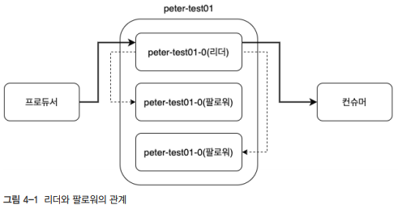

# 카프카의 내부 동작 원리와 구현

## 1. 카프카 리플리케이션

고가용성 분산 스트리밍 플랫폼인 카프카는 무수히 많은 데이터 파이프라인의 중앙에 위치하는 메인 허브 역할을 한다. 카프카는 초기 설계 단계에서부터 하드웨어 이슈 등으로 브로커 한두 대에서 장애가 발생하더라도 중앙 데이터 허브로서 안정적인 서비스가 운영될 수 있도록 구상되었다.  

<br/>

### 1-1. 리플리케이션 동작 개요

카프카는 브로커의 장애에도 불구하고 연속적으로 안정적인 서비스를 제공함으로써 데이터 유실을 방지하며 유연성을 제공한다. 카프카의 리플리케이션 동작을 위해 토픽 생성 시 필수값으로 replication factor 라는 옵션을 설정해야 한다.  

 - 실제로 리플리케이션되는 것은 토픽이 아니라, 토픽을 구성하는 각각의 파티션들이다.
```sh
# 파티션 1개, 리플리케이션 팩터 3개인 peter-test01 토픽 생성
/usr/local/kafka/bin/kafka-topics.sh --bootstrap-server peter-kafka01.foo.bar:9092 --create --topic peter-test01 --partitions 1 --replication-factor 3

# 토픽 상세 내용 확인
# 파티션0의 리더는 브로커1을 나타내고, 리플리케이션들은 브로커1,2,3에 있다.
/usr/local/kafka/bin/kafka-topics.sh --bootstrap-server peter-kafka01.foo.bar:9092 --topic peter-test01 --describe
```
<br/>

 - 토픽에 메시지 전송
```sh
# 토픽에 메시지 전송
/usr/local/kafka/bin/kafka-console-producer.sh --bootstrap-server peter-kafka01.foo.bar:9092 --topic peter-test01

# 세그먼트 파일 확인
/usr/local/kafka/bin/kafka-dump-log.sh --print-data-log --files /data/kafka-logs/peter-test01-0/00000000000000000000.log
```
<br/>

### 1-2. 리더와 팔로워

카프카는 내부적으로 모두 동일한 리플리케이션들을 리더와 팔로워로 구분하고, 각자의 역할을 분담시킨다.  
__리더는 리플리케이션 중 하나가 선정되며, 모든 읽기와 쓰기는 그 리더를 통해서만 가능하다. 즉, 프로듀서는 모든 리플리케이션에 메시지를 보내는 것이 아니라 리더에게만 메시지를 전송한다. 또한, 컨슈머도 오직 리더로부터 메시지를 가져온다.__  
 - 프로듀서는 토픽으로 메시지를 전송하는데, 파티션의 리더만 읽고 쓰기가 가능하여 0번 파티션의 리더로 메시지를 보낸다.
 - 컨슈머 동작에서도 0번 파티션의 리더로부터 메시지를 가져온다.
 - 팔로워들은 리더에 문제가 발생하거나 이슈가 있을 경우를 대비해 지속적으로 파티션의 리더가 새로운 메시지를 받았는지 확인하고, 새로운 메시지가 있다면 해당 메시지를 리더로부터 복제한다.

<div align="center">
    
</div>
<br/>

### 1-3. 복제 유지와 커밋

리더와 팔로워는 ISR이라는 논리적 그룹으로 묶여있다. ISR 그룹 안에 속한 팔로워들만 새로운 리더의 자격을 가질 수 있다.  

ISR 내의 팔로워들은 리더와의 데이터 일치를 유지하기 위해 지속적으로 리더의 데이터를 따라가게 되고, 리더는 ISR 내 모든 팔로워가 메시지를 받을 떄까지 기다린다. 하지만 팔로워가 네트워크 오류, 브로커 장애 등 여러 이유로 리더로부터 리플리케이션하지 못하는 경우도 발생할 수 있다.  

리더는 읽고 쓰는 동작은 물론, 팔로워가 리플리케이션 동작을 잘 수행하고 있는지도 판단한다. 만약, 팔로워가 특정 주기의 시간만큼 복제 요청을 하지 않는 다면, 리더는 해당 팔로워가 리플리케이션 동작에 문제가 발생했다고 판단해 ISR 그룹에서 제외시킨다.  

ISR 내에서 모든 팔로워의 복제가 완료되면, 리더는 내부적으로 커밋되었다는 표시를 하게 된다. 마지막 커밋 오프셋 위치는 하이워터마크라고 부른다. 즉, 커밋되었다는 것은 리플리케이션 팩터 수의 모든 리플리케이션이 전부 메시지를 저장했음을 의미한다. 그리고 이렇게 커밋된 메시지만 컨슈머가 읽어갈 수 있다. 카프카에서 커밋되지 않은 메시지를 컨슈머가 읽을 수 없게 하는 이유는 메시지의 일관성을 유지하기 위해서이다.  
 - ISR 내에 모든 팔로워가 리더의 메시지를 복제한 경우 커밋으로 본다.
 - 카프카는 메시지 불일치 현상을 방지하고자 커밋된 메시지만 컨슈머가 읽어갈 수 있도록 구현되어 있다.

<br/>

모든 브로커는 재시작될 때, 커밋된 메시지를 유지하기 위해 로컬 디스크의 replication-offset-checkpoint라는 파일에 마지막 커밋 오프셋 위치를 저장한다.  
해당 파일은 브로커 설정 파일에서 설정한 로그 디렉토리의 경로에 있으며, 브로커 설정 파일의 로그 디렉토리는 /data/kafka-logs로 설정되어 있다.  

```sh
# 마지막 커밋 오프셋 위치 확인
cat /data/kafka-logs/replication-offset-checkpoint
peter-test01 0 1 # 0은 파티션 번호, 1은 커밋된 오프셋 번호

# 메시지 발송 후 커밋 오프셋 위치 확인
/usr/local/kafka/bin/kafka-console-producer.sh --bootstrap-server peter-kafka01.foo.bar:9092 --topic peter-test01
cat /data/kafka-logs/replication-offset-checkpoint
peter-test01 0 2 # 0은 파티션 번호, 2는 커밋된 오프셋 번호
```
<br/>

### 1-4. 리더와 팔로워의 단계별 리플리케이션 동작

리더는 메시지를 읽고 쓰기를 처리하며 매우 바쁘게 동작한다. 때문에, 리더가 리플리케이션 동작을 위해 팔로워들과 많은 통신을 주고받으면 카프카의 장점인 빠른 성능을 내기 어렵다.  
따라서, 카프카는 리더와 팔로워 간의 리플리케이션 동작을 처리할 때 서로의 통신을 최소화할 수 있도록 설계하여 리더의 부하를 줄였다.  

 - 카프카에서는 리더와 팔로워사이에 ACK를 주고받는 통신이 없다. 즉, ACK 통신을 제거함으로써 리플리케이션 동작의 성능을 더욱 높였다.
 - 카프카는 ACK 통신을 제외했음에도 팔로워와 리더 간의 리플리케이션 동작이 매우 빠르면서 신뢰할 수 있다. (리플리케이션 동작 방식은 리더 푸시가 아니라 팔로워들이 풀하는 방식을 이용)
```
1. 프로듀서가 토픽으로 메시지를 전달
2. 리더가 메시지를 저장 (팔로워들은 아직 리플리케이션 전)
3. 팔로워들은 리더에게 새로운 메시지를 확인하고 리플리케이션하기 위해 요청
 - 리더는 팔로워들이 리플리케이션 동작 성공 여부를 알지 못한다.
 - RabbitMQ에서는 모든 미러가 메시지를 받았는지에 대한 ACK를 리더에게 리턴한다.

4. 리더는 1번 오프셋의 위치에 두 번째 메시지를 프로듀서로부터 받은 뒤 저장
5. 0번 오프셋에 대한 리플리케이션 동작을 마친 파롤워들은 리더에게 1번 오프셋에 대한 리플리케이션 요청
6. 팔로워들로부터 1번 오프셋 요청을 받은 리더는 팔로워들이 0번 오프셋 대한 리플리케이션 동작 성공을 인지, 오프셋 0에 대해 커밋 표시를 한후 하이워터 마크 증가
 - 팔로워가 0번 오프셋 대한 리플리케이션 성공이 아니면, 0번 오프셋 리플리케이션 요청을 보냈을 것임
 - 리더는 팔로워들이 보내는 리플리케이션 요청의 오프셋으로 성공 여부를 알 수 있음
7. 팔로워들로부터 1번 오프셋 메시지에 대한 요청을 받은 리더는 0번 오프셋 메시지 커밋 내용도 함께 전달
```
<br/>

### 1-5. 리더에포크와 복구

