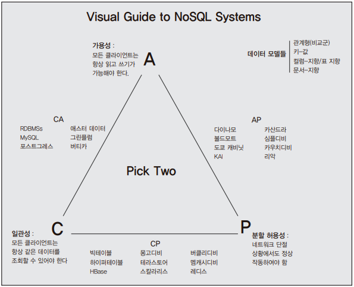

# 3. NoSQL

## 3.1 NoSQL 개념과 정리

NoSQL은 'Not Only SQL 약자'로 알려져 있지만, 사실 NoSQL은 공식적으로 정의된 적이 없다.  
마틴 파울러의 'NoSQL: 빅 데이터 세상으로 떠나는 간결한 안내서'에는 NoSQL이 아래의 조건을 만족하는 데이터 저장소라고 기술되어 있다.
 - 대용량 웹 서비스를 위하여 만들어진 데이터 저장소
 - 관계형 데이터 모델을 지양하며 대량의 분산된 데이터를 저장하고 조회하는 데 특화된 저장소
 - 스키마 없이 사용 가능하거나 느슨한 스키마를 제공하는 저장소

 

---
## 3.2 NoSQL 탄생 배경

2010년 이전에는 기업용 애플리케이션을 작성할 때 사용할 데이터 저장소로 관계형 데이터베이스를 선택했다.  
하지만, 일반적으로 관계형 데이터베이스는 저장된 데이터의 양이 많아질수록 읽기/쓰기 성능의 저하가 일어난다.  
특히 쓰기 성능의 저하가 심한데, 이는 대부분의 관계형 데이터베이스가 채택하고 있는 인덱스 처리 방법인 B트리의 한계에서 기인한다.  
또한, 관계형 데이터베이스는 중앙 집중식 데이터 관리 패턴에 해당하기 때문에 단일 하드웨어의 성능에 따라 전체 시스템의 성능이 결정된다.  

 

이러한 이유로 오라클과 같은 상용 데이터베이스 밴더사들은 분산 환경에서도 동작하도록 관계형 데이터베이스의 트랜잭션을 느슨하게 처리하는 솔루션을 개발했다.  
하지만, 이러한 솔루션은 애플리케이션 복잡도가 증가하고 하드웨어와 소프트웨어 개발 비용 증가로 이어지게 된다.  
또한, 관계형 데이터베이스의 기본적인 특성들이 훼손되고 분산 환경에도 그다지 최적화되지 못하는 딜레마에 빠지게 될 수 있다.  

 

글로벌 서비스 업체(구굴, 페이스북, 아마존 등)들은 더 이상 관계형 데이터베이스만으로는 서비스 트래픽을 감당하기 어렵다고 판단했다.  
시간이 지남에 따라 실시간 분산 처리를 위한 오픈소스 솔루션들이 개발되었고, 분산 환경에서 대량의 데이터를 빠르게 처리하기 위한 다양한 NoSQL이 생겨나게 된다.  

 

NoSQL은 관계형 데이터베이스가 제공하는 쿼리와 트랜잭션 같은 편의 기능을 제공하지 않으며, 제공하는 데이터의 일관성 레벨도 NoSQL별로 다르다.  
또한, NoSQL 마다 설계 사상과 내부구조가 다르고, 종류가 다양하다.  
그럼에도 불구하고 NoSQL을 선택하는 이유는 하드웨어 추가에 따른 성능의 선형 증가를 얻을 수 있다는 장점 때문이다.  

 

NoSQL은 대량의 데이터를 빠르게 처리하기 위해 메모리에 임시 저장하고 응답하는 등의 방법을 사용한다.  
또한, 동적인 스케일 아웃을 지원하고, 가용성을 위하여 데이터 복제 등의 방법으로 관계형 데이터베이스가 제공하지 못하는 성능과 특징을 제공한다.  
NoSQL은 매우 자유도가 높은 솔루션으로, 스키마 없이 데이터를 저장하고 조회할 수 있으며 실시간으로 시스템의 확장과 축소를 지원하기도 한다.  

 

---
## 3.3 CAP 정리

CAP정리란, 이론 컴퓨터 과학 분야에서 분산 컴퓨터 시스템을 설명하는 데 사용되는 이론이다.  
일관성, 가용성, 분할 허용성 모두를 동시에 지원하는 분산 컴퓨터 시스템은 없다라고 정의되어 있다.  
 - NoSQL은 일관성, 가용성, 분할 허용성 가운데 두 가지 속성만을 지원하며 나머지 한 속성은 특정 조건에서만 만족한다.

     

    이미지 출처 - https://blog.nahurst.com/visual-guide-to-nosql-systems

 

### 3.3.1 일관성

일관성은 동시성 또는 동일성이라고도 하며 '다중 클라이언트에서 같은 시간에 조회하는 데이터는 항상 동일한 데이터임을 보증하는 것'을 의미한다.  
일관성은 관계형 데이터베이스가 지원하는 가장 기본적인 기능이다. 하지만, NoSQL에서는 빠른 분산 처리를 위하여 일관성을 희생하기도 한다.

 

각 NoSQL은 분산 노드 간의 데이터 동기화를 위해서 두 가지 방법을 사용한다.  
 - 동기식 방법: 느린 응답, 강한 데이터 정합성
 - 비동기식 방법: 빠른 응답, 약한 데이터 정합성

 

첫 번째로 데이터의 저장 결과를 클라이언트로 응답하기 전에 모든 노드에 데이터를 저장하는 동기식 방법이다.  
동기식 방법은 모든 노드의 데이터 저장이 완료되는 시간 동안 클라이언트에게 저장 결과를 돌려줄 수 없으므로 느린 응답시간을 보이지만, 강한 데이터의 정합성을 보장한다.  

 

두 번째로 메모리나 임시 파일에 기록하고 클라이언트에 먼저 응답한 다음, 특정 이벤트 또는 프로세스를 사용하여 노드로 데이터를 동기화하는 비동기식 방법이다.  
비동기식 방법은 클라이언트에게 빠른 응답을 줄 수 있지만, 쓰기 노드에 장애가 발생하였을 때 데이터를 잃어버릴 수 있는 단점이 있다.

 

#### ※ 카산드라의 일관성 레벨

가용성과 분할 허용성을 지원하는 카산드라는 최종 일관성을 지원한다.  
최종 일관성이란 시간이 지남에 따라서 최종적으로 일관성이 유지되는 일관성을 말한다.  
또한, 카산드라는 설정 값을 조절하여 강한 일관성을 지원할 수 있다.  
 - One: 하나의 노드로부터 읽기 또는 쓰기의 성공 응답을 받으면 클라이언트로 응답한다.
 - Quorum: '설정된 복제계수 / 2 + 1'개의 노드로부터 읽기 또는 쓰기 성공 응답을 받으면 클라이언트로 응답한다.
 - All: '설정된 복제계수'의 노드로부터 읽기 또는 쓰기의 성공 응답을 받으면 클라이언트로 응답한다.
    - '설정된 복제계수'는 카산드라에서 사용하는 속성으로서 데이터 복제본을 몇 개나 저장할지 결정한다. 상용 서비스에서는 복제본 3개가 권장된다.
    - 일관성 레벨이 One일 때 가장 빠른 응답시간을 가지며, 일관성 레벨이 All일 때 가장 느린 응답 시간을 가지게 된다.
    - 즉, 응답시간(=성능)을 희생하여 강한 일관성을 지원할 수 있다.

 

### 3.3.2 가용성

가용성이란 '모든 클라이언트의 읽기와 쓰기 요청에 대하여 항상 응답이 가능해야 함을 보증하는 것'이며 내고장성이라고도 한다.  
내고장성을 가진 NoSQL은 클러스터 내에서 몇 개의 노드가 망가지더라도 정상적인 서비스가 가능하다.  

 

몇몇 NoSQL은 가용성을 보장하기 위해 데이터 복제를 사용한다.  
동일한 데이터를 다중 노드에 중복 저장하여 그중 몇 대의 노드가 고장 나도 데이터가 유실되지 않도록 하는 방법이다.  
가용성을 지원하는 NoSQL은 부분 노드 장애 상황에서도 데이터의 조회와 저장에 대한 처리가 가능하다.  

 

가용성을 위한 데이터 중복 저장 방법에는 동일한 데이터를 가진 저장소를 하나 더 생성하는 마스터-슬레이브 복제 방법과 데이터 단위로 중복 저장하는 피어-투-피어 복제 방법이 있다.  
마스터-슬레이브 복제는 관계형 데이터베이스 시스템에서 고가용성을 지원하기 위한 솔루션으로 사용되기도 한다.

 

### 3.3.3 네트워크 분할 허용성

네트워크 분할 허용성은 지역적으로 분할된 네트워크 환경에서 동작하는 시스템에서 두 지역 간의 네트워크가 단절되거나 네트워크 데이터의 유실이 일어나더라도 각 지역 내의 시스템은 정상적으로 동작해야 함을 의미한다.  

 

---
## 3.4 NoSQL의 분류

NoSQL은 데이터의 저장 방식에 따라 분류되기도 한다.  
저장소는 크게 키-값 모델, 문서 모델, 컬럼 모델, 그래프 모델로 분류할 수 있다.  

 

### 3.4.1 키-값 모델 NoSQL

키-값 모델 NoSQL은 가장 기본적인 형태의 NoSQL으로, 키 하나로 데이터 하나를 저장하고 조회할 수 있는 단일 키-값 구조를 가진다.  
 - 관계형 데이터베이스와 비교하면 주 키 하나와 일반 필드 하나를 가진 테이블을 예로 들 수 있다.
 - JAVA 언어와 비교하면 Map 자료형을 예로 들 수 있다.

 

#### 키-값 모델 NoSQL 특징

키-값 모델 NoSQL에 저장 가능한 데이터의 종류는 각 NoSQL별로 상이하다.  
대부분의 키-값 모델 NoSQL은 단순한 저장구조로 인하여 복잡한 조회 연산을 지원하지 않는다.  
또한, 고속 읽기와 쓰기에 최적화된 경우가 많다.  
다른 모델의 NoSQL과 비교하여 API가 단순하기 때문에 처음 NoSQL을 접하는 사용자가 쉽게 이해하고 사용할 수 있다.  
 - [레디스](http://redis.io/)
    - 다양한 자료구조를 저장하고 조회할 수 있으며 다양한 종류의 조회 방법을 지원하는 인메모리 NoSQL이다. C 언어로 구현되어 있다.
    - 키-값 저장소로 분류되지만 공통 특징 이외의 부가적인 기능을 제공한다.
 - [리악](http://docs.basho.com/)
    - 단일 고장점을 가지지 않는 아키텍처와 맵 리듀스를 지원하는 키-값 모델 NoSQL이다. 값에 태그를 저장하여 보조 인덱스의 생성이 가능하다. 카산드라와 유사한 클러스터링 아키텍처를 지원하며, 최종 일관성을 지원한다.
 - [다이나모](http://aws.amazon.com/dynamodb/)
    - 범위 조회가 가능한 키-값 모델 NoSQL이다. 아마존에서 개발하고 서비스 중인 사용 서비스, 서비스 종류에 따라 다른 과금 체계를 가진다. 데이터는 SSD에 저장되며, 맵리듀스를 사용한 프로그래밍이 가능하다.
 - 볼드모트(http://www.project-voldemort.com/voldemort/)
    - 링크드인에서 사용하고 있는 키-값 모델 저장소다. 단일 고장점을 가지지 않으며, 아마존의 다이나모 설계를 구현한 오픈소스 솔루션이다. 볼드모트 공식 문서에 따르면 초당 1~2만 건을 처리할 수 있다.

 

#### 데이터 저장 방법

키-값 모델 NoSQL의 데이터 저장은 단일 키에 단일 데이터를 저장하는 간단한 구조로 인하여 주로 단순한 정보의 빠른 저장과 조회를 제공한다.  

    

 

#### 적절한 사용처

키-값 모델 NoSQL의 적절한 사용처로는 사용자의 프로필 정보, 웹 서버의 클러스터를 위한 세션 정보, 장바구니 정보, URL 단축 정보 저장 등이 해당된다.  

키-값 모델 NoSQL은 데이터 자체의 값을 기준으로 검색하는 기능을 지원하지 않기 때문에 우편번호를 저장하고 30개씩 분할하여 출력하는 서비스에 적절하지 못하다. 또한, 복잡한 다중연산이 필요한 서비스에도 어울리지 않으며, 하나의 서비스 요청에 다수의 데이터 조회 및 수정 연산이 발생하면 트랜잭션 처리가 불가능하여 데이터 정합성을 보장할 수 없다.  

 

### 3.4.2 문서 모델 NoSQL

문서 모델 NoSQL 저장소는 키-값 모델을 개념적으로 확장한 구조다.  
하나의 키에 하나의 구조화된 문서를 저장하고 조회한다.  

 

#### 문서 모델 NoSQL 특징

문서 모델 NoSQL이 동작하는 방식은 마치 URL을 이용하여 웹 서버에 저장된 HTML 문서를 조회하는 것과 유사한데, URL이 키에 해당하고 HTML 문서가 저장된 데이터에 해당된다.  
문서 모델 NoSQL의 키는 문서에 대한 ID로 표현된다. 또한, 저장된 문서를 컬렉션으로 관리하며, 문서 저장과 동시에 문서 ID에 대한 인덱스를 생성한다. 문서 ID에 대한 인덱스를 사용하여 O(1) 시간 안에 문서를 조회할 수 있다.  
키-값 및 컬럼 모델 NoSQL에 비하여 상대적으로 많은 종류의 기능을 제공하며, 관계형 데이터베이스와 유사한 검색 조건을 포함한 쿼리를 처리할 수 있다.  
대부분의 문서 모델 NoSQL은 B트리 인덱스를 사용하여 2차 인덱스를 생성한다. B트리는 크기가 커지면 커질수록 새로운 데이터를 입력하거나 삭제할 때 성능이 떨어지게 된다. 때문에, B트리를 사용하는 문서 모델 NoSQL은 읽기와 쓰기 비율이 7:3 이상일 때 가장 좋은 성능을 보인다.  
 - [MongoDB](http://www.mongodb.org/)
    - 자동 샤딩을 지원하는 인기 절정의 NoSQL이다.
 - [카우치베이스](http://www.couchbase.com/)
    - B트리의 단점을 보완한 수정된 B트리 인덱스를 사용하며, 자체 클러스터 모니터링 기능이 뛰어난 문서 모델 NoSQL이다. 내부적으로 맵 리듀스를 사용하여 동작한다.
 - [테라스토어](https://code.google.com/p/terrastore/)
    - Quartz Scheduler를 만든 테라코타 사에서 만들었다. 일관성을 희생하지 않으면서 동적 확장과 자동 샤딩을 지원하는 문서 모델 NoSQL이다.
 - [레이븐DB](https://github.com/ravendb/ravendb)
    - 분산 노드에서 관계형 데이터베이스에서 지원하는 ACID 특성을 지원하는 문서 모델 NoSQL이다. 닷넷으로 작성되어 있으며, LINQ라는 쿼리 언어를 지원한다.

 

#### 데이터 저장 방법

문서 모델 NoSQL은 구조화된 문서 데이터를 저장하며, 문서 안에 문서를 포함하는 내포 관계를 정의하거나 문서의 참조를 지정할 수 있다.  
 - 문서 모델 NoSQL은 항상 고정된 필드를 가진 구조의 문서를 저장할 필요가 없다.

    

 

#### 적절한 사용처

문서 모델 NoSQL은 B트리의 특성으로 인하여 한 번 작성되면 자주 변하지 않는 정보를 저장하고 조회하는 데 적합하다. 예를 들어 중앙 집중식 로그 저장, 타임라인 저장, 통계 정보 저장 등이 해당된다. 단, 조회 시 특정 수량을 기준으로 잘라서 조회하는 기능 등에는 알맞지 않다.  

 

### 3.4.3 컬럼 모델 NoSQL

컬럼 모델 NoSQL은 하나의 키에 여러 개의 컬럼 이름과 컬럼 값의 쌍으로 이루어진 데이터를 저장하고 조회한다.  
단일 키에 의한 단일 컬럼 및 범위 조회도 가능하다.  
모든 컬럼은 항상 타임스탬프값과 함께 저장된다.  
컬럼 모델 NoSQL에서 키는 로우키라 불린다.  

#### 컬럼 모델 NoSQL 특징

대부분의 컬럼 모델 NoSQL은 구글 빅테이블의 영향을 받아 개발되어, 로우키, 컬럼키, 컬럼 패밀리 같은 빅테이블 개념이 공통적으로 사용된다. 저장과 조회의 기본 단위는 컬럼이고, 컬럼은 컬럼 이름과 컬럼 값, 타임스탬프로 구성된다. 컬럼의 집합은 로우이며, 로우키는 각 로우를 유일하게 식별하는 값이다. 로우의 집합은 테이블 또는 키 스페이스가 된다.  

 

컬럼 모델 NoSQL에서 컬럼 하나를 조회할 때는 행을 구분하는 로우키와 열을 구분하는 컬럼키를 사용한다. 마치 스프레드시트에서 X축, Y축에 따라 셀을 조회하는 방법과 동일하다. 이때 컬럼키를 생략하면 해당 로우에 저장된 모든 컬럼이 조회된다.  

 

 - 데이터 파일의 저장 방법
   - 컬럼 모델 NoSQL은 컬럼 패밀리를 기준으로 데이터 파일을 생성한다.
   - 예를 들어, 두 개의 컬럼 패밀리를 가진 로우를 저장하면 두 개의 물리적인 파일이 생성되어 저장된다. 때문에, 하나의 로우에 저장된 모든 컬럼을 조회하는 것보다 로우키에 해당하는 컬럼 패밀리를 조회하는 것이 더 빠르다.
   - 또한, 하나의 로우에 많은 컬럼 패밀리를 지정하면 하나의 로우를 조회하기 위해서 더 많은 물리적 파일에 접근하게 되어 응답시간이 늘어나게 된다.

 - 타임스탬프
   - 컬럼 모델 NoSQL은 저장된 컬럼에 대한 타임스탬프를 유지한다.
   - 이미 저장되어 있는 컬럼과 동일한 로우키와 컬럼키를 가진 필드를 추가하면 최근의 타임스탬프를 가진 새로운 컬럼이 추가되어 동일한 이름을 가진 컬럼에 두 개의 값이 유지된다. 이때 조회 연산이 수행되면 가장 최근의 타임스탬프를 가진 데이터를 돌려준다.
   - 또한, 동일한 이름을 가진 컬럼을 몇 개까지 유지할 것인가에 대한 설명도 가능하며, 과거의 데이터도 조회할 수 있다.
 - 빠른 쓰기 성능을 위해서 메모리와 커밋로그에 데이터를 기록하고 클라이언트로 응답하고 지정한 임계값보다 메모리의 크기가 커지면 영구 저장소에 저장하는 방법을 사용하기도 한다.
 - [HBase](http://hbase.apache.org/)
   - 자바로 구현된 하둡 기반의 컬럼 모델 NoSQL이다. 데이터를 저장하기 위한 파일시스템으로 하둡을 사용한다.
 - [카산드라](http://cassandra.apache.org/)
   - 아마존의 분산 처리 아키텍처와 빅테이블의 데이터 구조를 가지고 있는 컬럼 모델 NoSQL이다. 페이스북에서 개발했다.
 - [하이퍼 테이블](http://hypertable.com)
   - C++로 구현되어 있으며 HBase와 유사한 구조를 가진다. HBase에 비하여 빠른 성능을 제공한다.

 

#### 데이터 저장 방법

로우키의 정렬은 바이트 단위의 사전식 정려를 따른다.  
또한, 컬럼 패밀리에 포함된 컬럼의 정렬도 로우키의 정렬 순서와 동일한 기준을 따라서 정렬된다.

    

 

#### 적절한 사용처

대부분의 컬럼 모델 NoSQL은 쓰기와 읽기 중에서 쓰기에 더 특화되어 있다.  
쓰기 연산은 데이터를 먼저 커밋로그와 메모리에 저장한 후 응답하기 때문에 매우 빠른 응답 속도를 제공한다.  
때문에, 읽기 연산 대비 쓰기 연산이 많은 서비스나 빠른 시간 안에 대량의 데이터를 입력하고 조회하는 서비스를 구현할 때 가장 좋은 성능을 나타낸다.  
예를 들어 채팅 내용 저장, 메일 저장소, 알림 내용 저장, 실시간 분석을 위한 데이터 저장소 등의 서비스 구현에 적합하다.  
 - 카산드라는 페이스북에서 메일과 쪽지의 알림을 처리하기 위하여 개발됐다.
 - HBase는 대용량 데이터 분석에 주로 사용된다.

 

### 3.4.4 그래프 모델 NoSQL

그래프 모델 NoSQL은 노드와 관계를 사용하여 데이터를 저장하고 조회하는데, 관계는 속성이라는 부가 정보를 가진다.  
관계형 데이터베이스는 엔티티와 관계를 레코드로 표현하는데, 그래프 모델 NoSQL은 노드와 관계로 표현한다.  
예를 들어 사용자와 구매 정보를 그래프 모델 NoSQL에서 표현한다면, 사용자와 상품은 노드가 되며 구매는 관계가 된다.  

 

#### 그래프 모델 NoSQL 특징

그래프 모델 NoSQL은 노드와 노드 간의 관계를 저장하며 노드가 하나일 때는 관계를 지정할 수 없다.  
노드의 조회를 위해서 관계를 조회 조건으로 사용한다.  
관계는 방향성을 가지기도 하는데, 이 방향성에 의하여 여러 단계의 조회가 가능하다. 이를 순회라고 한다.  
하나의 노드에서 다른 노드까지 도착하는데 여러 경로가 존재할 수 있다.  
이로 인해 데이터 조회를 위한 순회의 깊이를 제한하기도 한다.  
 - 그래프 자체의 복잡성으로 인하여 도입을 위한 기술적 장벽이 있다.

 

#### 데이터 저장 방법

그래프 모델 NoSQL은 노드와 관계를 사용하여 데이터를 저장한다.

    

 

#### 적절한 사용처

그래프 모델 NoSQL은 친구 추천과 같은 연관검색을 위한 정보를 저장하고 조회하는 데 적합하다.  
기존 관계형 데이터베이스에서 구현하기 까다로운 부분이 그래프 모델 NoSQL에서는 기본으로 제공되기 때문이다.  
추천 시스템, 다중 관계를 가진 엔티티를 저장하고 조회하는 데 알맞다.
 - 많은 그래프 모델 NoSQL은 각 데이터에 대한 관계를 저장하기 때문에 데이터를 다중 노드에 분산하여 저장하는 데 많은 한계가 있다.
 - 만약 노드가 분산된 저장소에 저장되어 있을 때 관계를 조회하면 원격지의 저장소에 접근해야 하기 때문에 성능이 떨어지게 된다. 이러한 이유로 분산 처리를 지원하는 그래프 모델 NoSQL은 많지 않다.

 

### 3.5 언제 NoSQL을 사용해야 하는가

대량의 단순 정보를 빠르게 저장하고 조회할 때, 관계형 데이터베이스가 처리하지 못하는 대량의 데이터를 입력할 때, 스키마가 고정되지 않은 데이터를 저장하고 조회할 때 해당될 수 있다.  
관계형 데이터베이스의 특성상 제공 가능한 성능에 한계가 있다. 그 한계를 넘어선 성능이 필요할 때 NoSQL을 선택할 수 있다.
 - 제일 중요한 것은 '언제 NoSQL을 사용해야 하는가?'보다는 '어떤 NoSQL을 사용해야 하는가?'이다.
 - 일관성 모델: 서비스에서 어느 정도의 일관성이 필요한지 확인한다. 강한 일관성이 필요한 서비스를 구현하기 위해서 궁극적 일관성을 지원하는 카산드라를 선택하는 것은 득보다 실이 클 수 있다. 일관성은 데이터 저장 모델과는 크게 상관이 없다.
 - 데이터 모델: 제공하려는 기능이 키-값 모델과 같은 간단한 데이터 모델로 처리가 가능한지 또는 문서 모델과 같이 중첩된 구조를 지원해야 하는지 판단해야 하는데, 이 부분은 실제 구현에 따라서 달라질 수 있다. 결론적으로, 선택한 NoSQL의 데이터 모델로 필요한 기능을 구현할 수 있는지에 대해 판단해야 한다.
 - 읽기 쓰기 성능: 제공할 기능의 읽기와 쓰기 비율에 따라서 선택할 NoSQL도 바뀌게 된다. 예를 들어, 읽기 쓰기 모두에 빠른 응답시간이 필요하다면 인 메모리 NoSQL이 후보가 될 수 있으며, 상대적으로 읽기 비율이 높다면 B트리 인덱스 구조를 사용하는 문서 모델 NoSQL이 후보가 될 수 있다.
 - 단일 고장점: 선택한 NoSQL이 단일 고장점을 가지고 있는지 확인하여야 하며, 단일 고장점을 가지고 있더라도 쉬운 복구가 가능한지 확인해야 한다. 예를 들어, HBase는 단일 고장점을 가지고 있지만 하드웨어적인 방법을 통해서 단일 고장점을 제거할 수 있다. 또한, 보조 네임 노드를 사용하고 있기 때문에 장애 상황에서 빠른 복구도 가능하다. 무정지 서비스가 중요 목표라면 단일 고장점을 가진 NoSQL 선택을 피해야 한다.
 - 원자성 지원: 선택한 NoSQL의 트랜잭션 지원 여부, 단일 연산에 대한 원자성 지원 여부 같은 CAP 특징을 확인해야 한다. 원자성의 지원이 어느 쪽에서 지원되는지 확인하여야 한다. 클라이언트에서 지원하는 단일 연산의 원자성은 코드의 복잡성을 증가시킬 수 있다.
 - 하드웨어 구성: 해당 NoSQL이 가지는 시스템 아키텍처를 확인해야 한다. 가용성을 지원하기 위해서 마스터-슬레이브 구조의 NoSQL을 선택했다면 저장되는 데이터의 최대 크기는 절대적인 저장소 크기의 절반이다. 또한, NoSQL 내부의 구성요소와 하드웨어의 대한 기본 구성 정보를 알아야 한다. 예를 들어 HBase는 최소 5대 이상의 하드웨어에서 수행되어야만 성능의 선형 증가를 얻을 수 있다.
 - 무중단 시스템: 시스템을 확장할 때 시스템 중단이 필요한지 여부와 같은 시스템의 특성을 확인해야 한다. 예를 들면 MongoDB와 같이 자동 샤딩을 지원하는 NoSQL은 운영 중에 시스템을 추가할 수 있지만, 자동 샤딩 중에는 서비스 응답시간이 느려지기도 한다.
 - NoSQL은 관계형 데이터베이스의 한계를 극복하고 모든 장점만 모아둔 솔루션이 아니다. 기존의 관계형 데이터베이스가 제공하는 테이블 조인, 트랜잭션, SQL 문과 같은 편의성을 포기하고 스케일 아웃과 같은 NoSQL의 장점을 얻은 또 다른 데이터베이스다. 즉, 얻는 것이 있으면 잃는 것도 있다.