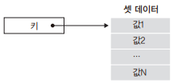
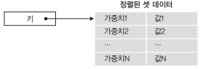
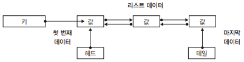
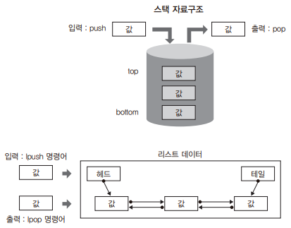
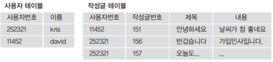
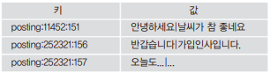

# 4. 레디스 시작

## 4.1 레디스 자료구조

레디스가 지원하는 데이터형은 총 5가지 이다.  
논리적 구조 측면에서 보았을 때 정렬된 셋은 셋 데이터형에 저장된 요소에 정렬 기능이 추가된 구조로, 3가지 데이터형과 문자열로 구분할 수 있다.  
맵 데이터 구조는 키 하나에 데이터형 하나가 저장되는 매우 단순한 구조를 가진다.  
이 단순함은 레디스의 가장 큰 장점이자 단점이 될 수 있는데, 장점은 익히기 쉽고 직관적이고, 단점은 저장된 데이터를 가공하는 방법에 제한이 있다는 점이다.  
레디스는 이러한 가공 방법의 제한을 다양한 종류의 데이터형과 명령을 통해서 보완하고 있다.  

<br/>

## 4.2 레디스 데이터 구조와 명령어

레디스는 저장된 데이터형에 따라서 각각 다른 명령을 지원하며, 명령 수는 약 150여 개에 이른다.  
레디스 명령을 처리 방식에 따른 범주로 나누어 보면 크게 세 가지로 분류되는데 데이터 처리 명령과 키 관리 명령 그리고 서버 관리 명령이다.  

<br/>

### 4.2.1 문자열 데이터

문자열 데이터는 키 하나에 문자열 하나를 저장할 수 있다.  
저장 가능한 문자열의 크기는 최대 512MB이며 이 크기를 넘어서 저장할 때에는 '(error) ERR string exceeds maximum allowed size (512MB)' 에러 메시지를 출력한다.  
 - 레디스가 문자열 데이터를 저장할 때는 인코딩된 문자열과 몇 가지 부가 정보가 포함된 구조체로 변환하여 저장하며 이것을 레디스 객체형이라고 부른다.

<br/>

#### 문자열 데이터의 입력과 조회

레디스는 동시에 여러 키와 데이터를 저장하고 조회하는 mget, mset 명령을 제공한다.  
레디스는 기본적인 명령(set, get)에 접두사와 접미사를 추가한 명령어가 제공된다.  
예를 들어 셋 데이터를 처리할 때는 접두사로 Z를, 해시 데이터를 처리할 때는 H를 사용한다.  
 - mset <키> <값> [<키> <값>] ..: 키와 값의 쌍으로 이루어진 데이터를 저장한다.
    - 최초 지원: 1.0.1
    - 시간 복잡도: O(N), N 값은 저장할 키 수
    - 응답: <상태응답>, 항상 OK
 - mget <키> [<키>] ..: 주어진 키에 대한 값의 목록을 조회한다.
    - 최초 지원: 1.0.0
    - 시간 복잡도: O(N), N 값은 조회할 키 수
    - 응답: <멀티 벌크응답>, 조회된 키의 값 목록
 - setnx <키> <값>: 단일 키에 대해서 데이터를 조회한 뒤 값이 없으면 저장한다.
    - 최초 지원: 1.0.0
    - 시간 복잡도: O(1)
    - 응답: <숫자응답>, 저장되었으면 1, 저장에 실패하면 0
 - msetnx <키> <값> [<키> <값>] ..: N개의 키와 값의 쌍을 요청하고, 이미 존재하는 값이 하나라도 있으면 모든 키와 값은 저장하지 않는다.
    - 최초 지원: 1.0.1
    - 시간 복잡도: O(N), N값은 입력을 요청한 키의 수
    - 응답: <숫자응답>, 주어진 모든 키가 저장되었을 때 1, 저장되지 않았을 때 0
 - getset <키> <값>: 키가 이미 있더라도 새로운 값을 저장하고 이전의 값을 돌려준다. 
    - 만약 존재하지 않는 키에 대하여 getset 명령이 수행되면 주어진 값을 저장하고 결과로 nil을 돌려준다.
    - 최초 지원: 1.0.0
    - 시간 복잡도: O(1)
    - 응답: <벌크응답>, 이전에 저장된 값

```bash
127.0.0.1:6379> mset key1 value1 key2 value2 key3 value3
OK
127.0.0.1:6379> mget key9 key1 key2 key3
1) (nil)        
2) "value1"     
3) "value2"     
4) "value3"  

# 단일 값이 없으면 저장
127.0.0.1:6379> setnx key1 value1
(integer) 0     

# 값이 하나라도 있으면 저장 X, 모두다 없어야 저장
127.0.0.1:6379> msetnx key1 value1 key4 value4 key5 value5
(integer) 0  

# 키가 이미 있더라도 새로운 값을 저장하고 이전의 값을 돌려준다.
127.0.0.1:6379> getset mykey1 'value'
(nil)
127.0.0.1:6379> getset mykey1 'new value'
"value"
```

<br/>

#### 숫자의 증가와 감소

레디스는 저장된 문자열 데이터가 숫자일 때 incr, decr 같은 숫자 증감 명령을 사용할 수 있다.  
이외에 숫자 증감 처리하기 위한 명령어로는 BY 접미사가 부은 incrby, decrby 명령이 있다.  
incr, decr은 값이 1씩 증감되는데, BY 접미사가 붙은 incrby, decrby 명령은 입력된 인자에 해당하는 값을 증감시킨다.  
 - 증감처리는 64비트 부호화 정수 signed integer로 표현할 수 있는 범위에서만 가능하다. (-9223372036854775808 ~ 9223372036854775807)
 - incrby <키> <값>: 주어진 키에 저장된 숫자를 주어진 값만큼 증가시킨다.
   - 값에 음수가 입력되면 주어진 값만큼 감소가 이루어진다. 단, 키에 저장된 값이 숫자일 때만 수행된다.
   - 최초 지원: 1.0.0
   - 시간 복잡도: O(1)
   - 응답: <숫자응답>, 명령이 실행된 후의 키의 값
 - decrby <키> <값>: 주어진 키에 저장된 숫자를 주어진 값만큼 감소시킨다.
   - 값에 음수가 입력되면 주어진 값만큼 증가가 이루어진다. 단, 키에 저장된 값이 숫자일 때만 수행된다.
   - 최초 지원: 1.0.0
   - 시간 복잡도: O(1)
   - 응답: <숫자응답>, 명령이 실행된 후의 키의 값

```bash
127.0.0.1:6379> incr test:key1
(integer) 1
127.0.0.1:6379> incrby test:key1 5
(integer) 6
127.0.0.1:6379> decr test:key1
(integer) 5
127.0.0.1:6379> decrby test:key1 -1
(integer) 6

# 64비트 부호화 정수 범위
127.0.0.1:6379> set test:key2 9223372036854775806
OK
127.0.0.1:6379> incr test:key2
(integer) 9223372036854775807
127.0.0.1:6379> incr test:key2
(error) ERR increment or decrement would overflow

127.0.0.1:6379> set test:key3 -9223372036854775807
OK
127.0.0.1:6379> decr test:key3
(integer) -9223372036854775808
127.0.0.1:6379> decr test:key3
(error) ERR increment or decrement would overflow
```

<br/>

#### 비트연산

레디스는 비트연산을 통해 저장되는 문자열 데이터를 비트 단위로 처리할 수 있다.  
즉, 레디스는 각 비트의 값을 변경하고 조회할 수 있다.  
 - setbit <키> <오프셋> <값>: 주어진 키에 저장된 값에 대한 처리를 수행한다.
    - 즉, 입력된 오프셋 위치에 저장된 bit 값을 변경한다. setbit 명령의 응답은 setbit 명령 수행 이전에 저장된 값이다.
    - 최초 지원: 2.2.0
    - 시간 복잡도: O(1)
    - 응답: <숫자응답>, 이전에 저장되었던 비트의 값
 - getbit <키> <오프셋>: 입력된 오프셋 위치에 저장된 bit 값을 조회한다.
    - 만약, 주어진 키가 존재하지 않거나 주어진 오프셋에 해당하는 값이 없을 때는 0을 돌려준다.
    - 최초 지원: 2.2.0
    - 시간 복잡도: O(1)
    - 응답: <숫자응답>, 해당 오프셋 위치의 비트의 값, 0 또는 1
 - strlen <키>: 주어진 키에 저장된 문자열의 길이를 조회한다.
    - 만약 주어진 키가 존재하지 않으면 0을 돌려준다. strlent 명령은 저장된 데이터의 크기에 상관없이 항상 동일한 응답시간을 제공하는 특별한 성질을 가진다.
    - 최초 지원: 2.2.0
    - 시간 복잡도: O(1)
    - 응답: <숫자응답>, 저장된 문자열의 길이
 - bitcount <키> [시작인덱스] [종료인덱스]: 주어진 키값의 비트 중 1인 값의 개수를 조회한다.
    - 인덱스 범위는 바이트 단위 인덱스다.
    - 최초 지원: 2.6.0
    - 시간 복잡도: O(N), N은 저장된 데이터의 길이
    - 응답: <숫자응답>, 지정된 범위에 저장된 비트 중 1의 개수

```bash
127.0.0.1:6379> setbit bit:key1 257 1
(integer) 0
127.0.0.1:6379> getbit bit:key1 257
(integer) 1
127.0.0.1:6379> setbit bit:key1 257 1
(integer) 1
127.0.0.1:6379> getbit bit:key1 257
(integer) 1
127.0.0.1:6379> getbit bit:key1 256
(integer) 0
127.0.0.1:6379> strlen bit:key1
(integer) 33
```

<br/>

### 4.2.2 해시 데이터

해시 데이터는 문자열 필드와 값으로 이루어진 맵 구조로 되어 있다.  
해시 데이터에는 2^32 - 1 개의 필드와 값을 저장할 수 있는데, 숫자로 바꾸면 약 42억 개가 넘는다.  
또한 hgetall, hkeys, hvals를 제외한 모든 해시 명령의 시간 복잡도는 O(1)이다.  
 - 해시 데이터는 키 하나가 여러 개의 필드-값 쌍으로 이루어진다.
 - 일반적인 프로그래밍 언어의 맵 자료구조와 동일하다.

<br/>

#### 그룹 데이터 저장

해시 데이터는 여러 종류의 데이터를 하나의 키에 저장할 수 있다.  
hmset, hmget 명령은 Hash를 뜻하는 'h'와 Multi를 뜻하는 'm' 접두사가 붙어있다.
 - hmset <키> <필드> <값> [필드 값] ..: 주어진 필드와 값의 쌍을 해시 데이터에 저장한다.
    - 주어진 모든 키와 값들을 저장하는데, 인자로 입력되는 필드와 값의 쌍은 다중 입력이 가능하다.
    - 만약, 주어진 키가 존재하지 않으면 새로운 해시 데이터가 생성되어 저장된다.
    - 최초 지원: 2.0.0
    - 시간 복잡도: O(1)
    - 응답: <상태응답>, 항상 OK
 - hsetnx <키> <필드> <값>: 주어진 필드가 존재하지 않을 때 저장한다.
    - 만약, 주어진 필드가 존재한다면 값은 저장되지 않는다.
    - 최초 지원: 2.0.0
    - 시간 복잡도: O(1)
    - 응답: <숫자응답>, 값이 저장되면 1, 아니면 0
 - hmget <키> <필드> [<필드>] .. : 주어진 필드 목록을 주어진 키에서 조회한다.
    - 최초 지원: 2.0.0
    - 시간 복잡도: O(1)
    - 응답: <멀티 벌크응답>, 주어진 필드의 값
 - hlen <키>: 주어진 키에 저장된 필드의 개수를 조회한다.
    - 주어진 키가 존재하지 않으면 0을 돌려주고, 주어진 키의 데이터형이해시가 아니면 오류를 돌려준다.
    - 최초 지원: 2.0.0
    - 시간 복잡도: O(1)
    - 응답: <숫자응답>, 주어진 해시에 저장된 필드 개수
 - hdel <키> <필드> [<필드>] .. : 주어진 키에 저장된 필드를 제거한다.
    - 주어진 키가 존재하지 않으면 0을 돌려주고, 주어진 키의 데이터형이 해시가 아니면 오류를 돌려준다.
    - 최초 지원: 2.0.0
    - 시간 복잡도: O(1)
    - 응답: <숫자응답>, 삭제된 필드의 수

```Bash
# hmset: 주어진 키에 다중 필드와 값을 저장(이름, 이메일, 나이)
127.0.0.1:6379> hmset user1:info name gil-dong email gildong@test.com age 20
OK

# hsetnx: 주어진 키의 필드가 존재하는지 검사하고 저장한다.
127.0.0.1:6379> hsetnx user1:info email foo@nar.com
(integer) 0

# hmset: 마지막 로그인 일자와 로그인 디바이스 정보 저장
127.0.0.1:6379> hmset user1:info lastlogin 20230702 device android
OK

# hmget: 이름과 이메일 필드 조회
127.0.0.1:6379> hmget user1:info name email
1) "gil-dong"
2) "gildong@test.com"

# hlen: 해시 데이터에 저장된 필드 수 조회
127.0.0.1:6379> hlen user1:info
(integer) 5

# hdel: 해시 데이터에 저장된 필드 삭제
127.0.0.1:6379> hdel user1:info device
(integer) 1
127.0.0.1:6379> hlen user1:info
(integer) 4
```

<br/>

#### 숫자의 증감

해시에 저장된 데이터의 필드값이 숫자일 때 hincrby, hincrbyfloat 명령으로 증감처리를 할 수 있다.  
문자열 데이터의 지원하는 숫자 증감 명령들과는 다르게 해시 명령은 증가 명령만을 지원한다.  
숫자의 감소를 처리하기 위해서는 명령의 인자에 음수를 입력하면 된다.  
 - hincrby <키> <필드> <지정값>: 주어진 키에 저장된 필드에 숫자 증감처리를 한다.
    - 만약, 주어진 키가 존재하지 않으면 새로운 해시 데이터를 생성한다.
    - 최초 지원: 2.0.0
    - 시간 복잡도: O(1)
    - 응답: <숫자응답>, 명령이 수행되고 난 후의 필드 값
 - hincrbyfloat <키> <필드> <지정값>: 주어진 키에 저장된 필드에 숫자 증감처리를 한다.
    - 단, 지정값은 배정밀도 float값이어야 하며, 소수점은 17자리로 고정되어 있다.
    - 만약, 주어진 키가 존재하지 않으면 새로운 해시 데이터를 생성한다.
    - 최초 지원: 2.0.0
    - 시간 복잡도: O(1)
    - 응답: <숫자응답>, 명령이 수행되고 난 후의 필드 값

```Bash
127.0.0.1:6379> hmset kris:wizard life 1000 mana 1300
OK
127.0.0.1:6379> hincrby kris:wizard life -21
(integer) 979
127.0.0.1:6379> hincrby kris:wizard mana -30
(integer) 1270
127.0.0.1:6379> hincrby kris:wizard mana 25
(integer) 1295
127.0.0.1:6379> hincrbyfloat kris:wizard ciritical 12.5
"12.5"
```

<br/>

#### 해시 데이터의 키 목록 조회

해시 데이터에 저장된 모든 키의 목록과 모든 값의 목록을 조회할 때는 hgetall을 사용하면 된다.  
키의 목록이나 값의 목록만을 조회하는 명령은 hkeys, hvals가 있다.  
 - hkeys <키>: 주어진 키에 저장된 모든 필드의 목록을 조회한다.
    - 최초 지원: 2.0.0
    - 시간 복잡도: O(N), N은 저장된 필드 수
    - 응답: <멀티 벌크응답>, 주어진 키에 저장된 모든 필드 목록
 - hvals <키>: 주어진 키에 저장된 모든 값에서 필드 이름으 제외한 값의 목록을 조회한다.
    - 최초 지원: 2.0.0
    - 시간 복잡도: O(N), N은 저장된 필드 수
    - 응답: <멀티 벌크응답>, 주어진 키에 저장된 모든 값 목록

<br/>

### 4.2.3 셋 데이터

셋 데이터는 중복을 허용하지 않는 집합 형태의 자료구조이며, 정렬되어 있지 않다.  
셋 데이터에는 2(^32) - 1개의 값을 저장할 수 있다.  
셋 데이터의 내부 구현은 해시 구조이기 때문에 저장된 요소의 개수에 상관없이 동일한 시간 복잡도를 가진다.  
 - 셋 데이터는 하나의 키에 여러 개의 요소가 저장되며 집합 연산이 가능하다.
 - 합집합, 교집합, 차집합 등 집합 연상이 가능하다.
<p style="text-align: center;">
     
</p>

<br/>

#### 집합 연산

NoSQL은 데이터 간의 관계를 저장하는 기능을 지원하지 않는다.  
하지만, 셋 데이터를 사용한 집합 연산을 이용하여 관계의 저장이 가능하다.  
 - sinter <키> [<키> ..]: 주어진 키에 저장된 요소들의 교집합을 돌려준다.
    - 최초 지원: 1.0.0
    - 시간 복잡도: O(N), N은 가장 적은 수의 요소를 가진 셋에 저장된 요소 수
    - 응답: <멀티 벌크응답>, 차집합에 해당하는 값 목록

```Bash
# 팔로잉 예시 (단방향 친구 맺기)
# 사용자 A와 B가 있을 때, B가 A를 팔로우하면, B가 A를 팔로잉한다고 표현한다.
# B 입장에서 A는 팔로잉, A 입장에서 B는 팔로워이다. 이때, A도 B를 팔로우하면 팔로우 관계가 된다.
  # USER1이 USER2를 팔로우(USER1 팔로잉, USER2 팔로워)
127.0.0.1:6379> sadd user:1:follows 2
(integer) 1
127.0.0.1:6379> sadd user:2:followers 1
(integer) 1

  # USER3이 USER1를 팔로우(USER3 팔로잉, USER1 팔로워)
127.0.0.1:6379> sadd user:3:follows 1
(integer) 1
127.0.0.1:6379> sadd user:1:followers 3
(integer) 1

  # USER1이 USER3를 팔로우(USER1 팔로잉, USER3 팔로워)
127.0.0.1:6379> sadd user:1:follows 3
(integer) 1
127.0.0.1:6379> sadd user:3:followers 1
(integer) 1

  # USER2이 USER3를 팔로우(USER2 팔로잉, USER3 팔로워)
127.0.0.1:6379> sadd user:2:follows 3
(integer) 1
127.0.0.1:6379> sadd user:3:followers 2
(integer) 1

  # USER1의 팔로잉(2, 3), USER1의 팔로워(3)
127.0.0.1:6379> sinter user:1:follows user:1:followers
1) "3"
```
<p style="text-align: center;">
     
</p>

<br/>

#### 집합 요소 조회

 - scard <키>: 주어진 키에 저장된 요소들의 개수를 돌려준다.
    - 만약, 주어진 키가 존재하지 않으면 0을 돌려준다.
    - 최초 지원: 1.0.0
    - 시간 복잡도: O(1)
    - 응답: <숫자응답>, 저장된 요소의 개수
 - srem <키> <요소> [<요소> ..]: 주어진 키에 저장된 요소를 제거하고 제거된 요소의 개수를 돌려준다.
    - 만약, 주어진 키가 존재하지 않거나 해당 요소가 존재하지 않으면 0을 돌려준다.
    - 최초 지원: 1.0.0
    - 시간 복잡도: O(1)
    - 응답: <숫자응답>, 제거된 값의 수
 - spop <키>: 주어진 키에 저장된 요소 중에서 임의의 요소를 제거하고 제거된 요소를 돌려준다.
    - 만약, 주어진 키가 존재하지 않으면 nil을 돌려준다.
    - 최초 지원: 1.0.0
    - 시간 복잡도: O(1)
    - 응답: <벌크응답>, 제거된 값
 - sismember <키> <요소>: 입력된 요소가 주어진 키에 저장되어 있는 지 검사한다.
    - 만약, 주어진 키가 존재하지 않으면 0을 돌려준다.
    - 최초 지원: 1.0.0
    - 시간 복잡도: O(1)
    - 응답: <숫자응답>, 존재하면 1, 존재하지 않으면 0
 - smove <원본키> <대상키> <요소>: 원본키에 저장된 요소를 대상키로 이동하고 이동 결과를 돌려준다.
    - 만약, 원본키가 존재하지 않으면 결과로 0을 돌려주고, 대상 키가 존재하지 않으면 새로운 셋 데이터를 생성하고 요소를 이동시킨다.
    - 최초 지원: 1.0.0
    - 시간 복잡도: O(1)
    - 응답: <숫자응답>, 이동되었으면 1, 실패하면 0

```Bash
127.0.0.1:6379> sadd user:1:friends Scott Sean Simon Hal Hank
(integer) 5
127.0.0.1:6379> sadd user:1:friends Uriah Jack Jake James Jason
(integer) 5
127.0.0.1:6379> sadd user:1:friends Justin Van Vernon Victor Vincent
(integer) 5

# 요소 개수
127.0.0.1:6379> scard user:1:friends
(integer) 15

# 요소 제거
127.0.0.1:6379> srem user:1:friends Justin
(integer) 1

# 요소 제거 및 출력
127.0.0.1:6379> spop user:1:friends
"Scott"
127.0.0.1:6379> scard user:1:friends
(integer) 13
127.0.0.1:6379> sismember user:1:friends Scott
(integer) 0

# 요소 이동(제거)
127.0.0.1:6379> smove user:1:friends test:set Jack
(integer) 1

# 요소 출력
127.0.0.1:6379> smembers user:1:friends
 1) "Jake"
 2) "Uriah"
 3) "Vernon"
 4) "Victor"
 5) "James"
 6) "Hal"
 7) "Simon"
 8) "Hank"
 9) "Vincent"
10) "Sean"
11) "Van"
12) "Jason"
```

<br/>

### 4.2.4 정렬된 셋 데이터

레디스의 정렬된 셋 데이터는 셋 데이터와 유사한 구조를 가지고 있기 떄문에 셋 데이터와 동일한 특징을 가지면서 요소 정렬이라는 부가적인 특징을 가진다.  
정렬된 셋 명령의 접두사는 'Z' 이다.  
정렬된 셋 데이터는 셋 데이터 구조에 요소의 가중치값이 추가되어 있다.  
가중치에 따라서 각 요소의 정렬이 수행되는데, 기본 정렬 순서는 오름차순이다.  
즉, 가중치가 작은 데이터부터 큰 데이터의 순서로 정렬되어 조회되며, zrevrange 명령을 통해서 내림차순으로 정렬된 결과를 조회할 수 있다.  
 - 정렬된 데이터 셋 구조는 2(^32) - 1 개의 요소를 저장할 수 있고, 가중치에 입력할 수 있는 값은 정수 또는 배정밀도 부동소수점이다.
 - 정렬된 셋 데이터는 주로 실시간 순위를 계산하는 데 사용된다.
<p style="text-align: center;">
     
</p>

<br/>

 - zrevrange <키> <시작인덱스> <종료인덱스> [WITHSCORES]: 주어진 키에 저장된 요소들의 내림차순 정렬 순서 범위에 해당하는 요소를 조회한다.
    - WITHSCORES 키워드를 추가하여 요소의 가중치값을 함께 조회할 수 있다.
    - 오름차순 정렬 순서 범위를 조회하는 zrange 명령도 있으며 사용법이 동일하다.
    - 최초 지원: 1.2.0
    - 시간 복잡도: O(log(N) + M), N은 저장된 정렬된 셋 수, M은 조회될 요소 수
    - 응답: <숫자응답>, 조회된 요소 목록

```Bash
127.0.0.1:6379> zadd sort:test 2 item1
(integer) 1
127.0.0.1:6379> zadd sort:test 4 item2
(integer) 1
127.0.0.1:6379> zadd sort:test 6 item3
(integer) 1
127.0.0.1:6379> zrevrange sort:test 0 -1 withscores
1) "item3"
2) "6"
3) "item2"
4) "4"
5) "item1"
6) "2"
```

<br/>

#### 가중치 변경

가중치를 변경하기 위해서는 저장된 아이템의 가중치를 새로 지정하는 방법이 있고, 문자열의 숫자 증감 명령인 incr, decr과 유사한 저장된 가중치를 증가또는 감소시킬 수 있다.  
 - zincrby <키> <증감값> <요소>: 주어진 키에 저장된 셋 데이터 중 지정된 요소의 가중치를 입력된 값만큼 증가시킨다. incr 명령과 동일하게 음수를 입력하여 값을 감소시킬 수 있다.
    - 최초 지원: 1.2.0
    - 시간 복잡도: O(log(N)), N은 정렬된 셋 데이터에 저장된 요소의 개수
    - 응답: <숫자응답>, 명령이 수행된 이후의 가중치값
 - zrank <키> <요소>: 주어진 키에 저장된 셋 데이터 중 지정된 요소의 순위를 조회한다.
    - 조회되는 순위는 0부터 시작하며, 정렬은 가중치 오름차순이다.
    - 최초 지원: 2.0.0
    - 시간 복잡도: O(log(N)), N은 정렬된 셋 데이터에 저장된 요소의 개수
    - 응답: <숫자응답>, 값이 존재하면 가중치 오름차순으로 정렬된 순위, 없으면 nil
 - zrevrank <키> <값>: 주어진 키에 저장된 셋 데이터 중 지정된 요소의 순위를 조회한다.
    - 조회되는 순위는 0부터 시작하며, 정렬은 내림차순이다. 즉, zrank 명령과 반대의 정렬 상태를 가진다.
    - 최초 지원: 2.0.0
    - 시간 복잡도: O(log(N)), N은 정렬된 셋 데이터에 저장된 요소의 개수
    - 응답: <숫자응답>, 값이 존재하면 가중치 내림차순으로 정렬된 순위, 없으면 nil
 - zrange: z(Sorted Set) range
    - 정렬된 셋의 범위 데이터를 오름차순으로 조회
 - zrangebyscore: z(Sorted Set) range by score
    - 정렬된 셋의 점수 범위에 해당하는 데이터 조회
 - zremrangebyrank: z(Sorted Set) rem range by rank
    - 정렬된 셋에서 순위에 해당하는 범위의 데이터 제거
 - zremrangebyscore: z(Sorted Set) rem range by score
    - 정렬된 셋에서 가중치에 해당하는 범위의 데이터 제거
 - zrevrange: z(Sorted Set) rev range
    - 정렬된 셋의 범위 데이터를 내림차순으로 조회
  
```Bash
127.0.0.1:6379> zadd sort:test 2 item1
(integer) 1
127.0.0.1:6379> zadd sort:test 4 item2
(integer) 1
127.0.0.1:6379> zadd sort:test 6 item3
(integer) 1

127.0.0.1:6379> zincrby sort:test -3 item2
"1"
127.0.0.1:6379> zrevrange sort:test 0 -1
1) "item3"
2) "item1"
3) "item2"
127.0.0.1:6379> zrank sort:test item3
(integer) 2
127.0.0.1:6379> zrevrank sort:test item3
(integer) 0
```

<br/>

#### 순위 처리와 조회

정렬된 셋 데이터는 주로 실시간 랭킹을 계산하는 데 사용된다.
 - zscore <키> <값>: 주어진 키에 저장된 셋 데이터 중 지정된 요소의 갖우치를 조회한다.
    - 최초 지원: 1.2.0
    - 시간 복잡도: O(1)
    - 응답: <숫자응답>, 주어진 요소가 존재하면 가중치, 없으면 nil
 - zrevrangebyscore <키> <최대가중치> <최소가중치> [WITHSCORES] [LIMIT '조회 결과 내의 위치' '조회할 건수']: 지정된 정렬된 셋에 저장된 데이터의 가중치 범위에 해당하는 요소의 목록을 조회한다.
    - WITHSCORES 키워드를 추가하면 가중치를 함께 조회할 수 있으며, LIMIT 키워드를 사용하여 조회되는 목록 수를 조절할 수 있다.
    - 최초 지원: 1.0.5
    - 시간 복잡도: O(log(N) + M): N은 정렬된 셋에 저장된 데이터 수, M은 조회 결과 수
    - 응답: <숫자응답>, 조회된 값 목록, 결과가 없을 때 nil

```Bash
127.0.0.1:6379> zadd user:comment:count 150 hanna
(integer) 1
127.0.0.1:6379> zadd user:comment:count 254 john
(integer) 1
127.0.0.1:6379> zadd user:comment:count 250 david
(integer) 1
127.0.0.1:6379> zadd user:comment:count 1256 kris
(integer) 1
127.0.0.1:6379> zadd user:comment:count 1016 mike
(integer) 1

# kris의 댓글 수 조회
127.0.0.1:6379> zscore user:comment:count kris
"1256"

# 댓글이 많은 순서로 kris의 순위 조회
127.0.0.1:6379> zrevrank user:comment:count kris
(integer) 0

# 댓글이 많은 순서로 1등부터 3등까지 조회
127.0.0.1:6379> zrevrange user:comment:count 0 2 withscores
1) "kris"
2) "1256"
3) "mike"
4) "1016"
5) "john"
6) "254"

# 댓글 수가 150개 이상, 250개 미만인 사용자 목록 조회
127.0.0.1:6379> zrevrangebyscore user:comment:count 259 150
1) "john"
2) "david"
3) "hanna"
```

<br/>

#### 정렬된 셋 명령의 특별한 표현식

정렬된 셋 명령 중에서 가중치를 인자로 사용하는 명령은 특별한 표현식을 포함하여 사용할 수 있는데, 바로 무한대 표현식과 초과/미만에 대한 표현식이다.  
즉, 명령의 접미사가 score인 명령에 해당된다.  
 - 무한대 표현식: +inf(양의 무한대), -inf(음의 무한대)
 - zcount: 가중치 범위의 값에 해당하는 요소의 개수를 조회한다.
 - zrangebyscore: 가중치 범위의 값에 해당하는 요소의 목록을 오름차순으로 조회한다.
 - zremrangebyscore: 가중치 범위의 값에 해당하는 요소를 제거한다.
 - zrevrangebyscore: 가중치 범위의 값에 해당하는 요소의 목록을 내림차순으로 조회한다.

```Bash
127.0.0.1:6379> zadd myset 1 "one"
(integer) 1
127.0.0.1:6379> zadd myset 2 "two"
(integer) 1
127.0.0.1:6379> zadd myset 3 "three"
(integer) 1

127.0.0.1:6379> zrevrangebyscore myset +inf 2
1) "three"
2) "two"
127.0.0.1:6379> zrevrangebyscore myset 3 1
1) "three"
2) "two"
3) "one"
127.0.0.1:6379> zrevrangebyscore myset (3 (1
1) "two"
```

<br/>

### 4.2.5 리스트 데이터

레디스의 리스트 데이터는 저장 순서를 기억하는 데이터 구조로 중복을 허용한다.  
저장 가능한 최대 요소 수는 2(^32) - 1개로 약 42억 개이다.  
레디스의 리스트 데이터는 이중 연결 리스트로 구현되어 있기 때문에 첫 번째 요소와 마지막 요소의 조회 시간이 가장 빠르며 리스트의 중간에 저장된 데이터를 조회하는 시간이 가장 오래 걸린다.  
 - 이중 연결 리스트는 헤드와 테일을 가지고 있는데, 헤드는 리스트의 첫 번째 요소를 가리키며, 테일은 리스트의 마지막 요소를 가리킨다.
 - 헤드와 테일을 데이터의 왼쪽과 오른쪽으로 표현할 수 있다. 이를 표현하기 위하여 리스트 명령에는 lpush, rpush와 같이 L, R 접두사로 시작하는 명령으로 표현한다.
<p style="text-align: center;">
     
</p>

<br/>

#### 스택 연산

스택은 나중에 입력된 데이터가 먼저 출력되는 자료구조이다.  
 - lindex <키> <조회인덱스>: 지정된 리스트에 저장된 요소의 인덱스에 해당하는 요소의 값을 조회한다.
    - 인덱스는 0부터 시작하며, 리스트 데이터의 왼쪽이 시작 위치다. 음수 표현을 사용할 수 있다. 다만, 해당 위치에 요소가 존재하지 않을 때 (nil)을 반환된다. 또한, 키에 저장된 값이 리스트 데이터가 아닐 때 에러가 출력된다.
    - 최초 지원: 1.0.0
    - 시간 복잡도: O(N), N은 리스트 데이터에 저장된 요소 수
    - 응답: <벌크응답>, 해당 인덱스 위치에 저장된 요소
 - rpop <키>: 지정된 리스트에 저장된 요소 중 맨 오른쪽의 요소를 조회한다.
    - 단, 저장된 데이터가 없거나 키가 존재하지 않을 때는 nil을 돌려준다.
    - 최초 지원: 1.0.0
    - 시간 복잡도: O(1)
    - 응답: <벌크응답>, 조회된 요소값
 - blpop <키> [키 ..] <만료시간>: 지정된 리스트에 저장된 요소 중 맨 왼쪽 요소를 조회한다.
    - 단, 저장된 데이터가 없거나 키가 존재하지 않을 때는 만료시간에 지정된 시간만큼 대기한다. (단위: 초)
    - 단, 지정된 만료시간이 0이면 데이터가 들어올 떄까지 무한히 대기한다.
    - 최초 지원: 2.0.0
    - 시간 복잡도: O(1)
    - 응답: <멀티 벌크응답>, 조회된 요소
 - brpop <키> [키 ..] <만료시간>: 지정된 리스트에 저장된 요소 중 맨 오른쪽의 요소를 조회한다.
    - 단, 저장된 데이터가 없거나 키가 존재하지 않을 때는 만료시간에 지정된 시간만큼 대기한다. (단위: 초)
    - 단, 지정된 만료시간이 0이면 데이터가 들어올 떄까지 무한히 대기한다.
    - 최초 지원: 2.0.0
    - 시간 복잡도: O(1)
    - 응답: <멀티 벌크응답>, 조회된 요소
<p style="text-align: center;">
     
</p>

<br/>

#### 큐 연산

큐는 입력된 데이터가 먼저 출력되는 파이프와 같은 구조이다.  
이를 리스트 데이터를 사용하여 표현하려면 한쪽 방향에서 입력하고, 반대쪽 방향에서 출력하면 된다.  
레디스 명령으로 표현하면 lpush, rpop 또는 rpush, lpop 명령을 사용하여 큐 자료구조를 구현할 수 있다.  
<p style="text-align: center;">
     
</p>

<br/>

#### 리스트 데이터 조회

리스트 데이터 구조 자체는 매우 단순하지만, 지원하는 명령이 방향성을 가지므로 데이터 구조와 명령 간의 관계를 알아두어야 한다.  
레디스에서 리스트 데이터를 조회하는 방법에는 하나의 요소를 조회하는 단건 조회, 인덱스 범위에 해당하는 요소를 조회하는 범위 조회, 데이터가 입력될 때까지 기다리는 블로킹 조회가 있다.  
 - 방향성: lpush 명령과 rpush 명령은 방향성을 가지고 있다. 각각 왼쪽과 오른쪽에서 데이터의 입력이 일어나기 때문에 데이터가 저장되는 순서가 다르다. 데이터를 조회할 때 반드시 저장한 방향을 확인하고 처리해야 한다.
 - 임의 위치 조회: 리스트 데이터에 저장된 데이터가 충분히 많을 때 lindex 명령으로 임의의 위치의 데이터를 조회하거나, lrange 명령으로 임의의 범위 조회는 자제하는 것이 레디스의 성능 저하를 예방하는 길이다. lindex와 lrange 명령의 시간 복잡도는 O(N)이다. 리스트 데이터형은 이중 연결 리스트를 사용하여 구현되어 있기 때문에 데이터가 충분히 클 때, 임의의 위치를 조회하는 연산은 인덱스만큼의 포인터 조회 연산이 필요하다. 즉, 리스트의 중간 부분을 조회하게 되면 조회 성능이 크게 떨어진다. 만약, 이 명령을 사용하여 임의의 위치를 조회하여야 하는 상황이라면 적절한 성능 측정을 통해서 원하는 처리 속도가 나오는지 확인해야 한다.
<p style="text-align: center;">
     
</p>

```Bash
127.0.0.1:6379> lpush test:list "1" "2" "3"
(integer) 3
127.0.0.1:6379> lpush test:list "4" "5" "6"
(integer) 6
127.0.0.1:6379> lpush test:list "7" "8" "9"
(integer) 9

127.0.0.1:6379> lindex test:list 8
"1"
127.0.0.1:6379> lindex test:list -1
"1"
127.0.0.1:6379> lindex test:list 0
"9"
127.0.0.1:6379> lrange test:list 0 2
1) "9"
2) "8"
3) "7"
127.0.0.1:6379> lrange test:list -3 -1
1) "3"
2) "2"
3) "1"
```

<br/>

#### 블로킹 조회

블로킹이란 어떤 연산이 특정 조건이 될 때까지 대기하는 것을 말한다.  
레디스에서는 블로킹 연산을 지원하는 명령은 blpop, brpop, brpoplpush 명령뿐이다.  
 - blpop <키> [키 ..] <만료시간>: 지정된 리스트에 저장된 요소 중 맨 왼쪽 요소를 조회한다.
    - 단, 저장된 데이터가 없거나 키가 존재하지 않을 때는 만료시간에 지정된 시간만큼 대기한다. (단위: 초)
    - 단, 지정된 만료시간이 0이면 데이터가 들어올 떄까지 무한히 대기한다.
    - 최초 지원: 2.0.0
    - 시간 복잡도: O(1)
    - 응답: <멀티 벌크응답>, 조회된 요소
 - brpop <키> [키 ..] <만료시간>: 지정된 리스트에 저장된 요소 중 맨 오른쪽의 요소를 조회한다.
    - 단, 저장된 데이터가 없거나 키가 존재하지 않을 때는 만료시간에 지정된 시간만큼 대기한다. (단위: 초)
    - 단, 지정된 만료시간이 0이면 데이터가 들어올 떄까지 무한히 대기한다.
    - 최초 지원: 2.0.0
    - 시간 복잡도: O(1)
    - 응답: <멀티 벌크응답>, 조회된 요소

```Bash
127.0.0.1:6379> lpush job:queue1 'Queue1'
(integer) 1

# job:queue1 키에 값이 존재하여 바로 반환된다.
127.0.0.1:6379> brpop job:queue1 0
1) "job:queue1"
2) "Queue1"

# job:queue1 키에 값이 존재하지 않아서 5초 대기 후 nil 반환
127.0.0.1:6379> brpop job:queue1 5
(nil)
(5.04s)
```

<br/>

### 4.2.6 키 관리

레디스에 저장된 키를 관리하는 명령에는 키의 삭제, 만료, 키 목록 조회, 직렬화, 역 직렬화, 데이터형 조회, 키 이동 등이 있다.  
이 중에서 키의 삭제와 변경, 만료, 데이터형 조회, 키 목록 조회에 대해서 알아본다.  

<br/>

#### 키의 삭제와 변경

레디스에서 키를 삭제하거나 키의 이름을 변경하는 명령은 del 및 rename이다.  
del과 rename 명령은 저장된 데이터의 자료형에 관계없이 실행할 수 있다.  
 - del <키> [<키> ..]: 저장된 키와 데이터를 삭제하고 삭제된 키의 개수를 돌려준다. 만약, 키가 존재하지 않으면 0을 돌려준다.
      - 최초 지원: 1.0.0
      - 시간 복잡도: O(1)
      - 응답: <숫자응답> 삭제된 키의 수
 - rename '변경할키' '변경될키': 주어진 키의 이름을 변경하고 변경 결과를 돌려준다. 만약, 변경할 키가 이미 존재하면 0을 돌려준다.
      - 최초 지원: 1.0.0
      - 시간 복잡도: O(1)
      - 응답: <상태응답> 성공하면 OK, 실패하면 ERR
 - expire <키> <만료시간>: 지정된 키에 만료시간을 초 단위로 설정한다. 단, 지정된 키가 존재하지 않거나 설정에 실패하면 0을 응답한다.
      - 최초 지원: 1.0.0
      - 시간 복잡도: O(1)
      - 응답: <숫자응답> 설정되었으면 1, 설정된 키가 없으면 0
 - ttl <키>: 지정된 키의 남은 만료시간을 초 단위로 조회한다. 단, 만료시간이 지정되지 않았거나 키가 존재하지 않으면 -1을 응답한다.
      - 최초 지원: 1.0.0
      - 시간 복잡도: O(1)
      - 응답: <숫자응답> 만료시간이 설정되지 않았으면 01, 아니면 남은 만료시간
 - exists <키>: 지정된 키가 존재하는지 검사한다. 키가 존재하면 1, 존재하지 않으면 0을 응답한다.
      - 최초 지원: 1.0.0
      - 시간 복잡도: O(1)
      - 응답: <숫자응답> 존재하면 1, 존재하지 않으면 0
 - expireat <키> '유닉스 타임스탬프값': 만료시간을 유닉스 타임스탬프 시간으로 설정한다. 즉, 지정된 시간에 키가 만료된다.
      - 유닉스 타임스탬프는 유닉스에서 사용하는 시간으로 1970년 1월 1일 00시 00분 00초부터 지금까지 몇 초가 지났는지 알려주는 값이다. 즉, '1234567890'은 국제 표준시 2009년 2월 13일 23시 31분 30초를 나타낸다.
      - 최초 지원: 1.2.0
      - 시간 복잡도: O(1)
      - 응답: <숫자응답> 설정되었으면 1, 설정된 키가 없으면 0
 - persist <키>: 키에 지정된 만료시간을 제거한다. 단, 키가 존재하지 않거나 키에 지정된 만료 시간이 없으면 0을 응답한다.
      - 최초 지원: 2.2.0
      - 시간 복잡도: O(1)
      - 응답: <숫자응답> 헤제되었으면 1, 키가 존재하지 않으면 0
```Bash
# 키 변경 삭제 예제
127.0.0.1:6379> set my:key 'test value'
OK
127.0.0.1:6379> rename my:key my:testkey
OK
127.0.0.1:6379> mget my:key my:testkey
1) (nil)
2) "test value"
127.0.0.1:6379> del my:key my:testkey
(integer) 1
127.0.0.1:6379> mget my:key my:testkey
1) (nil)
2) (nil)

# 키의 만료 처리 예제
127.0.0.1:6379> set test:key hello
OK
   # 남은 시간 출력, 만료시간 미지정시 -1
127.0.0.1:6379> ttl test:key
(integer) -1
   # 만료시간 지정: 10초
127.0.0.1:6379> expire test:key 10
(integer) 1
   # 남은 시간 출력: 6초
127.0.0.1:6379> ttl test:key
(integer) 6
   # 키가 존재하는지 출력: 0은 존재하지 않음 (만료 시간이 지난 경우)
127.0.0.1:6379> exists test:key
(integer) 0
```

<br/>

#### 키 목록 조회

keys 명령은 레디스에 저장된 모든 키의 목록을 조회한다.  
조회할 패턴을 입력하여 패턴에 매칭되는 키들만 조회한다.  
키의 패턴은 유닉스의 'glob-style' 패턴을 지원한다.  
이것은 유닉스에서 ls 명령을 사용할 떄 입력할 수 있는 패턴과 동일하다.  
또한, 특수문자를 지정하기 위하여 역슬래시(\) 문자를 사용한다.
 - keys '조회할패턴': 레디스에 저장된 모든 키의 목록을 조회한다.
      - 최초 지원: 1.0.0
      - 시간 복잡도: O(N), N은 레디스에 저장된 모든 키의 개수
      - 응답: <멀티 벌크응답> 조회된 키 목록
```Bash
# 모든 키 삭제
127.0.0.1:6379> flushall
OK
# 모든 키 조회
127.0.0.1:6379> keys *
(empty array)

127.0.0.1:6379> set test:key 'hello'
OK
127.0.0.1:6379> set test:key2 'hello2'
OK
127.0.0.1:6379> keys *
1) "test:key2"
2) "test:key"
```

<br/>

## 4.3 레디스 키 설계

NoSQL에서 데이터를 조회하기 위한 가장 기본적인 값은 '키'이다.  
이는 관계형 데이터베이스에서 말하는 테이블의 주 키와 동일한 개념으로 키 하나가 하나의 레코드를 정의한다고 볼 수 있다.  
대부분의 NoSQL은 단일 키에 의해서 데이터를 처리하기 때문에 관계형 데이터베이스에 비하여 정보를 구조적으로 저장하고 조회하는 능력이 떨어진다.  
NoSQL은 관계형 데이터베이스의 구조적이며 중복을 지양하는 저장 방법을 희생하여 단순한 구조의 대량 데이터를 저장하고 조회하는 데 초점을 맞추어 개발했기 떄문이다.  
NoSQL의 단순성을 해치지 않으면서 정보를 효율적으로 저장할 수 있는 방법이 '키 설계'이다.  

<br/>

레디스에서 키를 설계하는 방법은 관계형 데이터베이스의 스키마를 기본으로 하여 레디스의 저장구조로 바꾸는 방법과 화면에 출력될 데이터를 기준으로 하여 키를 설계하는 방법이 있다.  
두 가지 방법 모두 키에 부가적인 정보를 포함하고, 키 설계가 완료된 시점에서 키는 조회 조건, 값은 화면에 출력되는 내용이다.
 - 관계형 데이터베이스: 업무 도메인 분석, 정보 개체 정의, 개체 간 관계 정의의 순서로 분석하여 스키마를 설계하고 쿼리문을 통하여 데이터를 조회한다.
 - NoSQL: 업무 도메인 분석, 조회할 데이터, 개체 정의의 순서를 통해서 데이터를 저장하고 조회한다.

<br/>

관계형 데이터베이스에서는 데이터의 관계가 최우선 조건이라면, NoSQL에서는 쉽고 빠른 조회가 최우선 조건이다.  
관계형 데이터베이스에서 데이터를 조회하고자 할 때는 저장된 데이터에 대한 부분 정보를 가지고 있고, 이 부분 정보를 검색 조건으로 하여 전체 정보를 조회한다.  
레디스에서는 값에 부분정보가 포함되는 것이 아니라, 키 정보에 부분정보가 포함된다.  
```
# 관계형 데이터베이스에서 사용자 정보를 조회하는 예제
select * from user_profile where user_id = 'log'

# 레디스에서 사용자 정보를 조회하는 예제
get user:profile:log
```
<p style="text-align: center;">
   사용자(데이터 개체)와 작성글(개체) 간의 관계 (RDBMS)
</p>
<p style="text-align: center;">
     
</p>
<p style="text-align: center;">
   레디스 데이터 저장구조 (Redis)<br/>
   키가 사용자가 작성한 글의 정보를 저장하고 있다.<br/>
   키의 중간에 사용된 '사용자번호'는 스키마 중 사용자 테이블의 사용자번호 필드<br/>
   '작성글번호'는 작성글 테이블의 작성글번호 필드를 의미한다.<br/>
   즉, 레디스에서는 관계형 데이터베이스 테이블의 주 키를 조합하여 레디스의 키로 사용하도록 설계한다.
</p>
<p style="text-align: center;">
     
</p>

<br/>

<p style="text-align: center;">
    RDBMS -> Redis 변환 예제<br/>
    변환된 결과만을 보아선 관계 정보를 레디스의 키로 변환한 것처럼 보이지만, <br/>
    실제로는 조회 조건에 따라서 키를 생성한 것이다. <br/>
    아래처럼 키를 설계하면 사용자번호와 포스팅 번호를 알아야 조회가 가능하다. <br/>
    즉, 글 목록 화면에서 글을 클릭했을 때만 사용 가능한 키다.(글 상세)<br/>
    만약, 특정 사용자의 작성 글 목록을 조회하기 위해서는 해시 데이터를 사용할 수 있다.
</p>
<p style="text-align: center;">
     
</p>
<p style="text-align: center;">
     
</p>